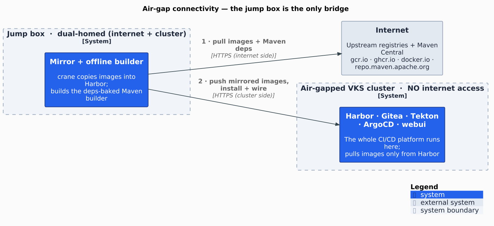
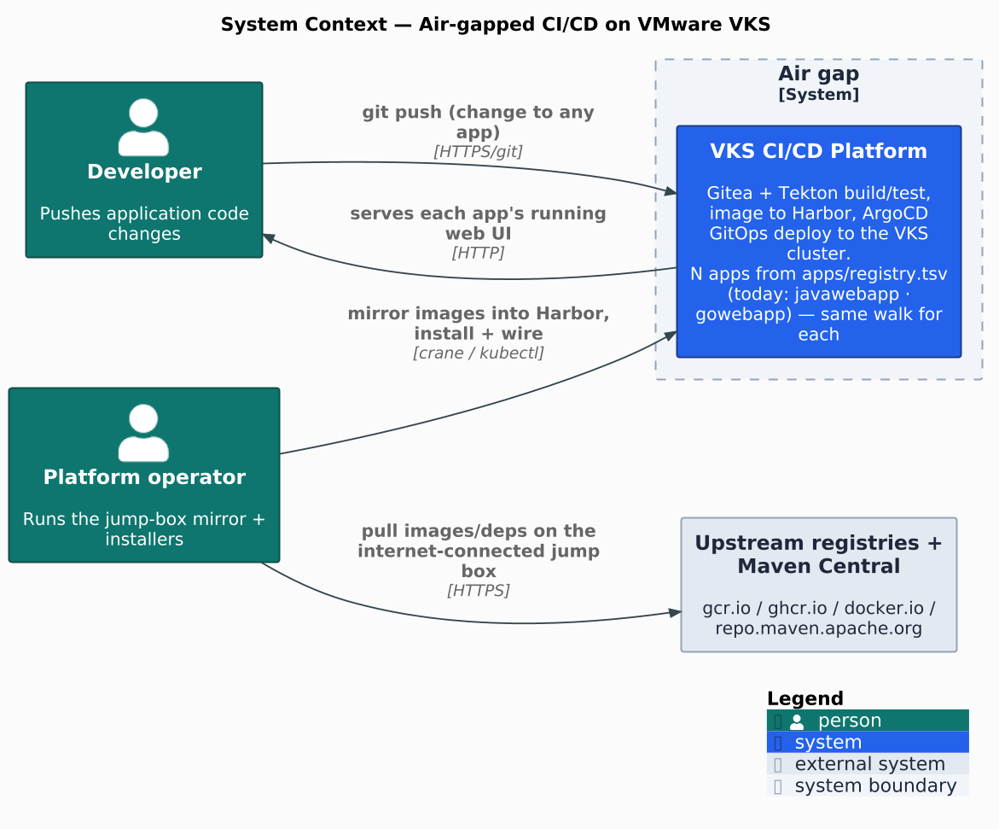
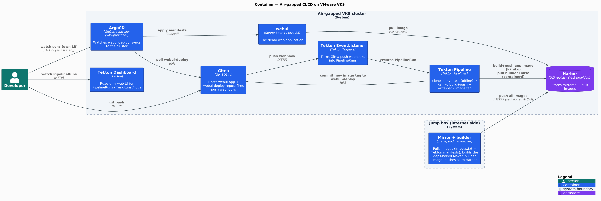
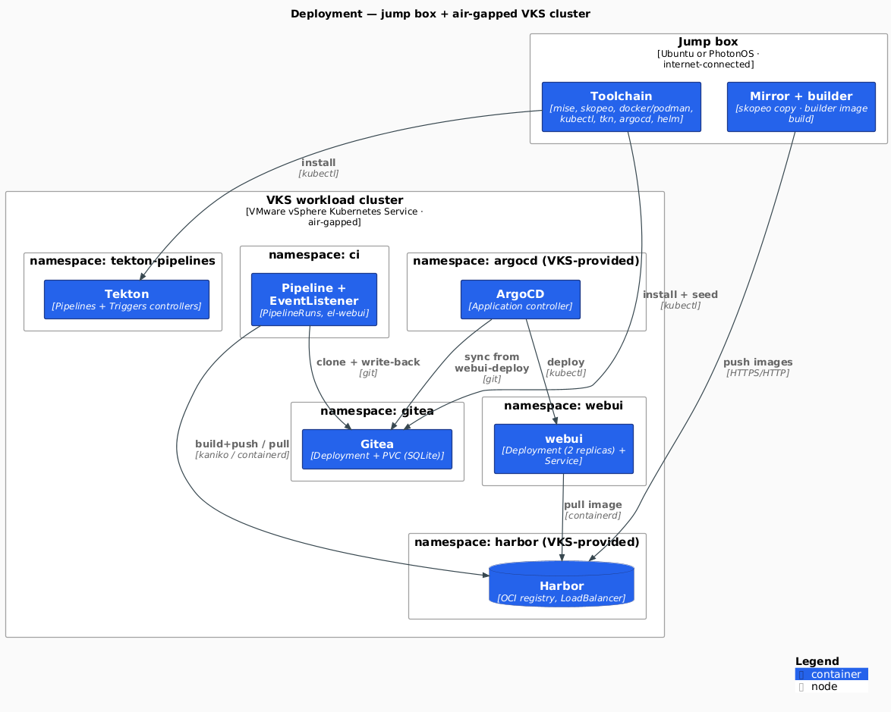
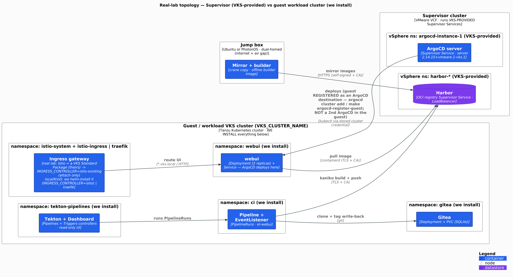
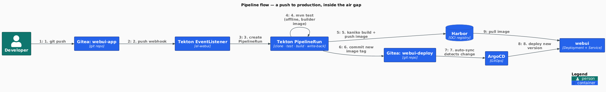

[](https://github.com/AndriyKalashnykov/vks-airgap-cicd/actions/workflows/ci.yml)
[](https://docs.renovatebot.com/)
[](LICENSE)
[](https://hits.sh/github.com/AndriyKalashnykov/vks-airgap-cicd/)

# Air-gapped GitOps CI/CD on VMware VKS — Reference Demo

Reference implementation of an end-to-end CI/CD pipeline for a **fully air-gapped**
VKS cluster (VMware vSphere Kubernetes Service, VCF 9 + Supervisor). Two surfaces:

- **Pipeline surface** — self-hosted **Gitea** + **Tekton** (test → **Kaniko** build →
  **Harbor** push → GitOps tag write-back), wired to **Harbor** + **ArgoCD**, which run as VCF **Supervisor Services** (you install them, or they already exist and you are a tenant).
- **Delivery surface** — an OS-portable (Ubuntu / PhotonOS) jump-box image mirror (**crane**,
  dual-homed or sneakernet), a dependency-baked offline **Maven** builder, a pluggable ingress
  (**Istio** default, **Traefik** optional — or **attach to the Istio a real VKS lab already has**,
  since Istio ships there as a VKS Standard Package) fronting the UIs at `*.vks.local`, and a one-command
  **KinD** end-to-end that proves the whole flow locally.

<p align="center"></p>

<p align="center"><em>The jump box is the only bridge — it pulls from the internet and pushes into the air-gapped cluster, which has no internet access of its own.</em></p>

> A developer pushes a change to **Gitea** → **Tekton** runs tests, builds a container
> image with **Kaniko** and pushes it to **Harbor** → Tekton bumps the image tag in the
> deploy repo → **ArgoCD** syncs the new version to the cluster → the web UI updates.
> On a real lab, **Harbor** and **ArgoCD** run as **VCF Supervisor Services** (on the Supervisor —
> you either install them, or they already exist and you're a tenant), and **Istio** is a **VKS
> Standard Package** in the guest cluster — so this project **attaches** to it rather than
> installing it. What this project always owns: mirroring every required image into Harbor, and
> installing + wiring **Gitea + Tekton** and the demo app.
> See [`docs/vks-services/`](docs/vks-services/) for what each service is, and how to install/configure/use it.

## Choose your path

New here? Pick the path that matches your situation — each one is self-contained end to end:

1. **KinD** — *see it work.* No VKS cluster, **zero `.env`**, one command.
2. **Real lab, Scenario 1** — *I install Harbor + ArgoCD* (as VCF **Supervisor Services**), then run the pipeline.
3. **Real lab, Scenario 2** — *I'm a **tenant***: Harbor + ArgoCD already exist. I **discover** them,
   **request** what I'm not allowed to self-service, then run the pipeline.

| I want to… | Path | You need |
|------------|------|----------|
| **Just see it work** (no VKS cluster) | [KinD](#try-it-locally-end-to-end-with-kind) — one command, zero `.env` | **Have:** Docker (KinD needs Docker specifically) · internet access<br>**Run:** `make deps` → `make e2e-kind` |
| **Real lab — I install Harbor + ArgoCD** | [Scenario 1](#run-against-a-real-vks-lab--scenario-1-harbor--argocd-need-to-be-installed) | **Have:** a vSphere login that can install a Supervisor Service, create a vSphere Namespace and provision a guest cluster · cluster-admin on that guest cluster · the licensed VCF CLI archives ([where to get them](#vks-authentication-vcf-9--supervisor--real-lab-only))<br>**Reachable from the jump box:** the internet, the Supervisor API, Harbor — and ArgoCD's cluster must reach your guest API<br>**Run:** `make deps` → `make install-vcf-clis` → `make env-init` → `make env-populate` → `make env-check` → `make psa-check` |
| **Real lab — Harbor + ArgoCD already exist** (I'm a **tenant**) | [Scenario 2](#run-against-a-real-vks-lab--scenario-2-harbor--argocd-already-installed) | **Have:** cluster-admin on your own guest cluster · Harbor **project-admin** (else ask for robot credentials) · the licensed VCF CLI archives<br>**Ask the platform team for:** your guest cluster **registered** with ArgoCD (admin-only) · an ArgoCD role that lets you create an `Application` · mesh rights — `make istio-preflight` prints exactly what to request<br>**Run:** `make deps` → `make install-vcf-clis` → `make env-init` → `make env-populate` → `make harbor-robot` → `make psa-check` |

The real-lab paths start from the jump-box **[Prerequisites](#prerequisites)** below.
Run **`make check-tools`** to see which CLIs you have and which are required.

> **Container engine:** podman or Docker for a real lab (`CONTAINER_ENGINE`, podman preferred).
> `make e2e-kind` requires **Docker** specifically.

## Prerequisites

### Bootstrap a bare jump box (before you can clone this repo)

**Fast path (dual-homed Ubuntu/Photon)** — one command OS-gates, installs git/curl/make +
mise, clones this repo, runs `make deps`, and prints a toolchain report:

```bash
curl -fsSL https://raw.githubusercontent.com/AndriyKalashnykov/vks-airgap-cicd/main/bootstrap-jumpbox.sh | bash

# Prefer to read before running? Download, inspect, then run this INSTEAD of the line above:
#   curl -fsSLO https://raw.githubusercontent.com/AndriyKalashnykov/vks-airgap-cicd/main/bootstrap-jumpbox.sh
#   less bootstrap-jumpbox.sh && bash bootstrap-jumpbox.sh
```

It's idempotent (re-run skips what's present); pin a ref with `REF=<tag-or-sha>`. It installs
only the **open** toolchain — the licensed VCF CLIs stay operator-supplied (`make install-vcf-clis`).
It needs internet (dual-homed); a fully air-gapped host uses the carried bundle instead.

> **`curl` must already be present** for the pipe form above. Ubuntu images ship it; a **bare
> Photon OS 5** box does **not** — run `sudo tdnf install -y curl` first, then re-run the command.

<details>
<summary><strong>Manual / detailed path</strong> — the step-by-step the bootstrap automates (click to expand)</summary>

<br>

Everything else (mise, `make deps`, the toolchain) runs from a clone of this repo, so first
get **git + SSH + make** working on a fresh box. Do this once, manually.

**Ubuntu:**

```bash
sudo apt-get update
sudo apt-get install -y git openssh-client ca-certificates curl make
```

**Photon OS:**

```bash
# Refresh the package cache FIRST. A stale tdnf cache is the #1 cause of a broken TLS stack
# on a long-lived Photon box: `tdnf install git` UPGRADES openssl-libs, and a partial or
# mismatched upgrade then breaks HTTPS/SSH — git clone fails with an SSL error. Cleaning the
# cache and installing a consistent TLS set up front avoids it.
sudo tdnf clean all && sudo tdnf makecache
sudo tdnf install -y ca-certificates openssl curl git openssh-clients make tar
```

**If `git clone` (or `make deps`) still fails with an SSL / TLS / certificate error on Photon
OS**, that is the stale-cache openssl mismatch — refresh and reinstall the TLS stack, then
retry the clone:

```bash
sudo tdnf clean all && sudo tdnf makecache
sudo tdnf reinstall -y ca-certificates openssl openssl-libs curl curl-libs
```

**Configure your git identity** (both OSes; used for local commits — the in-cluster pipeline
commits under its own identity):

```bash
git config --global user.name  "VKS Developer"
git config --global user.email "vks.developer@sample.corp.com"
```

**Create an SSH key and add it to GitHub** (for `git@github.com:` clones):

```bash
ssh-keygen -t ed25519 -C "vks.developer@sample.corp.com" -f ~/.ssh/id_ed25519 -N ""
cat ~/.ssh/id_ed25519.pub     # add this line at GitHub → Settings → SSH and GPG keys → New SSH key
ssh -T git@github.com         # expect: "Hi <user>! You've successfully authenticated…"
```

**Clone the repo, then install mise** and let the Makefile pull the rest of the toolchain:

```bash
# SSH (needs the key above added to your GitHub account)…
git clone git@github.com:AndriyKalashnykov/vks-airgap-cicd.git
# …or HTTPS (this repo is public — no key needed) — use ONE of these two:
# git clone https://github.com/AndriyKalashnykov/vks-airgap-cicd.git
cd vks-airgap-cicd

curl https://mise.run | sh                 # installs mise to ~/.local/bin
export PATH="$HOME/.local/bin:$PATH"       # put mise on PATH for THIS shell (the installer also
                                           # adds `mise activate` to your profile for new shells)
make deps                                  # installs the full jump-box toolchain (mise tools +
                                           # scripts/00-install-prereqs.sh); it also sets up rootless
                                           # podman for the builder-image build — crun + registries on
                                           # Photon, uidmap + slirp4netns on Ubuntu
```

</details>

> The **`make deps` toolchain install + rootless-podman engine + cluster reachability** are
> validated end-to-end by `make jumpbox` — it runs them on a fresh jump-box container
> (`JUMPBOX_OS=photon` on `photon:5.0`, the default, or `JUMPBOX_OS=ubuntu` on `ubuntu:26.04`;
> `make jumpbox-both` runs the matrix), joined to a local KinD cluster with rootless podman, and
> fails if `make deps` or the container-engine setup breaks on a real jump box of that OS.

### Toolchain and access

- A jump box running **Ubuntu** or **PhotonOS** with internet access.
- Network reach to the VKS Supervisor, Harbor, and (for dual-homed) the workload cluster.
- The Harbor **CA certificate** (`.env` → `HARBOR_CA_FILE`) — Harbor is self-signed HTTPS; Gitea is served over HTTP (no CA needed).
- [mise](https://mise.jdx.dev/) for the rest of the toolchain (installed by `make deps`; git must already be present).
- **Container engine:** image operations (mirror, Maven builder build/push, diagram
  rendering) use `CONTAINER_ENGINE` — **podman-preferred**, docker fallback. `make deps`
  installs the rootless-podman runtime deps per OS (crun + an active
  `unqualified-search-registries` on Photon; `uidmap` + `slirp4netns` on Ubuntu, which apt
  leaves out of a default podman install). The **local KinD end-to-end** additionally
  **requires Docker**: KinD's node and `cloud-provider-kind` run on the `kind` Docker network +
  socket. So a real air-gap run can be podman-only; `make e2e-kind` needs Docker.

<details>
<summary><strong>Sizing reference</strong> — jump-box disk space + guest-cluster resources (click to expand)</summary>

<br>

**Jump-box disk space** — measured for the current image set (~30 images: 9 pinned in
[`images/images.txt`](images/images.txt) plus the Tekton Pipelines+Triggers controller
images pulled from their release manifests, which dominate the count — alongside Gitea,
Kaniko, Maven, Temurin JDK/JRE, alpine/git, yq, and the ingress images). Figures are approximate.

| What | Where | Size |
|------|-------|------|
| Mirror image cache — **single-arch** (default, `MIRROR_ARCH=amd64`) | `bundle/images/` | **~3.0 GB** |
| Mirror image cache — **all architectures** (`MIRROR_ALL_ARCH=1`) | `bundle/images/` | ~5.2 GB |
| Maven builder image build (local docker/podman storage) | engine store | ~1.5 GB |
| Sneakernet bundle tarball (sneakernet flow only) | repo root | ~2.5 GB (on top of the cache) |

> Even in single-arch mode the **Tekton controller images stay multi-arch**
> (~2 GB of the 3 GB): they are digest-pinned in the release manifests, so their
> multi-arch list digest must be preserved for the pull to resolve. The single-arch
> saving therefore applies to the large tag-referenced images (Maven, Temurin, the builder).

**Recommended free space on the jump box:** **≥ 10 GB** dual-homed (cache + builder build +
overhead); **≥ 15 GB** sneakernet (adds the transferable bundle tarball). The **VKS/KinD
cluster** additionally stores these images in Harbor + each node's containerd (~5–6 GB) —
that is cluster-side, separate from the jump box.

**Guest (VKS workload) cluster sizing** — sizing for the **guest cluster** where this project deploys **Gitea + Tekton (+ Dashboard) +
the webui app** and its images. Harbor and ArgoCD run on the **Supervisor** as VCF Supervisor Services, so they are budgeted
separately (see the last bullet). Figures were measured on the live single-node KinD stack
(no metrics-server, so per-pod RAM is the declared request or a working-set estimate).

| Tier | vCPU | RAM | Disk | Fits |
|------|------|-----|------|------|
| **Minimum** | 4 | 8 GB | 40 GB | steady state + one pipeline; pipelines serialize, no concurrency headroom |
| **Recommended** | 6 | 12 GB | 60 GB | comfortable single pipeline + ~30% headroom + image-growth room |
| **Comfortable** | 8 | 16 GB | 80–100 GB | 2–3 concurrent PipelineRuns, production-ish headroom |

- **What dominates the baseline:** the steady-state RAM *request* is ~3.7 GiB, of which
  **istiod alone reserves 2 GiB** (its real working set is ~150–200 MiB). Choosing
  `INGRESS_CONTROLLER=traefik` (single binary, ~128 MiB) frees ~2 GiB + ~0.5 vCPU — the
  Minimum tier then drops to **4 vCPU / 6 GB**.
- **The spikes are the pipeline pods.** `maven-test` (offline JVM build, ~1–1.5 GiB) and
  `kaniko-build` (image build, ~1.5–2 GiB) run **sequentially**, so a single-pipeline peak is
  the baseline **+ ~2 vCPU / ~2 GiB**; each *concurrent* run adds that again. These pods
  declare no limits, so the cluster needs real headroom for them.
- **Disk:** ~6 GB of mirrored + built images in the node's containerd, a 5 GB Gitea PVC, a
  2 GB CI workspace, plus transient kaniko/maven scratch and a new `webui:<sha>` image per
  run (budget growth room — hence the 40 → 100 GB range).
- **If Harbor + ArgoCD are co-located** in this same guest cluster (instead of provided
  externally), add roughly **+2 vCPU / +4 GB RAM / +5 GB disk** to each tier.

</details>

### VKS authentication (VCF 9 + Supervisor) — real lab only

> Needed by **both real-lab scenarios**, before their first step. The **KinD path skips this**
> entirely (`make kind-up` writes a kubeconfig and sets `VKS_AUTH_METHOD=kubeconfig` for you).

<details>
<summary><strong>Auth methods</strong> — kubeconfig / vcf / vsphere via VKS_AUTH_METHOD (click to expand)</summary>

<br>

`scripts/30-vks-login.sh` (`make vks-login`) is the single pluggable step that produces a
working `KUBECONFIG` and context; everything downstream is auth-agnostic. Select the method
with `VKS_AUTH_METHOD`:

| Method | Use it when | Inputs (`.env`) |
|--------|-------------|-----------------|
| `kubeconfig` (default) | You already have the lab's exported kubeconfig | `KUBECONFIG`, `VKS_CONTEXT` |
| `vcf` | Real VCF 9 lab, via the VCF Consumption CLI | `SUPERVISOR_HOST`, `VKS_USERNAME` (+ `VKS_SSO_DOMAIN`), `VKS_NAMESPACE`, `VKS_CLUSTER_NAME`, `VKS_CONTEXT_NAME`, `VKS_INSECURE_SKIP_TLS_VERIFY` |
| `vsphere` | Pre-9 Supervisor, via the kubectl-vsphere plugin (legacy) | `SUPERVISOR_HOST`, `VKS_NAMESPACE`, `VKS_CLUSTER_NAME`, `VKS_USERNAME`, `VKS_PASSWORD` |

**`vcf` method — the real VCF Consumption CLI flow.** `.env` inputs:

```bash
VKS_AUTH_METHOD=vcf
SUPERVISOR_HOST=<supervisor-IP-or-FQDN>   # no scheme; vCenter → Workload Management → Supervisors → Control Plane IP
VKS_USERNAME=administrator@WLD.SSO        # 'user@SSO.DOMAIN' (or set VKS_SSO_DOMAIN and give the bare user)
VKS_NAMESPACE=<vsphere-namespace>         # the <ns> in `vcf context use <name>:<ns>`
VKS_CLUSTER_NAME=<vks-cluster-name>       # the workload cluster to fetch the kubeconfig for
VKS_CONTEXT_NAME=sup66                    # the vcf context NAME you type at the create prompt
VKS_INSECURE_SKIP_TLS_VERIFY=true         # skip verifying the Supervisor's self-signed cert
```

`make vks-login` then runs (interactively — the CLI **prompts** for the context name and the
password, so no secret ever touches argv):

```bash
vcf context create --endpoint https://<SUPERVISOR_HOST> --username <user>@<SSO-DOMAIN> \
    --insecure-skip-tls-verify --auth-type basic     # enter the context name (VKS_CONTEXT_NAME) + password when prompted
vcf context use <VKS_CONTEXT_NAME>:<VKS_NAMESPACE>   # note the <ctx>:<ns> COLON form
vcf cluster kubeconfig get <VKS_CLUSTER_NAME> --export-file <KUBECONFIG>   # write the workload-cluster kubeconfig to $KUBECONFIG
```

`vcf cluster kubeconfig get` is the **primary** VKS 9 way to obtain the **workload-cluster**
kubeconfig (verify the exact 9.1 flags on your lab). The legacy `kubectl vsphere login --server
<ip> --vsphere-username <u> --tanzu-kubernetes-cluster-name <c> --tanzu-kubernetes-cluster-namespace
<ns> [--insecure-skip-tls-verify]` form (the `vsphere` method) is the **vSphere-with-Tanzu 7/8
fallback** — present only where the `vcf` CLI is unavailable.

If the workload cluster needs the kubectl-vsphere plugin, fetch it from the Supervisor:

```bash
wget --no-check-certificate https://<SUPERVISOR_HOST>/wcp/plugin/linux-amd64/vsphere-plugin.zip
```

> **Not yet lab-validated.** The `vcf` flow is written to the command **shape** verified from
> primary sources (the ogelbric/LAB VCF-CLI transcript and Broadcom's "Install the Argo CD
> Service" techdoc), but it has **not** been run end-to-end against a real VKS lab in this repo.
> The login is interactive today: no non-interactive/stdin password mechanism is confirmed for
> `vcf context create`, so `30-vks-login.sh` carries a `TODO(verify on a real VKS lab)` to
> confirm one before automating further. A password is never placed on argv either way.
> `kubeconfig` (bring the lab's exported kubeconfig) is the simplest working method.

</details>

## Tech stack

<details>
<summary><strong>Layers &amp; choices</strong> — what each component is and why (click to expand)</summary>

<br>

| Layer | Technology | Why |
|-------|-----------|-----|
| Git server | **Gitea** (self-hosted, SQLite) | Single-image, air-gap-friendly Git host with webhooks; installed inside the cluster |
| CI engine | **Tekton** Pipelines + Triggers | Kubernetes-native, in-cluster builds — no external CI runner to reach across the air gap |
| CI dashboard | **Tekton Dashboard** | Read-only web UI for PipelineRuns / TaskRuns / logs, fronted at `tekton.vks.local` |
| Image build | **Kaniko** | Builds container images in-cluster without a Docker daemon (rootless, no privileged socket) |
| Registry | **Harbor** (a VCF Supervisor Service) | The one OCI registry all parties share (host push, Kaniko push, containerd pull) |
| GitOps CD | **ArgoCD** (a VCF Supervisor Service) | Watches the deploy repo and reconciles the cluster to the committed image tag |
| Ingress | **Istio** (default) / **Traefik** (option) / **attach to an existing Istio** | One LoadBalancer fronting the UIs at `*.vks.local`; pluggable via `INGRESS_CONTROLLER` (`istio` \| `istio-existing` \| `traefik`) |
| Image mirror | **crane** (go-containerregistry) | Copies images internet→Harbor (dual-homed) or into a sneakernet bundle, single- or multi-arch; a static Go binary, so it installs cross-distro via mise (incl. Photon OS 5, where skopeo has no static build/package) |
| Demo app | **Spring Boot 4 / Java 25** | Minimal web UI whose greeting proves the deployed image changed end-to-end |
| Offline build | dependency-baked **Maven** builder image | Bakes `~/.m2` so in-cluster `mvn` builds with no Maven Central reach |
| Local e2e | **KinD** + **cloud-provider-kind** | Stands up the Supervisor-Service pieces (Harbor + ArgoCD) locally with a real LoadBalancer |
| Toolchain | **mise** | One cross-distro (Ubuntu/PhotonOS) version manager for the jump-box tools |

</details>

## Architecture

<details>
<summary><strong>System context, containers, deployment, pipeline flow &amp; operating modes</strong> (click to expand)</summary>

<br>

Harbor + ArgoCD are VCF **Supervisor Services** (blue in the diagrams) — you install them (Scenario 1) or the platform team already has (Scenario 2). The jump box mirrors every
image into Harbor; a `git push` then drives the whole CI/CD flow entirely inside the air gap.

### System context

<p align="center"></p>

### Containers

<p align="center"></p>

### Deployment

<p align="center"></p>

### Cluster topology (real lab)

On a real VKS lab the stack spans **two** clusters: Harbor + ArgoCD are Supervisor Services
Supervisor Services that run on the **Supervisor**, while Gitea, Tekton, the ingress, and
the app are installed into the **guest** workload cluster. Because ArgoCD lives on the
Supervisor, the guest cluster is **registered as an ArgoCD destination** (`make
argocd-register-guest`) so it can deploy `webui` there — it does **not** run a second ArgoCD
in the guest. (The KinD stand-in collapses both levels into one cluster.)

<p align="center"><a href="docs/diagrams/out/vks-topology.png"></a></p>

### Pipeline flow

<p align="center"><a href="docs/diagrams/out/pipeline-flow.png"></a></p>

Diagram sources are committed under [`docs/diagrams/`](docs/diagrams/) (C4-PlantUML);
`make diagrams` re-renders the PNGs and `make diagrams-check` fails CI if they drift.

### Two operating modes

| Mode | When | Flow |
|------|------|------|
| **dual-homed** (default) | Jump box reaches internet **and** the VKS/Harbor network (routed to ESXi) | `make mirror` pulls + pushes in one run |
| **sneakernet** | Jump box has internet only | `make mirror-pull && make bundle` → carry the bundle → `make bundle-load && make mirror-push` inside |

There's no switch to flip — the mode is simply **which mirror commands you run** (the Flow column above).

</details>

## Try it locally end-to-end with KinD

<details>
<summary><strong>Local KinD end-to-end</strong> — stand up the whole stack + pipeline locally (click to expand)</summary>

<br>

> **You want to *see it work*.** No VKS cluster, **zero `.env`**, one command.

You don't need a VKS cluster to exercise the whole pipeline. `make e2e-kind` stands up a
local [KinD](https://kind.sigs.k8s.io/) cluster, installs the Supervisor-Service pieces
(**Harbor** + **ArgoCD**) into it, then runs the exact same
`mirror → builder → platform → gitops → verify` flow the real environment uses. This path
is verified end-to-end (git push → Tekton build → Harbor → ArgoCD → the live app serves
the new version).

> **Zero `.env` setup — and the e2e ENFORCES it.** The kind steps **auto-discover and write
> `.env.kind`** for you — `KUBECONFIG`, `HARBOR_URL` (the Harbor LB IP), `HARBOR_CA_FILE`, the
> ArgoCD LB IP — and **generate** the passwords for the components we install. Run
> `make creds-show` for the effective URLs, logins and passwords.
>
> `make e2e-kind` deliberately **ignores your `.env`** (`SKIP_DOTENV=1`, set by
> `E2E_SKIP_DOTENV ?= 1`). It is a stand-in for a brand-new operator and for a CI runner —
> neither of which has a `.env` — so the secrets **must be generated**, exactly as they will be
> on your machine. Without this, a local run silently reads values only *your* box has and the
> fresh-box path is never exercised: that is how a CI smoke job once died on an empty
> `HARBOR_PASSWORD` while every local run was green. Use your own `.env` with
> `make e2e-kind E2E_SKIP_DOTENV=0`.
>
> The real-lab discovery (Scenario 1/2) is the manual parallel of the same thing.

```bash
make env-init                 # optional for KinD (it fills .env.kind for you); pins known demo secrets if you want them
make deps                     # kind, helm, kubectl, crane, etc.
make e2e-kind                 # cluster → Harbor → ArgoCD → mirror → build → deploy → ingress → verify
# open the UIs (see "Access the UIs" below) and drive the pipeline by hand:
# → "Demo walkthrough" below walks a code change from Gitea to the live page
make kind-down                # tear everything down (also prunes cloud-provider-kind orphans)
```

How the local stand-in works:

- **`cloud-provider-kind`** gives Harbor a real `LoadBalancer` IP on the kind docker
  network — reachable by the *same IP* from the host (push), Kaniko pods (push), and
  containerd (pull), which is what makes one image ref work everywhere.
- Harbor runs **self-signed HTTPS on its LB IP** by default (mimicking the VCF/VKS lab —
  see [KinD TLS fidelity](docs/decisions/kind-tls-fidelity.md)); `install-harbor` mints a
  self-signed CA + leaf (SAN = the LB IP) and wires each node's containerd
  (`/etc/containerd/certs.d/<ip>/`) with that **CA** so pulls verify over TLS. The CA is
  trusted at every consumer **sudo-free** — jump-box `crane`/`curl` via `SSL_CERT_FILE`, the
  builder push via podman `--cert-dir`, in-cluster Kaniko via the `harbor-ca` ConfigMap. It
  writes the discovered `HARBOR_URL` (the LB IP) + `HARBOR_CA_FILE` + `KUBECONFIG` into a
  gitignored **`.env.kind`** overlay so the normal scripts target the kind cluster unchanged.
  Harbor **and** ArgoCD both default to secure (self-signed TLS, mimicking the VCF/VKS 9.1
  lab). For the original plain-HTTP fast-iteration mode, flip both switches:
  `make e2e-kind HARBOR_INSECURE=1 ARGOCD_INSECURE=1`. Both modes are validated locally.
- `make vks-login` uses the kind kubeconfig (`VKS_AUTH_METHOD=kubeconfig`), so no VCF auth
  is needed for the local run.
- **Ingress — the KinD stand-in has NO mesh, so we install one.** `make install-ingress` installs
  **Istio** (`INGRESS_CONTROLLER=istio`, the default — control plane + gateway, images from Harbor;
  `traefik` is the lighter option) as one LoadBalancer
  that fronts the Gitea/app/Tekton-Dashboard UIs at `*.vks.local`, so
  you reach them by hostname instead of `kubectl port-forward`. **Harbor and ArgoCD each keep
  their own direct LB** — Harbor's IP is load-bearing for the containerd pull path, and ArgoCD
  gets its own self-signed-TLS LB (like the real VKS lab, which does not front ArgoCD behind
  the shared ingress). Both ingress images are mirrored into Harbor.

> **This is the only path where we install Istio.** A real VKS lab already has it (Istio ships as a
> **VKS Standard Package** in the guest cluster), so both real-lab scenarios **attach** to the
> existing mesh instead — see their ingress step. Full reference:
> [`docs/vks-services/istio.md`](docs/vks-services/istio.md).

Individual targets: `make kind-up`, `make install-harbor`, `make install-argocd`,
`make install-ingress` (or `make install-istio` / `make install-traefik`).

</details>

## Run against a real VKS lab — Scenario 1: Harbor & ArgoCD need to be installed

<details>
<summary><strong>You install Harbor &amp; ArgoCD</strong> — as VCF Supervisor Services, provision a workload cluster, then wire the pipeline and run it (self-contained; click to expand)</summary>

<br>

> **You install Harbor + ArgoCD** (as VCF **Supervisor Services**), then run the pipeline.

This is the real target. You are given a **Supervisor** endpoint (IP), a login, and a password —
nothing else. **Harbor** and **ArgoCD** are **not** pre-provided: you install them as **VCF
Supervisor Services**, provision a **workload VKS cluster**, then install **Gitea** + **Tekton**
and wire the pipeline. Dual-homed: the jump box reaches both the internet and the lab (Supervisor
API + Harbor).

The order below installs the lab-side services first (Harbor, ArgoCD, workload cluster; mostly
the vSphere Client + `kubectl`), then wires this repo and runs the flow. Everything you need is
in this section — you do not have to read the other scenario.

**Downloads** (each needs your Broadcom entitlement):

- **VCF Consumption CLI** 9.1.0.0 —
  [download](https://support.broadcom.com/group/ecx/productfiles?displayGroup=VMware%20Cloud%20Foundation%209&release=9.1.0.0&os=&servicePk=540528&language=EN&groupId=540529&viewGroup=true)
- **VCF Consumption CLI Plugins** 9.1.0.0 —
  [download](https://support.broadcom.com/group/ecx/productfiles?displayGroup=VMware%20Cloud%20Foundation%209&release=9.1.0.0&os=&servicePk=540528&language=EN&groupId=540672&viewGroup=true)
- **ArgoCD Service** (search **vSphere Supervisor Services** → **ArgoCD Service**) —
  [download](https://support.broadcom.com/group/ecx/productfiles?subFamily=vSphere%20Supervisor%20Services&displayGroup=ArgoCD%20Service&release=1.1.0&os=&servicePk=538499&language=EN)
- **Harbor** (search **vSphere Supervisor Services** → **Harbor**) —
  [download](https://support.broadcom.com/group/ecx/productfiles?subFamily=vSphere%20Supervisor%20Services&displayGroup=Harbor&release=2.14.3&os=&servicePk=542081&language=EN)

Reference docs:
[Installing and Configuring Harbor as a VCF Service](https://techdocs.broadcom.com/us/en/vmware-cis/vcf/vcf-service-administration-and-development/9-1/using-harbor-as-vcf-service/installing-and-configuring-harbor-and-contour.html)
·
[Install the Argo CD Service](https://techdocs.broadcom.com/us/en/vmware-cis/vcf/vcf-service-administration-and-development/9-1/using-argo-cd-service/install-argo-cd-service.html).

> **Doc-provenance note.** Broadcom's **9.1** ArgoCD/Harbor techdoc pages currently **301-redirect
> to the 9.0 tree**, so the version-specific facts below (the `2.14.15` ArgoCD server example, field
> names) are **9.0 content taken as authoritative-for-9.1** — an inference, not verified 9.1 ground
> truth. Confirm against the running lab (`kubectl explain argocd.spec.version`, the actual service
> YAML) before relying on an exact version.

### Install Harbor & ArgoCD as Supervisor Services

**A1 and A2 install ON the Supervisor** (each Service lands in its own vSphere Namespace),
**not** on a workload cluster — so they need **Supervisor** access, not the VKS kubeconfig you
fetch in A3. The `.env` prompts below are interleaved with the steps: set each value at the
step where it first becomes known, rather than all at once.

> **→ before you start, set the upfront vCenter vars in `.env`** (they drive the Supervisor login):
>
> ```bash
> SUPERVISOR_HOST=<supervisor-control-plane-IP>   # vCenter → Workload Management → Supervisors
> VKS_USERNAME=administrator@vsphere.local        # your vSphere SSO admin
> VKS_NAMESPACE=<vsphere-namespace>               # where you create the ArgoCD/workload resources
> VKS_CLUSTER_NAME=<vks-cluster-name>             # the workload cluster you provision in A3
> ```

**A1 — Install Harbor as a Supervisor Service** (vSphere Client — not scriptable):

1. **Ingress prereq:** install **Contour** first (Harbor's default ingress on VKS), or configure
   an NGINX-based load balancer for the Supervisor.
2. **Register the operator:** vSphere Client → **Supervisor Management → Services → Add New
   Service** → upload `harbor-service-<ver>.yml`.
3. **Configure `harbor-data-values-<ver>.yml`** — the key fields: `hostname` (the Harbor
   **FQDN**), `harborAdminPassword` (initial admin password, changeable later), `secretKey`
   (exactly 16 chars), `database.password`, `core.xsrfKey` (32 chars), the storage classes
   (registry/jobservice/database/redis/trivy — your storage-policy name, lowercased with dashes),
   and the ingress toggle (`enableContourHttpProxy: true` for Contour **or**
   `enableNginxLoadBalancer: true` for NGINX). Leave the `tlsCertificate` block alone unless you
   bring a custom cert — cert-manager auto-issues a self-signed one (keep the
   `managed-by: vmware-vRegistry` label; it is required for VKS trust).
4. **Deploy:** Harbor service card → **Actions → Manage Service** → pick version + target
   Supervisor → paste the edited `harbor-data-values` → **Finish**.
5. **Map the FQDN:** get the ingress IP (`kubectl get svc -n <harbor-ns>` for NGINX, or the
   Contour Envoy service IP), then add a DNS record — or a jump-box `/etc/hosts` entry — mapping
   the Harbor FQDN → that IP.

> **Fidelity bonus (real lab beats KinD here):** when Harbor and your VKS workload cluster run on
> the **same Supervisor**, the VKS clusters **automatically trust the Harbor registry
> certificate** — so the workload-node image pull "just works" without the per-node `certs.d`
> wiring the KinD stand-in uses.

With Harbor installed, record its access details before moving on to ArgoCD.

> **→ now (A1 done) set the Harbor values in `.env`** — the FQDN you set, or its discovered LB IP:
>
> ```bash
> HARBOR_URL=harbor.<lab-fqdn>          # the hostname you set; or:
> #   kubectl get svc -n <harbor-namespace> -o jsonpath='{.status.loadBalancer.ingress[0].ip}'
> HARBOR_USERNAME=admin                 # or a robot account (Step 4 / make harbor-robot)
> HARBOR_PASSWORD=<harborAdminPassword> # the A1 admin password; set in .env only, never on argv
> HARBOR_CA_FILE=./secrets/harbor-ca.crt   # Harbor's self-signed CA (saved in Step 2)
> HARBOR_INFRA_PROJECT=cicd             # CI/CD + base images
> HARBOR_APP_PROJECT=apps               # the built application image
> ```

**A2 — Install the ArgoCD Operator + an ArgoCD instance** (`kubectl`-driven):

1. **Install the ArgoCD Operator** service on the Supervisor (Supervisor Services, same flow as
   Harbor).
2. **Create a vSphere Namespace** for the instance (e.g. `argocd-instance-1`) with VM + storage
   classes.
3. **Authenticate to the Supervisor** with the VCF Consumption CLI (interactive — it prompts
   for the context name + password; no secret on argv), then activate the namespace:

   ```bash
   vcf context create --endpoint https://<supervisor-IP> --username <user>@<SSO-DOMAIN> \
       --insecure-skip-tls-verify --auth-type basic     # enter a context name (e.g. sup66) + password
   vcf context use <context-name>:<vsphere-namespace>   # note the <ctx>:<ns> COLON form
   ```

   On vSphere 8, use `kubectl vsphere login --server <IP>` instead. `make vks-login` with
   `VKS_AUTH_METHOD=vcf` runs this flow from `.env` (see the [VKS authentication](#vks-authentication-vcf-9--supervisor--real-lab-only) section).
4. **Pick a supported version** with `kubectl explain argocd.spec.version`, then apply the CR:

   ```yaml
   apiVersion: argocd-service.vsphere.vmware.com/v1alpha1
   kind: ArgoCD
   metadata:
     name: argocd-1
     namespace: argocd-instance-1
   spec:
     version: <supported-version>   # e.g. 2.14.15+vmware.1-vks.1
   ```

5. **Get its LoadBalancer IP:** `kubectl get svc -n argocd-instance-1` → the `argocd-server`
   EXTERNAL-IP (its **own** LB, self-signed TLS with no IP SAN — like the KinD stand-in).
6. **Get the admin password:**
   `kubectl get secret -n argocd-instance-1 argocd-initial-admin-secret -o jsonpath='{.data.password}' | base64 -d`.
7. **Log in + rotate:** `argocd login <LB-IP>` (accept the self-signed cert) →
   `argocd account update-password`.

> **Version note:** the operator CR pins the ArgoCD **server** (the example is `2.14.15`, a 2.x
> line), while the shipped `argocd` **CLI** from the VCF download is `3.0.19-vcf` (3.x). Read the
> real supported server versions with `kubectl explain argocd.spec.version` on the lab; the KinD
> stand-in runs a 3.x server, so expect a possible server-generation delta.
>
> **Topology to verify on the lab:** `make gitops` applies an ArgoCD `Application` (via
> `kubectl`) into `ARGOCD_NAMESPACE` and targets the in-cluster destination
> `https://kubernetes.default.svc`. Confirm the ArgoCD instance can deploy into the workload
> namespace it watches — same cluster, or the workload cluster registered with ArgoCD. An
> off-cluster ArgoCD addressed **only** by URL + API is not what the scripts assume.
>
> **`make argocd-preflight`** automates both checks against your `KUBECONFIG` cluster — it
> prints the operator's supported server versions (`kubectl explain argocd.spec.version`), the
> running server image, the `argocd` CLI version, and a **TOPOLOGY OK / MISMATCH** verdict
> (is ArgoCD in this cluster, are any workload clusters registered, does the target namespace
> exist). Run it after Step 1 (kubeconfig in place), before `make gitops`.

With the ArgoCD instance up, record its endpoint and namespace.

> **→ now (A2 done) set the ArgoCD values in `.env`** — the argocd-server LB IP + where it runs:
>
> ```bash
> ARGOCD_NAMESPACE=argocd-instance-1    # the vSphere Namespace your A2 ArgoCD instance runs in
> ARGOCD_SERVER=<argocd-server-LB-IP>   # kubectl get svc -n argocd-instance-1 argocd-server \
> #                                       -o jsonpath='{.status.loadBalancer.ingress[0].ip}'
> ARGOCD_APP_NAME=webui
> ARGOCD_DEST_NAMESPACE=webui
> ARGOCD_TRACK_BRANCH=main
> # ARGOCD_CA_FILE=./secrets/argocd-ca.crt   # ArgoCD's self-signed CA (Step 2, make fetch-argocd-ca)
> ```

**A3 — Provision the workload VKS cluster + get its kubeconfig.** Gitea, Tekton, and the demo app
run in a **guest VKS (Tanzu Kubernetes) cluster**, not on the Supervisor. Create a vSphere
Namespace, provision a VKS cluster in it, and obtain its kubeconfig (e.g. a `vcf`/`kubectl
vsphere` login to the guest cluster, or export it from VCF Automation). You need **cluster-admin**
on it — the flow creates namespaces (`gitea`, `ci`, `webui`) and installs Tekton CRDs. Place the
kubeconfig at `$KUBECONFIG` (used at "Wire the repo & run the pipeline", Step 1 below).

> **→ now (A3 done) set the workload kubeconfig in `.env`** — the `vcf` CLI writes it for you:
>
> ```bash
> vcf cluster kubeconfig get $VKS_CLUSTER_NAME --export-file ./secrets/vks.kubeconfig
> #   (legacy 8.x: kubectl vsphere login --server $SUPERVISOR_HOST --vsphere-username $VKS_USERNAME \
> #      --tanzu-kubernetes-cluster-name $VKS_CLUSTER_NAME --tanzu-kubernetes-cluster-namespace $VKS_NAMESPACE)
> KUBECONFIG=./secrets/vks.kubeconfig      # then set this to the exported path
> VKS_CONTEXT=<context-name-in-that-kubeconfig>
> ```

### Wire the repo & run the pipeline

**Step 0 — remove the KinD overlay.** `.env.kind` (written by the local flow) is sourced
*after* `.env` and would silently redirect everything at a kind cluster. Delete it first:

```bash
make kind-down        # if you ran the local flow (also removes .env.kind)
rm -f .env.kind       # belt-and-suspenders
```

**Step 1 — finish `.env`.** By now the interleaved "→ now set these in `.env`" callouts above
have filled the Harbor values (as you installed Harbor), the ArgoCD values (as you installed
ArgoCD), and `KUBECONFIG` / `VKS_CONTEXT` (when you provisioned the workload cluster). Only the
**Gitea password** (a login for the component **we** install) and the **VKS auth method** remain:

```bash
# --- Gitea (WE install it — you choose the password) ---
GITEA_ADMIN_PASSWORD=<choose-one>        # set in .env only

# --- VKS access method ---
VKS_AUTH_METHOD=kubeconfig               # simplest: use the KUBECONFIG you fetched in A3 as-is
```

For VKS auth, `kubeconfig` (the kubeconfig `vcf cluster kubeconfig get` wrote in A3) is the
simplest working method. To have `make vks-login` run the VCF Consumption CLI login itself, set
`VKS_AUTH_METHOD=vcf` and the `vcf` inputs (`SUPERVISOR_HOST` / `VKS_USERNAME` /
`VKS_NAMESPACE` / `VKS_CLUSTER_NAME` / `VKS_CONTEXT_NAME`) — see the
[VKS authentication](#vks-authentication-vcf-9--supervisor--real-lab-only) section for the exact flow (written
to the verified shape but not yet lab-validated). For the legacy vSphere plugin, set
`VKS_AUTH_METHOD=vsphere` and `SUPERVISOR_HOST` / `VKS_NAMESPACE` / `VKS_CLUSTER_NAME` /
`VKS_USERNAME` / `VKS_PASSWORD`.

**Step 2 — save the Harbor CA certificate** to `./secrets/harbor-ca.crt` (the
`HARBOR_CA_FILE` path). If the lab handed you the cert, drop it there. Otherwise fetch it
from the running Harbor with **`make fetch-harbor-ca`** (reads `HARBOR_URL`, writes
`HARBOR_CA_FILE`), or by hand:

```bash
make fetch-harbor-ca                         # convenience: HARBOR_URL → HARBOR_CA_FILE
# …or the equivalent by hand:
mkdir -p secrets
openssl s_client -connect <harbor-host>:443 -showcerts </dev/null 2>/dev/null \
  | openssl x509 -outform PEM > secrets/harbor-ca.crt
```

(Or download it from the Harbor UI → your project → **Registry Certificate**.) The CA is
consumed in **two** places, both handled for you: `make mirror` builds a **sudo-free** trust
bundle (`SSL_CERT_FILE` = the system CAs + your Harbor CA) so `crane` pushes over HTTPS
**without** touching the jump box's system trust store, and `make platform` creates an
in-cluster ConfigMap **`harbor-ca`** (key `ca.crt`) so Kaniko/Tekton trust it too. If Harbor
presents a publicly-trusted cert, leave `HARBOR_CA_FILE` empty.

For **ArgoCD**'s self-signed CA (only needed if you drive `argocd login` with verification, or
to trust its UI), fetch it the same way — set `ARGOCD_SERVER` to the A2 `argocd-server` LB IP and
run **`make fetch-argocd-ca`** (writes `ARGOCD_CA_FILE`). The pipeline wires ArgoCD via `kubectl`
(not the `argocd` CLI), so this is optional for the demo itself.

**Step 3 — install prereqs and log in to VKS:**

```bash
make deps         # kind, crane, tkn, argocd, kubectl, helm + the rest of the mise toolchain
make vks-login    # validates $KUBECONFIG + context against the lab cluster
```

**Step 3b — install the Broadcom VCF/VKS lab CLIs.** You need the **licensed** `argocd-vcf` +
`vcf` binaries if **either** applies (both are the normal real-lab case):

- you authenticate with `VKS_AUTH_METHOD=vcf` — `scripts/30-vks-login.sh` hard-requires `vcf`; or
- you need **`make fetch-argocd-kubeconfig`** (the Supervisor kubeconfig that lets `make gitops`
  register your guest cluster with the ArgoCD Supervisor Service) — it hard-requires `vcf` too.

They are only **optional** if you already hold a working workload-cluster kubeconfig
(`VKS_AUTH_METHOD=kubeconfig`) *and* your cluster is already registered with ArgoCD (Scenario 2,
where the platform team does it for you). The pipeline itself wires everything via `kubectl`. They install **sudo-free** to
`~/.local/bin`, and the installer picks the right archive for the jump box's **OS/arch**.

**Supply them as a folder.** Download the artifacts — however you have entitlement (the
[Broadcom support portal](https://support.broadcom.com) or an internal mirror) — on an
internet-connected box, drop them **all in one directory** (e.g. your browser's default
`~/Downloads/vcf`), and point `VCF_CLI_SRC_DIR` at it. This is the air-gap-correct path: carry
the folder in, no download client / token / network at install time.

**Just dump everything in there — the installer auto-selects.** You don't have to prune the
folder to this box's platform: it may hold every arch (`…-Linux_AMD64-…` + `…-Linux_ARM64-…`),
macOS builds, **and** the portal's multi-arch `…-Binaries-…` bundle, all at once. The installer
picks the archive matching **this jump box's OS/arch** and the **pinned versions** (from
`.env.example`) and ignores the rest — a mixed folder resolves deterministically, and if the
pinned version isn't present it errors clearly rather than ever installing a different version.

`VCF_CLI_SRC_DIR` is **required** — the installer does not guess where you dropped the files. Set
it on the command line, or uncomment it in `.env` (gitignored) so every `make` invocation picks
it up. The version pins in `.env.example` already match the current portal artifacts, so normally
you only set the folder:

```bash
make install-vcf-clis VCF_CLI_SRC_DIR=~/Downloads/vcf   # argocd-vcf + vcf + vcf plugins
# or put it in .env once:  VCF_CLI_SRC_DIR=/home/you/Downloads/vcf   → then just `make install-vcf-clis`
# versions are pinned in .env.example (ARGOCD_VCF_VERSION / VCF_CLI_VERSION / VCF_PLUGINS_VERSION);
# keep them in sync with the artifacts you place in the folder.
```

**Packages this step needs** (`tar`, `gzip`/`gunzip`, `find`, `install`) — **`make deps`
already provides them** (`scripts/00-install-prereqs.sh` installs `tar`, `gzip`, `findutils`),
so if you ran the bootstrap you're covered. The installer also checks for them and errors
clearly if any is missing. On a minimal box where you skipped `make deps`:

- **Ubuntu:** present by default — nothing extra.
- **Photon OS:** `sudo tdnf install -y findutils` (`find` is not in Photon's base; its
  `gzip`/`tar` come from BusyBox-style **toybox**, which lacks `gzip -t` — the installer uses
  portable checks so it works there). `unzip` is **not** required — the artifacts are `.gz`/`.tar.gz`.

> **Fidelity vs a real lab.** The local KinD stand-in faithfully reproduces the lab's
> **self-signed-TLS + CA-trust** posture (Harbor HTTPS + ArgoCD self-signed TLS on their own
> LBs). Three things differ on a real VKS lab and must be verified there: the workload cluster
> trusts the Harbor CA **declaratively** via the Cluster spec `trust.additionalTrustedCAs`
> (not per-node `certs.d`); a **private** Harbor project needs a robot account +
> `imagePullSecret`; and the lab is **FQDN**-addressed. See
> [KinD TLS fidelity → Fidelity vs a real VCF/VKS 9.1 lab](docs/decisions/kind-tls-fidelity.md).

When Harbor and the workload cluster are **not** on the same Supervisor (or the Harbor project is
**private**), the auto-trust does not apply and you must make the VKS cluster trust the Harbor CA
**declaratively**. Add the CA to the Cluster spec `trust.additionalTrustedCAs` — the value is the CA
PEM **encoded twice with base64** (VKS decodes one layer, then the node trust store decodes the
inner PEM):

```bash
# DOUBLE base64: the outer -w0 keeps it a single line for the Cluster YAML.
base64 -w 0 harbor-ca.crt | base64 -w 0
```

Reference: [William Lam — using a VKS cluster with a private container registry](https://williamlam.com/2024/06/using-a-vsphere-kubernetes-service-vks-cluster-with-a-private-container-registry.html).
(Verify the exact `trust.additionalTrustedCAs` shape against your VCF/VKS 9.1 lab — it is not
reproducible on the KinD stand-in.)

**Step 4 — Harbor projects + (recommended) a robot account.** `make mirror` (run in step 6)
creates the `cicd` and `apps` projects for you via Harbor's REST API if they don't exist
(needs push rights). It creates them **public** (`HARBOR_PUBLIC_PROJECTS=true`, the default),
so the cluster's containerd/kubelet pull the app image **anonymously** — the deployed manifest
carries no `imagePullSecret`, which is why the KinD demo needs none.

**If your lab mandates PRIVATE projects**, set `HARBOR_PUBLIC_PROJECTS=false` (so any project
`make mirror` auto-creates is private) or pre-create them private, and additionally create a
**robot-account image-pull secret** in the app namespace (`ARGOCD_DEST_NAMESPACE`) and
reference it from the app Deployment's `imagePullSecrets` — the pipeline's push secret
(`harbor-dockerconfig` in `ci`, step 5) authorizes **pushes only**, not the workload's pull.
The demo does not scaffold that pull secret (it assumes public projects); it is the one
private-lab step you supply by hand.

For least-privilege CI, create a Harbor **robot account** (push/pull scoped to the two projects)
instead of using `admin`. **`make harbor-robot`** does it via Harbor's REST API — it creates
`robot$<HARBOR_ROBOT_NAME>` (default `vks-cicd`) and writes the name + one-time secret to a
gitignored `secrets/harbor-robot.env` (mode 0600, never printed):

```bash
make harbor-robot                                  # → secrets/harbor-robot.env
# then copy its two lines (HARBOR_USERNAME='robot$vks-cicd' / HARBOR_PASSWORD=…) into .env
```

Confirm the namespace your ArgoCD (A2) runs in / watches (for `ARGOCD_NAMESPACE`):

```bash
kubectl get pods -A | grep argocd-application-controller   # its namespace = ARGOCD_NAMESPACE
```

**Step 5 — verify (or create) the in-cluster registry secret.** The pipeline pushes the
built image to Harbor from inside the cluster, which needs a Docker-config secret.
`make platform` (its `configure-tekton` step, run in step 6) creates it for you as
**`harbor-dockerconfig`** in the `ci` namespace, from `HARBOR_USERNAME` / `HARBOR_PASSWORD`.
Check whether it already exists:

```bash
kubectl -n ci get secret harbor-dockerconfig
```

<details>
<summary>Create or rotate <code>harbor-dockerconfig</code> by hand (only if needed)</summary>

<br>

Keep the secret **off argv** — build the `config.json` on disk and load it from a file; kaniko
needs the key named literally `config.json`, not `.dockerconfigjson`:

```bash
umask 077
auth=$(printf '%s:%s' "$HARBOR_USERNAME" "$HARBOR_PASSWORD" | base64 -w0)
printf '{"auths":{"%s":{"auth":"%s"}}}' "$HARBOR_URL" "$auth" > /tmp/harbor-config.json
kubectl -n ci create secret generic harbor-dockerconfig \
  --from-file=config.json=/tmp/harbor-config.json --dry-run=client -o yaml | kubectl apply -f -
rm -f /tmp/harbor-config.json
```

</details>

The Kubernetes secret is built from your Harbor **login/password**; Harbor's **REST API** is
used only to create the *projects* (and, optionally, a robot account) — it does not create
this cluster secret.

**Step 6 — install everything and verify end-to-end:**

```bash
make install-all   # mirror → mirror-verify → builder-image → vks-login → platform → gitops
make verify        # push a marked change → Tekton → Harbor → ArgoCD → live app serves it
```

`install-all` deliberately does **not** install Harbor or ArgoCD — those you installed above as
Supervisor Services. It mirrors all images into that Harbor, builds + pushes the offline Maven
builder image, installs Gitea + Tekton, and creates the ArgoCD `Application`.

> **Cross-cluster ArgoCD deploy.** ArgoCD runs on the **Supervisor**, so it must be told where
> your **guest** workload cluster is. Set **`ARGOCD_KUBECONFIG`** (Supervisor access) in `.env`
> alongside `KUBECONFIG` (guest access); `make gitops` (invoked by `install-all`) then
> **auto-registers** the guest cluster as an ArgoCD destination via **`make
> argocd-register-guest`** and points the `Application` there — it does **not** install a second
> ArgoCD in the guest.
>
> **Get `ARGOCD_KUBECONFIG` with `make fetch-argocd-kubeconfig`.** ArgoCD runs on the **Supervisor**,
> so registration needs a *Supervisor* kubeconfig — not the workload one `make vks-login` gives you.
> The target creates a Supervisor VCF-CLI context, writes it to `$ARGOCD_KUBECONFIG`, and **proves**
> it reaches `argocd-server` before you go further. (It is interactive — the CLI prompts for your
> password.) See [`docs/vks-services/argocd.md`](docs/vks-services/argocd.md). As the ArgoCD **admin** (you own the instance from A2), this
> auto-registration works out of the box. Leave `ARGOCD_KUBECONFIG` unset only if ArgoCD and the
> workload run in the same cluster.

**Step 7 — access the UIs.** Harbor and ArgoCD are the ones you installed above — use the FQDN /
LB IP + admin credentials you set there. For **Gitea** (which you installed) and the deployed
**app**, either front them with the ingress at `*.vks.local`, or `kubectl port-forward`
(`kubectl -n gitea port-forward svc/gitea-http 3000:3000`,
`kubectl -n webui port-forward svc/webui 18080:80`).

> **Ingress — the mesh ALREADY EXISTS here; attach to it, do not install one.** Istio ships on VKS
> as a **Standard Package** (`istio.kubernetes.vmware.com`) in the guest cluster. The bare
> `make install-ingress` defaults to `INGRESS_CONTROLLER=istio`, which would **helm-install a second
> istiod over the platform's mesh**. Instead:
>
> ```bash
> make istio-preflight                                     # read-only: is Istio here? what does it require of me?
> make install-ingress INGRESS_CONTROLLER=istio-existing   # installs NOTHING; attaches our routes only
> ```
>
> `istio-preflight` prints the exact `Gateway` selector the mesh requires, what your kubeconfig may
> actually do, and what (if anything) to request from the mesh admin. It also picks the route API:
> the **Kubernetes Gateway API** when Istio is an Accepted `GatewayClass` (Istio then
> auto-provisions the proxy *and* its LoadBalancer — nothing needed from the platform team), else
> the classic `Gateway`/`VirtualService` path. Add the printed `INGRESS_LB_IP` line to `/etc/hosts`
> (see [Access the UIs](#access-the-uis-urls-logins-passwords)).
>
> Only if the cluster genuinely has **no** mesh should you install one (`make install-ingress`, or
> `INGRESS_CONTROLLER=traefik` for the lighter option).
>
> **Run `make psa-check` before installing anything.** A VKS guest cluster enforces the
> `restricted` Pod Security Standard **by default** (VKr v1.26+), which **rejects** our Kaniko build
> pods and the Istio-provisioned gateway proxy unless their namespaces are labelled `baseline`. The
> installers apply the measured labels; `psa-check` proves the cluster will admit the workloads
> *before* you spend 20 minutes mirroring.

<details>
<summary><strong>VKS-lab checklist</strong> — easy-to-miss items (click to expand)</summary>

<br>

- **`.env.kind` must not exist** (step 0) — it is sourced after `.env` and silently forces
  kind values.
- **You need `kubectl` access to the cluster ArgoCD RUNS in** (the Supervisor), because the
  scripts create the `Application` by `kubectl apply`-ing it into `ARGOCD_NAMESPACE` — **not**
  via the ArgoCD API. ArgoCD itself does **not** have to run in your workload cluster: the
  `Application`'s destination is `${ARGOCD_DEST_SERVER}` (`k8s/argocd/application.yaml`), which
  defaults to in-cluster and is pointed at your guest cluster by `make argocd-register-guest`
  (see Step 6). An ArgoCD reachable *only* by URL + API — with no kubeconfig — is not supported.
- **`ARGOCD_NAMESPACE` must match** where the lab's ArgoCD controller watches Applications
  (step 4).
- **ArgoCD reaches Gitea over the in-cluster URL** (`GITEA_INTERNAL_URL`, default
  `http://gitea-http.gitea.svc:3000`) — Gitea and ArgoCD are in the same cluster, so this
  works without exposing Gitea externally.
- **cluster-admin** on the workload cluster is required — the flow creates namespaces
  (`gitea`, `ci`, `webui`) and installs Tekton CRDs.
- **StorageClass:** Gitea uses a PVC (`GITEA_STORAGE_SIZE`, default `5Gi`). Ensure the
  cluster has a default StorageClass (or set one explicitly).
- **Harbor projects** `cicd` + `apps` must exist (auto-created by `make mirror` with push
  rights; otherwise create them first).
- **Network reach (dual-homed):** the jump box must reach the VKS API server and the lab
  Harbor.

</details>

</details>

## Run against a real VKS lab — Scenario 2: Harbor & ArgoCD already installed

<details>
<summary><strong>Harbor &amp; ArgoCD already exist</strong> — you are a tenant: discover the endpoints, request the grants you need, then wire the pipeline and run it (self-contained; click to expand)</summary>

<br>

> **You're a *tenant***: Harbor + ArgoCD already exist. You **discover** them, **request** what you
> are not allowed to self-service, then run the pipeline.

In a shared lab the platform team has **already** installed Harbor and ArgoCD as Supervisor
Services. You are a **tenant**, not an admin — you don't install them. Instead you **discover**
the existing endpoints and **request** the grants you need, then wire this repo and run the flow.

**What that means concretely** — you consume a shared platform: you do **not** own the Supervisor,
the ArgoCD instance, the Harbor deployment, or (usually) the Istio mesh; you **do** own your guest
cluster's namespaces and the workloads in them.

| | |
|---|---|
| **Self-service** | your namespaces + Gitea/Tekton/the app · routes (`Gateway`/`HTTPRoute`/`VirtualService`) in **your own** namespaces · discovering the Harbor/ArgoCD/Istio endpoints · a Harbor **robot** *if* you hold **project-admin** (`make harbor-robot`) |
| **Must request** | the Harbor robot if you lack project-admin · an ArgoCD **AppProject/RBAC** role so you may create `Application`s · **registering your guest cluster** as an ArgoCD destination (**admin-only**) · a TLS `Secret` for `Gateway.tls.credentialName` (it lives in the *gateway's* namespace) |
| **Needed regardless** | **cluster-admin on your own guest cluster** (we create namespaces, RBAC, PSA labels) · PSA levels that admit Kaniko and the Istio-provisioned proxy (`make psa-check`) |
| **The surprise** | there are **no Istio credentials** — no login, no token, no admin API. Mesh access is plain kubectl RBAC; `make istio-preflight` reports what you may do and what to ask for. |

Everything you need is in this section — you do not have to read the other scenario. Dual-homed:
the jump box reaches both the internet and the lab (Supervisor API + Harbor).

### Discover Harbor & ArgoCD + request grants

**1 — Discover the endpoints** (read-only; you need at least read access to the Services'
namespaces, or ask the platform team for the values):

```bash
# Harbor LB IP (svc name/namespace vary per lab — verify on your lab):
kubectl get svc -n <harbor-namespace> <harbor-svc> \
  -o jsonpath='{.status.loadBalancer.ingress[0].ip}'
# ArgoCD server LB IP:
kubectl get svc -n <argocd-namespace> argocd-server \
  -o jsonpath='{.status.loadBalancer.ingress[0].ip}'
```

**2 — Request grants from the platform team:**

- **A Harbor project** (or two) you can **push** to, plus a **robot account** scoped to it.
  `make harbor-robot` self-services the robot **if you hold Harbor project-admin on that
  project** (Projects → *project* → Robot Accounts; system-admin is **not** required). Note the
  upstream caveat: you must be a **direct** project-admin, not a project-admin inherited via an
  SSO group. **If you do not hold project-admin, ask your platform admin** to create the robot
  (push+pull on your project) and hand you `robot$<name>` + its secret.
- **An ArgoCD `AppProject` + RBAC** permitting `make gitops` to create the `Application` and
  deploy into `ARGOCD_DEST_NAMESPACE`. This is generic ArgoCD multi-tenancy (a standard
  `AppProject` + a role/policy); there is no VKS-specific page for it — **verify the exact
  `AppProject`/RBAC shape on your lab**.
- **The workload cluster kubeconfig** — `vcf cluster kubeconfig get <cluster> --export-file
  ./secrets/vks.kubeconfig` for the cluster you run the demo in. You need **cluster-admin** on
  it (the flow creates the `gitea` / `ci` / `webui` namespaces and installs Tekton CRDs).

**3 — Record what you discovered / were granted in `.env`:**

```bash
HARBOR_URL=<discovered-harbor-LB-IP-or-FQDN>
HARBOR_USERNAME='robot$<name>'          # the robot you were granted; set in .env only
HARBOR_PASSWORD=<robot-secret>          # never on argv
HARBOR_CA_FILE=./secrets/harbor-ca.crt  # fetched in Step 2 below (make fetch-harbor-ca)
HARBOR_INFRA_PROJECT=<granted-project>  # may be ONE shared project, not a cicd/apps split
HARBOR_APP_PROJECT=<granted-project>
HARBOR_PUBLIC_PROJECTS=false            # tenant projects are typically private (see Step 4)
ARGOCD_SERVER=<discovered-argocd-server-LB-IP>
ARGOCD_NAMESPACE=<namespace the shared ArgoCD instance watches>
ARGOCD_APP_NAME=webui
ARGOCD_DEST_NAMESPACE=webui
ARGOCD_TRACK_BRANCH=main
# ARGOCD_CA_FILE=./secrets/argocd-ca.crt   # optional; fetched in Step 2 (make fetch-argocd-ca)
KUBECONFIG=./secrets/vks.kubeconfig
VKS_CONTEXT=<context-name-in-that-kubeconfig>
```

### Wire the repo & run the pipeline

**Step 0 — remove the KinD overlay.** `.env.kind` (written by the local flow) is sourced
*after* `.env` and would silently redirect everything at a kind cluster. Delete it first:

```bash
make kind-down        # if you ran the local flow (also removes .env.kind)
rm -f .env.kind       # belt-and-suspenders
```

**Step 1 — finish `.env`.** The discovery step above filled the Harbor + ArgoCD values,
`ARGOCD_NAMESPACE`, and `KUBECONFIG` / `VKS_CONTEXT`. Only the **Gitea password** (a login for
the component **we** install) and the **VKS auth method** remain:

```bash
# --- Gitea (WE install it — you choose the password) ---
GITEA_ADMIN_PASSWORD=<choose-one>        # set in .env only

# --- VKS access method ---
VKS_AUTH_METHOD=kubeconfig               # simplest: use the KUBECONFIG you fetched above as-is
```

For VKS auth, `kubeconfig` (the kubeconfig `vcf cluster kubeconfig get` wrote) is the simplest
working method. To have `make vks-login` run the VCF Consumption CLI login itself, set
`VKS_AUTH_METHOD=vcf` and the `vcf` inputs (`SUPERVISOR_HOST` / `VKS_USERNAME` /
`VKS_NAMESPACE` / `VKS_CLUSTER_NAME` / `VKS_CONTEXT_NAME`) — see the
[VKS authentication](#vks-authentication-vcf-9--supervisor--real-lab-only) section for the exact flow (written
to the verified shape but not yet lab-validated). For the legacy vSphere plugin, set
`VKS_AUTH_METHOD=vsphere` and `SUPERVISOR_HOST` / `VKS_NAMESPACE` / `VKS_CLUSTER_NAME` /
`VKS_USERNAME` / `VKS_PASSWORD`.

**Step 2 — save the Harbor CA certificate** to `./secrets/harbor-ca.crt` (the
`HARBOR_CA_FILE` path). If the lab handed you the cert, drop it there. Otherwise fetch it
from the running Harbor with **`make fetch-harbor-ca`** (reads `HARBOR_URL`, writes
`HARBOR_CA_FILE`), or by hand:

```bash
make fetch-harbor-ca                         # convenience: HARBOR_URL → HARBOR_CA_FILE
# …or the equivalent by hand:
mkdir -p secrets
openssl s_client -connect <harbor-host>:443 -showcerts </dev/null 2>/dev/null \
  | openssl x509 -outform PEM > secrets/harbor-ca.crt
```

(Or download it from the Harbor UI → your project → **Registry Certificate**.) The CA is
consumed in **two** places, both handled for you: `make mirror` builds a **sudo-free** trust
bundle (`SSL_CERT_FILE` = the system CAs + your Harbor CA) so `crane` pushes over HTTPS
**without** touching the jump box's system trust store, and `make platform` creates an
in-cluster ConfigMap **`harbor-ca`** (key `ca.crt`) so Kaniko/Tekton trust it too. If Harbor
presents a publicly-trusted cert, leave `HARBOR_CA_FILE` empty.

For **ArgoCD**'s self-signed CA (only needed if you drive `argocd login` with verification, or
to trust its UI), fetch it the same way — `ARGOCD_SERVER` is already set from discovery, so run
**`make fetch-argocd-ca`** (writes `ARGOCD_CA_FILE`). The pipeline wires ArgoCD via `kubectl`
(not the `argocd` CLI), so this is optional for the demo itself.

**Step 3 — install prereqs and log in to VKS:**

```bash
make deps         # kind, crane, tkn, argocd, kubectl, helm + the rest of the mise toolchain
make vks-login    # validates $KUBECONFIG + context against the lab cluster
```

**Step 3b — install the Broadcom VCF/VKS lab CLIs.** You need the **licensed** `argocd-vcf` +
`vcf` binaries if **either** applies (both are the normal real-lab case):

- you authenticate with `VKS_AUTH_METHOD=vcf` — `scripts/30-vks-login.sh` hard-requires `vcf`; or
- you need **`make fetch-argocd-kubeconfig`** (the Supervisor kubeconfig that lets `make gitops`
  register your guest cluster with the ArgoCD Supervisor Service) — it hard-requires `vcf` too.

They are only **optional** if you already hold a working workload-cluster kubeconfig
(`VKS_AUTH_METHOD=kubeconfig`) *and* your cluster is already registered with ArgoCD (Scenario 2,
where the platform team does it for you). The pipeline itself wires everything via `kubectl`. They install **sudo-free** to
`~/.local/bin`, and the installer picks the right archive for the jump box's **OS/arch**.

**Supply them as a folder.** Download the artifacts — however you have entitlement (the
[Broadcom support portal](https://support.broadcom.com) or an internal mirror) — on an
internet-connected box, drop them **all in one directory** (e.g. your browser's default
`~/Downloads/vcf`), and point `VCF_CLI_SRC_DIR` at it. This is the air-gap-correct path: carry
the folder in, no download client / token / network at install time.

**Just dump everything in there — the installer auto-selects.** You don't have to prune the
folder to this box's platform: it may hold every arch (`…-Linux_AMD64-…` + `…-Linux_ARM64-…`),
macOS builds, **and** the portal's multi-arch `…-Binaries-…` bundle, all at once. The installer
picks the archive matching **this jump box's OS/arch** and the **pinned versions** (from
`.env.example`) and ignores the rest — a mixed folder resolves deterministically, and if the
pinned version isn't present it errors clearly rather than ever installing a different version.

`VCF_CLI_SRC_DIR` is **required** — the installer does not guess where you dropped the files. Set
it on the command line, or uncomment it in `.env` (gitignored) so every `make` invocation picks
it up. The version pins in `.env.example` already match the current portal artifacts, so normally
you only set the folder:

```bash
make install-vcf-clis VCF_CLI_SRC_DIR=~/Downloads/vcf   # argocd-vcf + vcf + vcf plugins
# or put it in .env once:  VCF_CLI_SRC_DIR=/home/you/Downloads/vcf   → then just `make install-vcf-clis`
# versions are pinned in .env.example (ARGOCD_VCF_VERSION / VCF_CLI_VERSION / VCF_PLUGINS_VERSION);
# keep them in sync with the artifacts you place in the folder.
```

**Packages this step needs** (`tar`, `gzip`/`gunzip`, `find`, `install`) — **`make deps`
already provides them** (`scripts/00-install-prereqs.sh` installs `tar`, `gzip`, `findutils`),
so if you ran the bootstrap you're covered. The installer also checks for them and errors
clearly if any is missing. On a minimal box where you skipped `make deps`:

- **Ubuntu:** present by default — nothing extra.
- **Photon OS:** `sudo tdnf install -y findutils` (`find` is not in Photon's base; its
  `gzip`/`tar` come from BusyBox-style **toybox**, which lacks `gzip -t` — the installer uses
  portable checks so it works there). `unzip` is **not** required — the artifacts are `.gz`/`.tar.gz`.

> **Fidelity vs a real lab.** The local KinD stand-in faithfully reproduces the lab's
> **self-signed-TLS + CA-trust** posture (Harbor HTTPS + ArgoCD self-signed TLS on their own
> LBs). Three things differ on a real VKS lab and must be verified there: the workload cluster
> trusts the Harbor CA **declaratively** via the Cluster spec `trust.additionalTrustedCAs`
> (not per-node `certs.d`); a **private** Harbor project needs a robot account +
> `imagePullSecret`; and the lab is **FQDN**-addressed. See
> [KinD TLS fidelity → Fidelity vs a real VCF/VKS 9.1 lab](docs/decisions/kind-tls-fidelity.md).

Because your Harbor project is a **tenant** project (typically **private**), the workload cluster
must trust the Harbor CA **declaratively** — add the CA to the Cluster spec
`trust.additionalTrustedCAs` (a request to the platform team if you don't own the Cluster
resource). The value is the CA PEM **encoded twice with base64** (VKS decodes one layer, then the
node trust store decodes the inner PEM):

```bash
# DOUBLE base64: the outer -w0 keeps it a single line for the Cluster YAML.
base64 -w 0 harbor-ca.crt | base64 -w 0
```

Reference: [William Lam — using a VKS cluster with a private container registry](https://williamlam.com/2024/06/using-a-vsphere-kubernetes-service-vks-cluster-with-a-private-container-registry.html).
(Verify the exact `trust.additionalTrustedCAs` shape against your VCF/VKS 9.1 lab — it is not
reproducible on the KinD stand-in.)

**Step 4 — Harbor projects + the image-pull secret.** Point `HARBOR_INFRA_PROJECT` /
`HARBOR_APP_PROJECT` at the project(s) you were **granted** (Step 2) — they already exist, so
`make mirror` (run in Step 6) just pushes to them (it does **not** need to create them). Because a
tenant project is typically **private** (`HARBOR_PUBLIC_PROJECTS=false`), the workload's kubelet
cannot pull the app image anonymously: create a **robot-account image-pull secret** in the app
namespace (`ARGOCD_DEST_NAMESPACE`) and reference it from the app Deployment's `imagePullSecrets`.
The pipeline's push secret (`harbor-dockerconfig` in `ci`, Step 5) authorizes **pushes only**, not
the workload's pull — so this pull secret is the one private-lab step you supply by hand. Use the
robot you were granted:

```bash
make harbor-robot                                  # → secrets/harbor-robot.env (if you hold project-admin)
# then copy its two lines (HARBOR_USERNAME='robot$<name>' / HARBOR_PASSWORD=…) into .env
```

Confirm the namespace the shared ArgoCD watches (for `ARGOCD_NAMESPACE`):

```bash
kubectl get pods -A | grep argocd-application-controller   # its namespace = ARGOCD_NAMESPACE
```

**Step 5 — verify (or create) the in-cluster registry secret.** The pipeline pushes the
built image to Harbor from inside the cluster, which needs a Docker-config secret.
`make platform` (its `configure-tekton` step, run in Step 6) creates it for you as
**`harbor-dockerconfig`** in the `ci` namespace, from `HARBOR_USERNAME` / `HARBOR_PASSWORD`.
Check whether it already exists:

```bash
kubectl -n ci get secret harbor-dockerconfig
```

<details>
<summary>Create or rotate <code>harbor-dockerconfig</code> by hand (only if needed)</summary>

<br>

Keep the secret **off argv** — build the `config.json` on disk and load it from a file; kaniko
needs the key named literally `config.json`, not `.dockerconfigjson`:

```bash
umask 077
auth=$(printf '%s:%s' "$HARBOR_USERNAME" "$HARBOR_PASSWORD" | base64 -w0)
printf '{"auths":{"%s":{"auth":"%s"}}}' "$HARBOR_URL" "$auth" > /tmp/harbor-config.json
kubectl -n ci create secret generic harbor-dockerconfig \
  --from-file=config.json=/tmp/harbor-config.json --dry-run=client -o yaml | kubectl apply -f -
rm -f /tmp/harbor-config.json
```

</details>

The Kubernetes secret is built from your Harbor **login/password**; Harbor's **REST API** is
used only to create a robot account (if you self-service one) — it does not create this cluster
secret.

**Step 6 — install everything and verify end-to-end:**

```bash
make install-all   # mirror → mirror-verify → builder-image → vks-login → platform → gitops
make verify        # push a marked change → Tekton → Harbor → ArgoCD → live app serves it
```

`install-all` deliberately does **not** install Harbor or ArgoCD — the platform team already
did. It mirrors all images into that Harbor, builds + pushes the offline Maven builder image,
installs Gitea + Tekton, and creates the ArgoCD `Application` (through the `AppProject` + RBAC you
were granted).

> **Cross-cluster ArgoCD deploy.** The shared ArgoCD runs on the **Supervisor**, so it must be
> told where your **guest** workload cluster is — and **registering a cluster is an ArgoCD-ADMIN
> operation** you cannot self-service as a tenant. Do **not** set `ARGOCD_KUBECONFIG` (you lack
> Supervisor/ArgoCD-admin access, so `make gitops`'s auto-registration would fail). Instead
> **request** that the platform team register your guest cluster as an ArgoCD destination (they
> run `make argocd-register-guest` / `argocd cluster add`, or wire it via the argocd-attach-service
> CRs), then set **`ARGOCD_DEST_SERVER`** to your guest cluster's API URL in `.env` so the
> `Application` deploys **into your guest cluster**, not onto the Supervisor. This installs no
> second ArgoCD in the guest.

**Step 7 — access the UIs.** Harbor and ArgoCD are the **shared** instances — use the endpoints
you discovered + the credentials you were granted. For **Gitea** (which you installed) and the
deployed **app**, either front them with the ingress at `*.vks.local`, or `kubectl port-forward`
(`kubectl -n gitea port-forward svc/gitea-http 3000:3000`,
`kubectl -n webui port-forward svc/webui 18080:80`).

> **Ingress — the mesh ALREADY EXISTS here; attach to it, do not install one.** Istio ships on VKS
> as a **Standard Package** (`istio.kubernetes.vmware.com`) in the guest cluster. The bare
> `make install-ingress` defaults to `INGRESS_CONTROLLER=istio`, which would **helm-install a second
> istiod over the platform's mesh**. Instead:
>
> ```bash
> make istio-preflight                                     # read-only: is Istio here? what does it require of me?
> make install-ingress INGRESS_CONTROLLER=istio-existing   # installs NOTHING; attaches our routes only
> ```
>
> `istio-preflight` prints the exact `Gateway` selector the mesh requires, what your kubeconfig may
> actually do, and what (if anything) to request from the mesh admin. It also picks the route API:
> the **Kubernetes Gateway API** when Istio is an Accepted `GatewayClass` (Istio then
> auto-provisions the proxy *and* its LoadBalancer — nothing needed from the platform team), else
> the classic `Gateway`/`VirtualService` path. Add the printed `INGRESS_LB_IP` line to `/etc/hosts`
> (see [Access the UIs](#access-the-uis-urls-logins-passwords)).
>
> Only if the cluster genuinely has **no** mesh should you install one (`make install-ingress`, or
> `INGRESS_CONTROLLER=traefik` for the lighter option).
>
> **Run `make psa-check` before installing anything.** A VKS guest cluster enforces the
> `restricted` Pod Security Standard **by default** (VKr v1.26+), which **rejects** our Kaniko build
> pods and the Istio-provisioned gateway proxy unless their namespaces are labelled `baseline`. The
> installers apply the measured labels; `psa-check` proves the cluster will admit the workloads
> *before* you spend 20 minutes mirroring.

<details>
<summary><strong>VKS-lab checklist</strong> — easy-to-miss items (click to expand)</summary>

<br>

- **`.env.kind` must not exist** (Step 0) — it is sourced after `.env` and silently forces
  kind values.
- **The shared ArgoCD must be able to deploy into your workload cluster** — i.e. your guest
  cluster must be **registered** as an ArgoCD destination. That is **admin-only** (`clusters` is
  a global ArgoCD RBAC resource), so you **request** it; the destination then becomes
  `${ARGOCD_DEST_SERVER}` instead of in-cluster (`k8s/argocd/application.yaml`). You also need
  `kubectl` access to the cluster ArgoCD runs in, because the scripts create the `Application`
  by `kubectl apply` — **not** via the ArgoCD API (an ArgoCD reachable only by URL + API, with
  no kubeconfig, is not supported).
- **`ARGOCD_NAMESPACE` must match** where the shared ArgoCD controller watches Applications
  (Step 4), and your granted **`AppProject` + RBAC** must permit the `Application` + destination.
- **ArgoCD reaches Gitea over the in-cluster URL** (`GITEA_INTERNAL_URL`, default
  `http://gitea-http.gitea.svc:3000`) — Gitea and ArgoCD are in the same cluster, so this
  works without exposing Gitea externally.
- **cluster-admin** on the workload cluster is required — the flow creates namespaces
  (`gitea`, `ci`, `webui`) and installs Tekton CRDs.
- **StorageClass:** Gitea uses a PVC (`GITEA_STORAGE_SIZE`, default `5Gi`). Ensure the
  cluster has a default StorageClass (or set one explicitly).
- **Harbor project(s)** you were granted must exist and you must hold **push** on them; a
  **private** project also needs the app-namespace `imagePullSecret` (Step 4).
- **Network reach (dual-homed):** the jump box must reach the VKS API server and the lab
  Harbor.

</details>

</details>

## Access the UIs (URLs, logins, passwords)

<details>
<summary><strong>URLs, logins &amp; passwords</strong> — make creds + per-UI access (click to expand)</summary>

<br>

Run **`make creds`** — it self-resolves the kubeconfig and prints the URLs, logins, and (when an
ingress is installed) the one-time `/etc/hosts` line for the `*.vks.local` hosts. **Which URLs are
correct depends on the context** — Harbor and ArgoCD are *ours* in KinD but the *lab's* on a real
VKS cluster:

- The **`*.vks.local`** hostnames exist **only after the ingress is in place** — `make install-ingress`
  (KinD / a mesh-free cluster), or `make install-ingress INGRESS_CONTROLLER=istio-existing` on a real
  VKS lab, where Istio already exists and we only attach routes (part of
  `make e2e-kind`; a separate, optional step in the lab flow) and front only the UIs this project
  controls — **Gitea, the app, and the Tekton Dashboard**.
- **Harbor and ArgoCD are never behind the ingress** — each has its own LB address in both
  contexts. In KinD, Harbor is **self-signed HTTPS on its LB IP** and ArgoCD is **self-signed
  TLS on its own LB IP** (published as `ARGOCD_LB_IP`); the real lab serves the same posture at
  the lab's own URLs. The KinD-vs-lab gap shrinks to "we mint the cert locally".

| Service | Local KinD | Real VKS lab | Login |
|---------|------------|--------------|-------|
| **Gitea** (we install) | <http://gitea.vks.local> | `http://gitea.vks.local` once the ingress is in place (install, or attach with `INGRESS_CONTROLLER=istio-existing`), else `kubectl -n gitea port-forward svc/gitea-http 3000:3000` | `gitea_admin` / `GITEA_ADMIN_PASSWORD` |
| **Tekton Dashboard** (we install) | <http://tekton.vks.local> | same — ingress or `port-forward` | — (read-only) |
| **App (webui)** (we deploy) | <http://app.vks.local/> | same — ingress or `port-forward svc/webui` | — (health at `/actuator/health`) |
| **Harbor** | its own LB IP, **self-signed HTTPS** (`https://<ip>`, our CA) | the **lab's** Harbor URL, **HTTPS** | `admin` / `HARBOR_PASSWORD` |
| **ArgoCD** | its own LB IP, **self-signed TLS** (`https://<ARGOCD_LB_IP>`, `--insecure`) — **not** behind the ingress | the **lab's own ArgoCD** URL/IP, self-signed TLS | `admin` / `make argocd-password` |

**ArgoCD password** — `make argocd-password` reveals it for either context:

- **KinD:** set `ARGOCD_ADMIN_PASSWORD` in `.env` for a known, stable login (applied at
  `make install-argocd`, like Gitea/Harbor); leave it blank to keep ArgoCD's auto-generated
  password. Either way `make argocd-password` prints it — no `kubectl`/context needed.
- **Real VKS:** ArgoCD is lab-provided — leave `ARGOCD_ADMIN_PASSWORD` blank; the command
  reads the initial-admin secret if present, otherwise points you to your lab.

> Without the ingress (or before adding the `/etc/hosts` line), the same services are still
> reachable over `kubectl port-forward` — e.g. `kubectl -n gitea port-forward svc/gitea-http
> 3000:3000` → <http://localhost:3000>. Harbor and ArgoCD are always direct LoadBalancers, not behind the ingress.

The **Tekton Dashboard** (above) is Tekton's web UI. The Tekton **EventListener** is a
separate, in-cluster-only webhook receiver (`el-webui.ci.svc:8080`) — the Gitea webhook fires
cluster-internally, so there is nothing to expose or log into there.

</details>

## Demo walkthrough — drive the GitOps loop by hand

<details>
<summary><strong>Demo walkthrough</strong> — drive the GitOps loop by hand: watch a one-line change flow source → build → registry → GitOps write-back → running page (click to expand)</summary>

<br>

This is the demo. With the stack up (`make e2e-kind` locally, or `make install-all` against a
real VKS lab) you can watch a **one-line code change flow from the Gitea web editor all the way
to the running web page — entirely inside the air gap**, and see each hop in its own Web UI.
`make verify` does exactly this automatically; the steps below are the same loop by hand.

**Before you start:** run **`make creds`** for the URLs, logins, and the one-time `/etc/hosts`
line that maps the `*.vks.local` hosts to the ingress LoadBalancer (see
[Access the UIs](#access-the-uis-urls-logins-passwords)). Open these four UIs in tabs:

| UI | URL | Login | What you'll watch |
|----|-----|-------|-------------------|
| **App (webui)** | <http://app.vks.local/> | — | the greeting that changes |
| **Gitea** | <http://gitea.vks.local> | `gitea_admin` / your `GITEA_ADMIN_PASSWORD` | edit source; see the tag write-back |
| **Tekton Dashboard** | <http://tekton.vks.local> | — (read-only) | the PipelineRun: test → build → deploy |
| **Harbor** | its own LB IP, self-signed HTTPS (KinD) or the lab's HTTPS URL | `admin` / your `HARBOR_PASSWORD` | the freshly-built image |
| **ArgoCD** | its own LB IP, self-signed TLS (`https://<ARGOCD_LB_IP>`, `--insecure`) on KinD — on a real VKS lab, **your lab's own ArgoCD URL** | `admin` / `make argocd-password` | the sync that rolls the new image |

1. **See the current greeting.** Open <http://app.vks.local/>. The page shows a greeting —
   `Hello from vks-airgap-cicd` by default — rendered in the `<p class="message">` element,
   alongside the app version and git commit. This is what will visibly change.

2. **Edit the greeting in Gitea.** Go to **`demo/webui-app`** →
   `src/main/resources/application.yml`, click the **edit (pencil)** icon, and change the
   greeting default on line 18:

   ```yaml
   # from:
     message: ${APP_MESSAGE:Hello from vks-airgap-cicd}
   # to (any text):
     message: ${APP_MESSAGE:Hello from the air-gapped pipeline}
   ```

   **Commit directly to `main`.** The commit fires the Gitea push webhook
   (`el-webui.ci.svc:8080`) → the Tekton EventListener → a new PipelineRun. (This is the same
   `application.yml` line `make verify` rewrites with a unique marker.)

3. **Watch Tekton build it.** In the **Tekton Dashboard** (<http://tekton.vks.local>), a new
   **`webui-ci-*`** PipelineRun appears in the `ci` namespace. Its TaskRuns run in order — open
   each to tail logs live:

   | TaskRun | Does |
   |---------|------|
   | `clone-app` | clones `webui-app`; its short commit SHA becomes the image tag |
   | `test` | runs `./mvnw -B -o test` **offline** (against the deps-baked builder image) |
   | `build` | **Kaniko** builds the image and pushes it to Harbor |
   | `deploy-update` | writes the new tag back into `webui-deploy` (the GitOps hand-off) |

4. **See the new image in Harbor.** In Harbor, open project **`apps`** → repository
   **`webui`**. A new tag appears — the **git short SHA** of your commit
   (`$HARBOR_URL/apps/webui:<sha>` — on KinD that is Harbor's **LB IP**, which `make creds` prints;
   on a real lab it is your Harbor FQDN) — pushed by the Kaniko `build` task.

5. **See the tag written back in Gitea.** Open **`demo/webui-deploy`** → `kustomization.yaml`.
   There's a new commit by **`ci-bot`** with message **`ci: deploy webui <sha>`** that bumps
   `images[0].newTag` to your `<sha>`. This deploy repo — not the app repo — is what ArgoCD
   watches, which is why the tag write-back (not the source push) is what triggers a deploy.

6. **Watch ArgoCD deploy it.** In **ArgoCD** (its own self-signed-TLS LB IP on KinD —
   `https://<ARGOCD_LB_IP>`, shown by `make creds`; on a real VKS lab, **your lab's own
   ArgoCD URL**), the Application
   **`webui`** flips **`OutOfSync → Synced`** (auto-sync + self-heal) and rolls the Deployment
   in namespace `webui` to `$HARBOR_URL/apps/webui:<sha>`. (Auto-sync polls the deploy repo
   on an interval; click **Refresh** to reconcile immediately.)

7. **See the page change.** Refresh <http://app.vks.local/>. The greeting now shows your new
   text. That change went **source → test → image → registry → GitOps write-back → cluster →
   running page** without a single byte crossing the air gap.

> **`make verify` is the automated form of this whole loop** — it edits the same
> `application.yml` line with a unique marker, waits for the PipelineRun to succeed, forces an
> ArgoCD refresh, waits for the *deployed image* to change, then **port-forwards `svc/webui`**
> and polls it until the page contains the marker — so it needs no ingress and no `/etc/hosts`
> entry. (`make verify-ingress` is the separate check that proves the `*.vks.local` routes.)
> Run it to prove the pipeline; walk the UIs above to *see* it.

</details>

## Detailed steps

<details>
<summary><strong>Detailed steps</strong> — the numbered command-by-command install (offline vs cluster), the resumable-mirror note, and the minimum <code>.env</code> (click to expand)</summary>

<br>

Legend: **[offline]** verifiable without a cluster · **[cluster]** runs against live VKS.

| # | Command | Mode | What happens |
|---|---------|------|--------------|
| 1 | `make env-init` → `make env-populate` → `make env-check` | [offline] | `env-init` copies `.env.example`→`.env` (backs up any existing); `env-populate` mints the secrets we can (Gitea/Harbor/ArgoCD) + prints the values only you can provide (Harbor/Gitea URLs, VKS auth, CA files); `env-check` verifies presence. `make env-validate` adds format + connectivity checks. |
| 2 | `make deps` | [offline] | `mise install` (kubectl, helm, crane, jq, yq, …) + `scripts/00-install-prereqs.sh` (tkn, argocd). |
| 3 | `make ci` | [offline] | toolchain/image alignment + shellcheck + yamllint + hadolint + kubeconform + gitleaks + trivy fs/config + `mvn test` + docs/diagram checks. |
| 4 | `make mirror` | [cluster] | `10-mirror-pull.sh` pulls all images (+ Tekton release manifests) then `21-mirror-push.sh` pushes them into Harbor. Resumable (cache-skip) — see the note below. Then **`make mirror-verify`** confirms every image is intact in Harbor. **Sneakernet:** `make mirror-pull && make bundle`, carry the bundle, then `make bundle-load BUNDLE_TARBALL=… && make mirror-push` inside. |
| 5 | `make builder-image` | [internet] | Builds the Maven builder image with this app's deps pre-baked and pushes it to Harbor (so in-cluster CI builds offline). |
| 6 | `make vks-login` | [cluster] | `30-vks-login.sh` writes a working `$KUBECONFIG`/context (see auth note). |
| 7 | `make platform` | [cluster] | Installs Gitea (`k8s/gitea/`), seeds the two repos + webhook, installs Tekton (images remapped to Harbor), applies the pipeline/triggers. |
| 8 | `make gitops` | [cluster] | Registers the deploy repo and creates the ArgoCD `Application` (auto-sync). |
| 9 | `make verify` | [cluster] | Pushes a marked change to `webui-app`, then asserts: PipelineRun succeeds → image in Harbor → deploy tag bumped → ArgoCD Synced/Healthy → the live page shows the marker. |

> **The mirror is resumable and verifiable.** If `make mirror` / `make mirror-pull` is
> interrupted (Ctrl+C, dropped connection, an upstream-CDN reset such as ghcr.io throttling),
> **just re-run it** — every digest-pinned image already fully pulled is **skipped** (a
> per-image `.mirror-ok` completeness marker, written only on a complete pull), so it
> **resumes** from where it stopped instead of re-pulling all of them. Progress shows as
> `[i/N] (elapsed …)` so you can see it moving. `MIRROR_RETRIES` (default 5) sets per-image
> retries; `MIRROR_FORCE_PULL=1` re-pulls everything. After a Renovate image bump, the old
> digest's cache dir is auto-pruned on the next pull (`MIRROR_NO_PRUNE=1` to keep it).
>
> After pushing, run **`make mirror-verify`** to confirm every image is intact in Harbor —
> `crane validate` fetches and digests each layer (catches a corrupt/incomplete blob before
> it surfaces mid-pipeline as `MANIFEST_UNKNOWN`/`BLOB_UNKNOWN`) and cross-checks Harbor's
> digest against `images.lock`. `mirror-verify` is **read-only**, so it too is safe to
> interrupt and re-run.

### Minimum `.env` you must set

Start from `make env-init` (copies `.env.example`) + `make env-populate` (generates the secrets it
can, discovers what the cluster already knows). These are the values only **you** can supply:

```bash
HARBOR_URL=harbor.<lab-host-or-ip>       # the Harbor Supervisor Service's endpoint (discover: its LB IP/FQDN)
HARBOR_USERNAME=robot$vks-cicd           # `make harbor-robot` writes this pair to secrets/harbor-robot.env
HARBOR_PASSWORD=<robot-secret>           # never committed, never on argv
HARBOR_CA_FILE=./secrets/harbor-ca.crt   # `make fetch-harbor-ca` (self-signed lab Harbor)
GITEA_HOST=gitea.<lab-host-or-ip>        # the ingress hostname; GITEA_URL DERIVES from it
GITEA_ADMIN_PASSWORD=<you choose>        # Gitea is a component WE install
ARGOCD_NAMESPACE=argocd-instance-1       # the ns YOUR ArgoCD instance runs in (KinD uses `argocd`)
KUBECONFIG=./secrets/vks.kubeconfig      # produced by `make vks-login`
```

Then `make env-check` (presence) and `make env-validate` (format + reachability/auth) before you run
anything. The KinD path needs **none** of this — it discovers and generates everything.

</details>

## Repository layout

<details>
<summary><strong>Repository layout</strong> — what lives where (scripts, app, deploy, tekton, argocd, k8s, kind, docs) (click to expand)</summary>

<br>

| Path | Purpose |
|------|---------|
| `scripts/` | Ordered, OS-portable (Ubuntu+PhotonOS) automation; `lib/os.sh` + `lib/mirror.sh` are shared libraries |
| `apps/java/webui/` | Minimal Spring Boot web UI (seeded into Gitea `webui-app`); `Dockerfile` + `Dockerfile.builder` |
| `deploy/webui/` | Kustomize manifests ArgoCD deploys (one dir per app = one deploy repo). **Not applied by us** — seeded into the Gitea `webui-deploy` repo, which Tekton writes the image tag into and ArgoCD syncs |
| `k8s/` | Everything **we** apply to the cluster |
| `k8s/tekton/` | Tekton pipeline, tasks, triggers, RBAC |
| `k8s/argocd/` | ArgoCD `Application` definition |
| `k8s/gitea/` | Gitea install manifest (SQLite, single image) |
| `docs/vks-services/` | **What VKS actually provides** — Harbor, ArgoCD (Supervisor Services) and Istio (a guest-cluster Standard Package): what each one is, how it is installed/configured, how we consume it, and a provenance grade per fact (lab-verified / KinD-verified / doc / unverified). A living record — update it when a lab run confirms or refutes something |
| `k8s/istio/`, `k8s/traefik/` | Ingress manifests (`INGRESS_CONTROLLER=istio` default / `istio-existing` / `traefik`) fronting the UIs at `*.vks.local`. `k8s/istio/gateway.yaml` = the Gateway (selector is a token — it is DISCOVERED, never assumed); `virtualservices.yaml` = one VS per UI, in its BACKEND's namespace |
| `kind/` | KinD cluster config — containerd `certs.d` `config_path`, which carries the Harbor CA for the default TLS pulls (plain-HTTP only under `HARBOR_INSECURE=1`) |
| `docs/diagrams/` | C4-PlantUML sources + rendered PNGs |
| `images/images.txt` | Authoritative image inventory to mirror |
| `.env.example` | Committed source of truth for every tunable |

</details>

## Make targets

<details>
<summary><strong>Make targets</strong> — the most-used targets by group (<code>make help</code> prints the full list) (click to expand)</summary>

<br>

`make help` prints the full grouped list. The most-used targets:

| Group | Target | Purpose |
|-------|--------|---------|
| Prereqs | `deps` | Install the jump-box toolchain (mise tools incl. **kind**, crane, kubectl, helm + tkn/argocd) |
| Env | `env-init` / `env-populate` / `env-check` / `env-validate` | `.env` lifecycle: copy from `.env.example` → GENERATE the secrets we can + DISCOVER cluster values (and print what only you can provide) → presence gate → validity gate (format + KUBECONFIG/Harbor auth) |
| Env | `creds-show` (alias `creds`) / `argocd-password` | Print the access URLs + logins / the ArgoCD admin password |
| Prereqs | `install-vcf-clis` | Install the Broadcom VCF/VKS lab CLIs (argocd-vcf + vcf + plugins), sudo-free — lab-only, licensed artifacts from a folder (`VCF_CLI_SRC_DIR`) |
| Mirror | `mirror` / `mirror-pull` / `bundle` / `bundle-load` / `mirror-push` | Pull images → Harbor (dual-homed), or the sneakernet phases |
| Mirror | `builder-image` | Build + push the deps-baked offline Maven builder image |
| Install | `vks-login` / `platform` / `gitops` / `install-all` | Auth to VKS; install Gitea+Tekton; wire ArgoCD; or all of it |
| Install | `fetch-harbor-ca` | Fetch a self-signed lab Harbor's CA cert → `HARBOR_CA_FILE` (VKS-lab convenience) |
| KinD e2e | `e2e-kind` | Full local end-to-end in KinD (cluster → Harbor → ArgoCD → pipeline → ingress → verify). Runs with **`.env` ignored** (`E2E_SKIP_DOTENV`) so a local run reproduces a **fresh** box — see below |
| KinD e2e | `e2e-kind-both` | Both SSL modes: secure self-signed TLS, then insecure plain-HTTP |
| KinD e2e | `e2e-kind-istio-existing` | Attach mode: a "platform team" installs Istio under foreign naming; we attach and install nothing (+ both RED tests, both route APIs) |
| KinD e2e | `e2e-kind-cross-cluster` | Two KinD clusters: a HUB ArgoCD registers a GUEST cluster and syncs an app into it (the real-lab Supervisor→guest topology) |
| KinD e2e | `e2e-sneakernet` | Two-BOX sneakernet: bundle on the host, carry **only** the tarball into a FRESH jump-box container, reconstruct → push → integrity-verify |
| KinD e2e | `kind-up` / `install-harbor` / `install-argocd` / `install-ingress` / `kind-down` | Individual KinD steps (`install-istio` / `attach-istio` / `install-traefik` pick the controller) |
| Preflight | `check-tools` / `psa-check` | Required-vs-optional CLIs + versions / would a real VKS cluster (PSA `restricted` by default) even ADMIT our pods? |
| Istio | `istio-preflight` / `attach-istio` / `e2e-kind-istio-existing` | Read-only mesh discovery + what to ask the mesh admin for / attach to an Istio we did not install / its KinD regression test |
| Verify | `verify` | End-to-end smoke test on a LIVE cluster |
| Verify | `verify-ingress` / `verify-ingress-both` | Assert the `*.vks.local` UIs route through the ingress LB (one controller / both) |
| Verify | `jumpbox` / `jumpbox-both` | Validate the README bootstrap on a real jump-box container — `JUMPBOX_OS=photon`\|`ubuntu`, or both (needs the KinD cluster up) |
| App dev | `app-test` / `app-build` / `app-run` | Spring Boot app tests / jar / local run |
| Gates | `ci` / `static-check` / `docs-lint` | Composite offline gate; code gate; docs gate |
| Gates | `lint` / `validate` / `test-scripts` | Shell/YAML/Dockerfile lint · manifest schema validation · offline script-logic unit tests |
| Gates | `check-image-alignment` / `check-toolchain-alignment` / `check-java-alignment` | A version that lives in >1 file must agree everywhere (image tags ↔ `images/images.txt`; kubectl pin; Java major) |
| Gates | `check-env` / `check-env-coverage` / `check-env-clobber` / `check-how-provenance` | `.env.example` is the source of truth: it exists · every var the scripts read is documented · **no uncommented value silently defeats a dynamic fallback or a per-run override** · every `# how:` command is runnable or provenance-tagged |
| Gates | `check-readme-scenarios` / `check-tools` / `psa-check` | Every scenario answers every decision in its own section · required-vs-optional CLIs · would a real VKS cluster (PSA `restricted`) admit our pods? |
| Security | `sec` / `secrets` / `trivy-fs` / `trivy-config` | gitleaks + trivy fs (app deps) / config (manifests) |
| Diagrams | `diagrams` / `diagrams-check` / `vendor-diagrams` | Render PNGs / byte-diff drift gate / re-vendor C4-PlantUML |

</details>

## CI/CD

<details>
<summary><strong>CI/CD</strong> — GitHub Actions jobs (changes / static-check / docs-lint / ci-pass) (click to expand)</summary>

<br>

GitHub Actions (`.github/workflows/ci.yml`) runs on push to `main`, tags `v*`, and pull requests.

| Job | Runs | Purpose |
|-----|------|---------|
| **changes** | always | `dorny/paths-filter` classifies the diff into `code` / `docs` |
| **static-check** | if `code` changed | `make static-check` — toolchain/image alignment, shellcheck, yamllint, hadolint, kubeconform, security scans (gitleaks + trivy fs/config), `mvn test` |
| **docs-lint** | if `docs` changed | `make docs-lint` — markdownlint + `diagrams-check` (PNG drift vs `.puml`) |
| **ci-pass** | always | Aggregator; the single required status check — green only if the needed jobs passed |

Locally, `make ci` runs the same gates (`static-check` + `docs-lint`).

</details>

## Configuration

Everything is driven by `.env` (copied from `.env.example`), with an optional `.env.kind`
overlay written by the KinD flow. Nothing is hardcoded in scripts or the Makefile. See
`.env.example` for the full, documented list of tunables.

## Contributing

Contributions welcome — open an issue or a pull request. Before pushing, run `make ci`
(the offline gate: alignment, lint, manifest validation, security scans, app tests, and
docs/diagram drift checks) so the change matches what CI enforces. Dependency updates are
managed by [Renovate](https://docs.renovatebot.com/); tool and image versions are pinned
via `.mise.toml`, `.env.example`, `images/images.txt`, and inline `# renovate:` comments.

## License

Released under the [MIT License](LICENSE).
