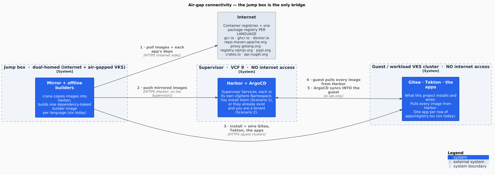

[](https://github.com/AndriyKalashnykov/vks-airgap-cicd/actions/workflows/ci.yml)
[](https://docs.renovatebot.com/)
[](LICENSE)
[](https://hits.sh/github.com/AndriyKalashnykov/vks-airgap-cicd/)

# Air-gapped CI/CD on VMware VKS

Reference implementation of an end-to-end CI/CD pipeline for a **fully air-gapped**
VKS cluster (VMware vSphere Kubernetes Service, VCF 9 + Supervisor). Two surfaces:

- **Pipeline surface** — self-hosted **Gitea** + **Tekton** (test → **Kaniko** build →
  **Harbor** push → GitOps tag write-back), wired to **Harbor** + **ArgoCD**, which run as **Supervisor Services** (you install them, or they already exist and you are a tenant).
- **Delivery surface** — an OS-portable (Ubuntu / PhotonOS) jump-box image mirror (**crane**,
  dual-homed or **[sneakernet](docs/sneakernet.md)** — carry the bundle across on a stick when the jump
  box has internet but no route to Harbor), a dependency-baked offline **Maven** builder, an **optional** pluggable
  ingress (**Istio** default, **Traefik** optional — or **attach to an Istio the platform team already
  installed**) fronting the UIs at `*.vks.local`, and a **KinD** end-to-end that proves the whole flow
  locally.

  The ingress is **optional**: it only decides *how you reach the UIs*. The pipeline itself is proven
  over a port-forward, so it needs no ingress and no `/etc/hosts` entry. Add one when you want
  `*.vks.local` URLs.

<p align="center"></p>

<p align="center"><em>The jump box is the only bridge — it pulls from the internet and pushes into the air-gapped cluster, which has no internet access of its own.</em></p>

> A developer pushes a change to **Gitea** → **Tekton** runs tests, builds a container
> image with **Kaniko** and pushes it to **Harbor** → Tekton bumps the image tag in the
> deploy repo → **ArgoCD** syncs the new version to the cluster → the web UI updates.
> On VKS, **Harbor** and **ArgoCD** run as **Supervisor Services** (on the Supervisor —
> you either install them, or they already exist and you're a tenant), and **Istio** is a guest-cluster
> **VKS Standard Package** your cluster owner may or may not have installed — so this project
> **attaches** to that mesh (`INGRESS_CONTROLLER=istio-existing`), and only helm-installs its own,
> with images from your Harbor, when there is none. `make istio-preflight` tells you which case you
> are in — never install over a mesh you did not install. What this project always owns: mirroring every required image into Harbor, and
> installing + wiring **Gitea + Tekton** and the demo app.
> See [`docs/vks-services/`](docs/vks-services/) for what each service is, and how to install/configure/use it.

## What the demo deploys

The demo ships **two apps, in two languages**, and runs both through the *same* walk:
`git push` → Tekton (test → Kaniko build → Harbor → tag write-back) → ArgoCD → the live page.
`apps/registry.tsv` is the single source of truth — everything else loops over it.

**The languages are not decoration — they are the air-gap story.** An in-cluster build reaches no
package registry, so every app ships a **pre-baked builder image** (`Dockerfile.builder`) carrying
its own dependency cache: `~/.m2` for Java, the module cache for Go. Both are built on the
internet-connected jump box, pushed to Harbor, and consumed by the offline build — same pipeline
either way. Each app is verified independently, so a green `javawebapp` never hides a broken
`gowebapp`, and `make check-ui-contract` requires every app to render an **identical page**, so they
differ in data and never in layout.

Adding an app is **one row** in `apps/registry.tsv` — but the row is an **enrolment**, so add it
only once the app is finished (it enrols the app in every gate at once). See
[Adding an app](docs/adding-an-app.md).
As a **tenant** it may also need grants you must request:
[Scenario 2 → adding an app as a tenant](docs/scenario-2.md#adding-an-app-as-a-tenant).

## Choose your path

New here? Pick the path that matches your situation — each one is self-contained end to end:

1. **VKS — I install Harbor + ArgoCD** (as **Supervisor Services**) — I am the admin: I provision the workload cluster too, then run the pipeline.
2. **VKS — Harbor + ArgoCD already exist** — I am a **tenant**: I **discover** them,
   **request** what I'm not allowed to self-service, then run the pipeline.
3. **KinD** — *see it work.* No VKS cluster, **zero `.env`**.

| I want to… | Path | You need |
|------------|------|----------|
| **VKS — I install Harbor + ArgoCD** (I am the admin) | [Scenario 1](docs/scenario-1.md) | **Have:** a vSphere login that can install a Supervisor Service, create a vSphere Namespace and provision a guest cluster · cluster-admin on that guest cluster · the licensed VCF CLI archives ([where to get them](docs/vks-authentication.md#acquiring-the-licensed-vcf-cli-archives))<br>**Reachable from the jump box:** the internet, the Supervisor API, Harbor — and ArgoCD's cluster must reach your guest API. |
| **VKS — Harbor + ArgoCD already exist** (I am a **tenant**) | [Scenario 2](docs/scenario-2.md) | **Have:** cluster-admin on your own guest cluster · Harbor **project-admin** (else ask for robot credentials) · the licensed VCF CLI archives ([where to get them](docs/vks-authentication.md#acquiring-the-licensed-vcf-cli-archives))<br>**Ask the platform team for:** your guest cluster **registered** with ArgoCD (admin-only) · an ArgoCD role that lets you create an `Application` · mesh rights — `make istio-preflight` prints exactly what to request<br>**Reachable from the jump box:** the internet and Harbor. |
| **Just see it work** (no VKS cluster) | [KinD](docs/kind-local.md) | **Have:** Docker (KinD needs Docker specifically) · internet access |

Pick one and follow it in order: each document answers the decisions in its own runbook, and
`make check-readme-scenarios` gates eight of them. The **container engine** below is the one
deliberate exception — it is decided here and not repeated in them. Each path opens by getting the
repo onto the box; the two VKS paths do it through a shared
[Common bootstrap](docs/common-bootstrap.md). Once it is up:
**[Access the UIs](docs/access-uis.md)** — URLs, logins, passwords.

**Delivery (both VKS paths):** if no single box reaches **both** the internet *and* Harbor, mirror via
**[sneakernet](docs/sneakernet.md)** — pull on the internet box, carry the bundle across, push from the
air-gap box. (KinD is dual-homed, so there is no bundle to carry.)

> **Container engine — podman is the default and you do nothing.** `make deps` installs it, and it is the
> only engine that needs **no sudo on any box**. **Docker is supported too, opt-in.**
>
> **This applies to all three paths and is not repeated in them — and there is nowhere to "set" it.**
> `CONTAINER_ENGINE` must stay **commented** in `.env` (an uncommented value pins the engine and
> defeats both the auto-detection and any per-run override — `.env.example` says so at the key), so
> it has to ride the command or be exported:
>
> ```bash
> export CONTAINER_ENGINE=docker     # keep it exported for the whole session
> ```
>
> Run a bare `make deps` instead and you get **podman** — and podman then wins on every later bare
> `make`, because the engine is auto-detected and podman is preferred when both are present.
>
> | your situation | what you run | sudo? |
> |---|---|---|
> | **Default (podman)** | nothing — `make deps` installs it | **never** |
> | **You want docker** | `make deps CONTAINER_ENGINE=docker` (bootstrap) — then, **once Harbor exists**, `make trust-harbor` | **rootless: none** · **rootful: one per registry** (at `trust-harbor` time) |
> | Not sure what your box has | `make engine-check` (read-only — tells you the engine, the mode, and what it will cost) | — |
> | `make e2e-kind` (the KinD stand-in) | needs Docker **regardless** — kind's nodes *are* docker containers | — |
>
> Rootful docker's sudo cannot be engineered away; `make trust-harbor` prints the exact line to run.

## Reference

Background and deep-dives. A path document names the ones it needs — Scenario 2 links
[VKS authentication](docs/vks-authentication.md) for the licensed archives, and Scenario 1 lists
them inline — so you do not need to read these first.

| | |
|---|---|
| [Architecture](docs/architecture.md) | system context, containers, deployment, pipeline flow |
| [Tech stack](docs/tech-stack.md) | what the demo is built from |
| [Prerequisites — the manual path](docs/prerequisites-manual.md) | the step-by-step the bootstrap automates |
| [Sizing](docs/sizing.md) | jump-box disk + guest-cluster resources |
| [Repository layout](docs/repository-layout.md) | where things live |
| [Adding an app](docs/adding-an-app.md) | one row in `apps/registry.tsv` — what loops over it, and what a tenant must request |
| [Make targets](docs/make-targets.md) | a **curated subset** with context — `make help` is the exhaustive list |
| [CI/CD](docs/ci-cd.md) | what CI actually gates (and what it deliberately does not) |
| [VKS authentication](docs/vks-authentication.md) | how `$KUBECONFIG` is produced on VKS (`VKS_AUTH_METHOD`, the `vcf` CLI flow), and **why Scenario 1 needs a second kubeconfig**. Both VKS scenarios run `make vks-login` themselves; **the KinD path skips it entirely** |
| [Demo walkthrough](docs/demo-walkthrough.md) | drive the GitOps loop by hand |
| [VKS services](docs/vks-services/) | what Broadcom ships (Harbor / ArgoCD / Istio), and how confident we are in each fact |
| [Decisions](docs/decisions/) | one document per design decision, with the evidence behind it |

## Contributing

Open an issue or a pull request. Before you push:

```bash
make ci
```

`make ci` is a **superset** of what a PR runs, not the same thing: a PR runs `static-check-fast`,
`static-check-pr` (which omits `sec` — gitleaks, trivy-fs, trivy-config) and `secrets-scan`, while
the full `static-check` runs on the weekly schedule. Two differences can still make CI red on a
green local run — CI sets `GWAPI_REQUIRE_FETCH=1`, so a schema fetch that *skips* locally is a
*failure* there, and the code jobs are path-filtered, so a docs-only PR skips them entirely.

**Do not bump tool or image versions by hand** — [Renovate](https://docs.renovatebot.com/) owns
them: `.mise.toml`, `pom.xml`, `Dockerfile*` and `.github/workflows/*` through its own managers, and
`Makefile`, `.env.example`, `images/images.txt`, `k8s/**.yaml` and `scripts/**.sh` through custom
ones. A **partial** hand-edit fails `make ci`, because the same version lives in several files and
an alignment gate asserts they agree.

## License

Released under the [MIT License](LICENSE).
