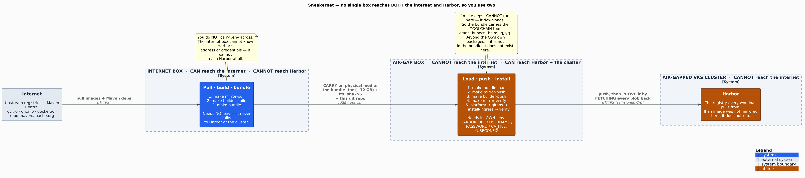

# Sneakernet — two boxes, one carried bundle

**Use this when no single box reaches both the internet and Harbor.** The **internet box** pulls the
images, you carry them across on media, the **air-gap box** pushes them in.

If one box reaches **both**, stop: run `make mirror`. Sneakernet is not a mode, it is just which commands
you run on which box.

(Elsewhere the repo says **jump box** for a single box that reaches both the internet and Harbor — the
dual-homed case. Sneakernet is for when no such box exists: the two roles below live on two separate
machines.)

<p align="center"><a href="diagrams/out/sneakernet.png"></a></p>

| | **internet box** | **air-gap box** |
|---|---|---|
| reaches the internet | ✅ | ❌ |
| reaches Harbor + the cluster | ❌ | ✅ |
| does | `mirror-pull` → `builder-build` → `bundle` | `bundle-load` → `mirror-push` → `builder-push` → `mirror-verify` → the install |
| needs a `.env` | no — it never talks to Harbor | yes — `HARBOR_*` + `KUBECONFIG` |

*(Mechanism and the measurements behind these choices: [`docs/decisions/sneakernet.md`](decisions/sneakernet.md).)*

---

## Step 0 — set up the internet box

**For:** it needs the full toolchain, and it is the only box that can download one.

```bash
git clone <this repo> && cd vks-airgap-cicd
make deps
```

**Expect:** `make deps` completes. This is the ordinary `make deps` bootstrap — nothing sneakernet-specific.

## Step 0b — set up the air-gap box

**For:** `make deps` **cannot run here** — it downloads. The air-gap box is provisioned by hand, once, before
anything is carried.

**Copy the repo onto it** (tar/scp/the same stick — **not** `git clone`; there is no internet).

**What it needs, and where each thing comes from:**

| | comes from | what |
|---|---|---|
| **the bundle carries it** — do NOT install these | `make bundle-load` puts them on `~/.local/bin` | `crane`, `kubectl`, `helm`, `jq`, `yq` (static binaries) |
| **you must provision it** — the bundle cannot carry it | your lab's **internal package mirror** | `bash` (4+), `tar`, `curl`, `sha256sum`, `make`, `git`, `openssl`, `envsubst` (gettext), `awk` (gawk), `sed`, `grep` |

The second row is OS packages, not static binaries, so they cannot ride in the tarball. **Do not assume
your base has them** — measured on the bare images:

| | already there | **missing — install these** |
|---|---|---|
| `photon:5.0` | bash, tar, gzip, find, curl, sha256sum, sed, grep | **make, gawk, git, openssl, gettext** (`envsubst`) |
| `ubuntu:26.04` | bash, tar, gzip, find, awk, sed, grep, sha256sum | **make, git, openssl, gettext-base, curl** |

> **`awk` is the one that bites.** Photon does not ship it, and it is not optional: `lib/apps.sh` reads
> `apps/registry.tsv` with it (**every** per-app loop) and `mirror-verify` does its digest lookup with it.
> A box without it passes every other check and then dies at `mirror-verify`.

No container engine is needed on the air-gap box: `crane` pushes images, and the Maven builder is carried
pre-built.

**Check it BEFORE you carry 12 GB across a room** — it is the cheapest failure available:

```bash
make check-tools CHECK_TOOLS_PHASE=pre-carry
```

**Expect:** the five carried tools report `CARRIED (in the bundle)` — **that is correct, they are not
supposed to be here yet** — and everything the tarball *cannot* bring must show `OK`:

```text
  kubectl      CARRIED    (in the bundle)      <- the bundle brings these five
  crane        CARRIED    (in the bundle)
  awk          OK         GNU Awk 5.3.1        <- THESE are what you are checking
  envsubst     OK         ...
  PRE-CARRY OK — everything the bundle CANNOT bring is present on this box.
```

If an **OS package** is missing (`awk`, `tar`, `curl`, `git`, `openssl`, `envsubst`, `make`,
`sha256sum`) it exits non-zero and points you at your lab's package mirror. Fix it **now** — the tarball
cannot carry it.

> **The `CHECK_TOOLS_PHASE=pre-carry` flag is not decoration.** Without it, `check-tools` treats the five
> as missing (correct on every *other* box) and tells you to run `make deps` — **which downloads from the
> internet**, and this box has none.

**After `make bundle-load`** (Step 3), run a plain `make check-tools`: it must be **fully clean**. That
run is the one that proves this box can actually run the install.

**Its `.env` must carry:** `HARBOR_URL`, `HARBOR_USERNAME`, `HARBOR_PASSWORD`, and either `HARBOR_CA_FILE`
(carry the CA) or `HARBOR_INSECURE=1`.

> **If the air-gap box already has its own `kubectl`/`helm`, `bundle-load` KEEPS it** and says so, rather
> than shadowing it with the carried one — your lab's kubectl is probably pinned to your cluster's
> version, and silently overriding it is a version-skew bug we would have handed you. Force ours with
> `BUNDLE_TOOLS_FORCE=1` if the box's copy is broken or the wrong arch.

---

## Step 1 — pull and build, on the internet box

```bash
make mirror-pull      # every image in images/images.txt → ./bundle
make builder-build    # the offline Maven builder → ./bundle/builders/ (needs Maven Central; NOT Harbor)
make bundle           # → vks-airgap-cicd-bundle-<date>.tar  + its .sha256
```

**Expect:** `staged crane / kubectl / helm / jq / yq` (each `static`), then `toolchain staged (…)`,
`bundle ready: …tar (12G)`, and a `.sha256` beside it.

`mirror-pull` **resumes** — re-run it after a dropped connection and it skips what already completed.

> **`builder-build` is not optional for the Java app.** Its Maven dependencies are baked into an image on
> the internet side, because the in-cluster Kaniko build cannot reach Maven Central. The air-gap box cannot
> build it (no internet) and the internet box cannot push it (no Harbor) — so it is **carried in the bundle**
> and pushed on the far side by `make builder-push`.

<!-- -->

> **Container engine — only the INTERNET box's matters.** `builder-build` runs `<engine> build` + `<engine>
> save` under `CONTAINER_ENGINE` (podman by default; `make builder-build CONTAINER_ENGINE=docker` uses
> docker). Both `podman save` and `docker save` emit the same crane-readable `docker-archive`, which is why
> the **air-gap box needs no engine at all** — `crane` pushes the carried tarball. To exercise the whole
> sneakernet under docker: `make e2e-sneakernet CONTAINER_ENGINE=docker`; for a fast, deterministic check
> of just the `<engine> save` → `crane push` round-trip (docker AND podman): `make test-builder-save-crane`.

## Step 2 — carry

Copy **the tarball, its `.sha256`, and the repo**. All three, on the same media.

> **A FAT32 stick cannot hold a file over 4 GiB, and this bundle is ~12 GB.** Use exFAT/ext4/XFS/NTFS, or
> `split -b 3G` and `cat` it back. `make bundle` warns you.

## Step 3 — push, on the air-gap box

```bash
make bundle-load BUNDLE_TARBALL=/media/…/vks-airgap-cicd-bundle-<date>.tar
make mirror-push      # every mirrored image → Harbor
make builder-push     # the carried Maven builder → Harbor
make mirror-verify    # PROVE it: crane fetches every blob back out of Harbor
```

> **The carried tools land in `~/.local/bin`, which must be on your `PATH`.** `bundle-load` installs them
> there and then, if that directory is not on your `PATH`, stops at the end with the exact `export
> PATH="$HOME/.local/bin:$PATH"` line to add (or re-run with `BIN_DIR=/usr/local/bin`, a directory already
> on it) — do that and re-run. It checks this during `bundle-load`, before `mirror-push` needs `crane`.

**Expect:** `verifying checksum` → `installed crane -> ~/.local/bin/crane` (and the same for any of
`kubectl`/`helm`/`jq`/`yq` this box did not already have) → `carried toolchain: N installed, M already
present and kept` → `✓ mirror-verify: N images intact in Harbor`.

> **Do not skip `mirror-verify`.** An OCI push asks the registry `HEAD <blob>` and **skips the upload if
> the registry says it already has it** — so a registry that lies turns your whole mirror into a no-op that
> **exits 0**. That has happened here. Verify by *fetching*, never by the pusher's exit code.

## Step 4 — install, on the air-gap box

```bash
make platform gitops                       # Gitea + Tekton, then the ArgoCD Application
make install-ingress   # default: install istio from the CARRIED charts (no internet). On a REAL VKS mesh use istio-existing — see the table below.
make verify
```

**Do NOT run `make install-all` on the air-gap box** — it starts with `mirror`, which needs the internet.
Run the steps above instead.

**If you stop before `gitops`** — as the automated air-gap leg does — the apps have no pods yet, so
`make verify` and `make verify-ingress` cannot pass: they assert every host reaches a *live* backend.
Run **`make verify-ingress-rendered`** instead. It checks something narrower and, at that point, more
useful: that the **carried** `yq`/`envsubst`/`kubectl` actually rendered the per-app Gateway hosts and
VirtualServices. Each app host must answer **5xx** — a 503 means Envoy matched a rendered route and
found no endpoints, whereas a 404 would mean the route was never rendered at all. It is *additive*:
it never replaces `verify-ingress`, and narrowing that gate to make it pass here would be loosening a
verification gate to obtain green.

**Ingress — pick one. All three work here; none needs the internet.**

| | when |
|---|---|
| `INGRESS_CONTROLLER=istio` (default) | you install the mesh. Charts are carried in the bundle. |
| `INGRESS_CONTROLLER=istio-existing` | the platform team already runs Istio — attach, install nothing. **The usual real-lab answer.** |
| `INGRESS_CONTROLLER=traefik` | you want the smallest thing that routes. |

---

## `MIRROR_FORCE_PULL=1` — when

The pull is cached, and that is safe by construction: digest-pinned images are content-addressed, and
tag-based refs are always re-pulled. Force it only when you **distrust the cache** (hand-edited, a disk
filled mid-write, a restored snapshot), when you are cutting a bundle for a **hand-off you cannot re-do**,
or when you are **debugging the mirror** and want the cache out of the picture. Otherwise it re-downloads
12 GB for nothing.

## How this is tested

`make e2e-sneakernet` runs the real two-box flow on KinD, on **both** far-side OSes by default
(`SNEAKERNET_OS = photon ubuntu`): the host plays the internet box, and **only the tarball** crosses into a
fresh container playing the air-gap box. Each OS leg gets a **fresh, empty Harbor**, so its push is a real
push and not a `HEAD`-skip no-op. The air-gap box asserts `./bundle` is empty and that `crane` is **not**
already installed before loading — so the images can only have come from the carried bundle.

`make airgap-toolchain-test` hardens the **toolchain** half beyond what `e2e-sneakernet` asserts. The
e2e's air-gap box does exercise all five — `jumpbox-run.sh` runs `make check-tools` after
`bundle-load`, and `03-check-tools.sh` lists `crane`/`kubectl`/`helm`/`jq`/`yq` as **`carried`**
(treated as required) and *executes* each one — so a bundle that dropped a tool would fail there. What
the e2e does **not** do is prove where they came from: it asserts only that **crane** was absent
beforehand, and its box sits on the `kind` network. The toolchain test closes exactly that gap — a box
with **no mise at all** (`jumpbox/Dockerfile.airgap` — OS packages only) and **`--network none`**, so
nothing can arrive from anywhere; it asserts **all five** are absent first (a pre-provisioned box
proves nothing), then that each is installed **and executes**, on both Photon and Ubuntu.
