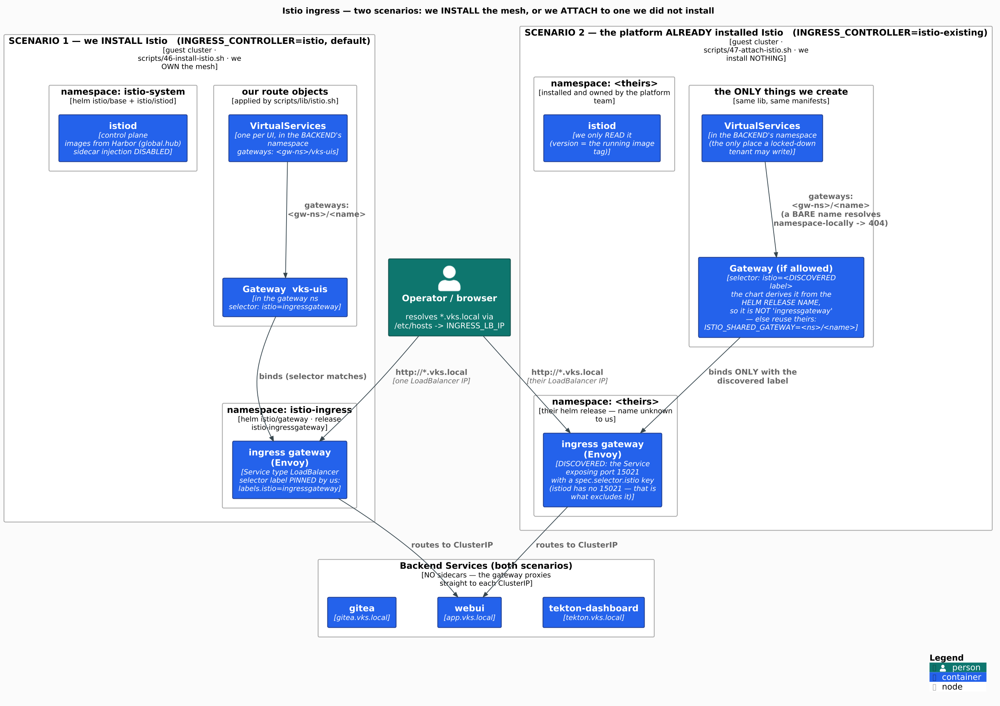

# Istio on VKS

**Where it runs:** the **GUEST / workload cluster** — *not* the Supervisor.
**Who installs it:** the cluster owner, as a **VKS Standard Package**. Not us.
**What we do:** **attach** to it (`INGRESS_CONTROLLER=istio-existing`) — we install nothing.

> **The one-line answer to "how do we get Istio's credentials?"**
> **There are none.** Istio has no login, no bearer token, no admin API, no UI. Access to the mesh
> is plain **kubectl RBAC**. The only credential-shaped object anywhere near it is a TLS `Secret`
> named by `Gateway.tls.credentialName`, which must live in the **gateway's** namespace — so it is
> something you **request from the mesh admin**, never something you fetch. (Contrast Harbor and
> ArgoCD, which do have real admin passwords.)

## What Broadcom ships

| Fact | Value | Confidence |
|---|---|---|
| Packaging | Carvel **Standard Package**, installed into the **guest cluster** | 9.0-doc (inferred for 9.1) [src: url=https://techdocs.broadcom.com/us/en/vmware-cis/vcf/vcf-service-administration-and-development/9-0/managing-vsphere-kuberenetes-service-clusters-and-workloads/installing-standard-packages-on-tkg-service-clusters/installing-standard-packages-on-tkg-cluster-using-tkr-for-vsphere-8-x/installaing-and-using-istio/install-istio.html date=2026-07-15 quote="Follow these instructions to install the Istio carvel package on a VKS cluster that is running VKr 1.29 and later."] |
| Package name | `istio.kubernetes.vmware.com` | 9.0-doc (inferred for 9.1) [src: url=https://techdocs.broadcom.com/us/en/vmware-cis/vcf/vcf-service-administration-and-development/9-0/managing-vsphere-kuberenetes-service-clusters-and-workloads/installing-standard-packages-on-tkg-service-clusters/installing-standard-packages-on-tkg-cluster-using-tkr-for-vsphere-8-x/installaing-and-using-istio/install-istio.html date=2026-07-15 quote="istio.kubernetes.vmware.com"] |
| Versions | VMware-built, e.g. `1.25.3+vmware.1-vks.1`, `1.28.2+vmware.1-vks.1` | 9.0-doc — **re-check the exact strings on a lab** [src: url=https://techdocs.broadcom.com/us/en/vmware-cis/vcf/vcf-service-administration-and-development/9-0/managing-vsphere-kuberenetes-service-clusters-and-workloads/installing-standard-packages-on-tkg-service-clusters/installing-standard-packages-on-tkg-cluster-using-tkr-for-vsphere-8-x/installaing-and-using-istio/install-istio.html date=2026-07-15 quote="1.25.3+vmware.1-vks.1"] |
| Install (package CLI) | `vcf package install istio -p istio.kubernetes.vmware.com -v <ver> --values-file istio-data-values.yaml -n istio-installed` | 9.0-doc [src: url=https://techdocs.broadcom.com/us/en/vmware-cis/vcf/vcf-service-administration-and-development/9-0/managing-vsphere-kuberenetes-service-clusters-and-workloads/installing-standard-packages-on-tkg-service-clusters/installing-standard-packages-on-tkg-cluster-using-tkr-for-vsphere-8-x/installaing-and-using-istio/install-istio.html date=2026-07-15 quote="vcf package install istio -p istio.kubernetes.vmware.com -v 1.25.3+vmware.1-vks.1 --values-file istio-data-values.yaml -n istio-installed"] |
| Install (VCF 9 addon CLI) | `vcf addon install create istio --cluster-name $VKS_CLUSTER -y` · update: `vcf addon install update istio --cluster-name $VKS_CLUSTER -f values.yaml` | community (VMware VCF blog, 2025-03, VKS 3.5) [src: url=https://blogs.vmware.com/cloud-foundation/2025/03/06/istio-on-vsphere-kubernetes-service-vks-a-walkthrough/ date=2026-07-15 quote="vcf addon install create istio --cluster-name $VKS_CLUSTER -y"] |
| Control-plane namespace | `istio-system` (configurable) | 9.0-doc [src: url=https://techdocs.broadcom.com/us/en/vmware-cis/vcf/vcf-service-administration-and-development/9-0/managing-vsphere-kuberenetes-service-clusters-and-workloads/installing-standard-packages-on-tkg-service-clusters/standard-package-reference/istio-package-reference.html date=2026-07-15 quote="The namespace in which to install Istio. It is also the root namespace in the mesh."] |
| **Ingress gateway** | **DISABLED by default** (`istio.gateways.ingress.enabled: false`); namespace `istio-ingress` when enabled | 9.0-doc [src: url=https://techdocs.broadcom.com/us/en/vmware-cis/vcf/vcf-service-administration-and-development/9-0/managing-vsphere-kuberenetes-service-clusters-and-workloads/installing-standard-packages-on-tkg-service-clusters/standard-package-reference/istio-package-reference.html date=2026-07-15 quote="It is auto deployed if istio.gateways.ingress.enabled is true in the data values, the default value is false."] |
| Data plane | **sidecar** by default; **ambient** supported (needs `istioCNI.enabled: true`) | 9.0-doc (ambient half cited; sidecar-default is inferred) [src: url=https://techdocs.broadcom.com/us/en/vmware-cis/vcf/vcf-service-administration-and-development/9-0/managing-vsphere-kuberenetes-service-clusters-and-workloads/installing-standard-packages-on-tkg-service-clusters/standard-package-reference/istio-package-reference.html date=2026-07-15 quote="A DaemonSet to power Istio's ambient data plane mode, which is responsible for securely connecting and authenticating workloads within the mesh."] |
| Air-gap / private registry | a Secret with registry credentials named in `istio.meshConfig.imagePullSecrets` | 9.0-doc [src: url=https://techdocs.broadcom.com/us/en/vmware-cis/vcf/vcf-service-administration-and-development/9-0/managing-vsphere-kuberenetes-service-clusters-and-workloads/installing-standard-packages-on-tkg-service-clusters/standard-package-reference/istio-package-reference.html date=2026-07-15 quote="Enabling Istio sidecar or gateway injection requires a Secret with registry credential in the application's namespace, and its name must be specified in istio.meshConfig.imagePullSecrets."] |
| **Route API Broadcom demonstrates** | the **Kubernetes Gateway API** (`gatewayClassName: istio`) → auto-provisioned Service `<gateway-name>-istio`, type LoadBalancer, **in the app's own namespace** | community (VMware VCF blog) [src: url=https://blogs.vmware.com/cloud-foundation/2025/03/06/istio-on-vsphere-kubernetes-service-vks-a-walkthrough/ date=2026-07-15 quote="gatewayClassName: istio"] |

**Two consequences that change what you must do:**

1. The shared ingress gateway is **off by default** — so on a real cluster there may be **nothing
   for the classic `Gateway`/`VirtualService` path to bind to**.
2. Broadcom routes with the **Gateway API** — which is *also* the easier path for a tenant (below).

## How to configure a mesh you did not install

### 1. Discover it (all `kubectl`, no CLI)

| What | How | Confidence |
|---|---|---|
| istiod namespace | `kubectl get deploy -A -l app=istiod` | KinD-verified [src: code:scripts/lib/istio.sh:52] |
| Istio version | the running **istiod image tag** — ground truth, never a doc | KinD-verified [src: code:scripts/lib/istio.sh:56-57] |
| **Ingress gateway Service** | a Service exposing **port 15021** (the istio-proxy status-port) **and** carrying a `spec.selector.istio` key | KinD-verified [src: code:scripts/lib/istio.sh:69-70] |
| **Gateway selector label** | `kubectl -n <ns> get svc <svc> -o jsonpath='{.spec.selector.istio}'` | KinD-verified [src: code:scripts/90-e2e-istio-existing.sh:112] |
| Route API in use | is there an **Accepted `GatewayClass` named `istio`**? → Gateway API. Else classic. | KinD-verified [src: code:scripts/lib/istio.sh:222-224] |

The **15021** signature matters: istiod does **not** expose it (it serves 15010/15012/443/15014),
so this cleanly excludes the control plane. A naive `app.kubernetes.io/part-of=istio` label match
picks **istiod** instead, and every route then silently fails to bind.

`make istio-preflight` does all of this, read-only, and tells you what to request from the mesh admin.

### 2. The load-bearing gotcha: the selector is NOT a constant

The `istio/gateway` helm chart derives the gateway workload's `istio:` label **from the helm release
name**. Installed as release `platform-gw`, the gateway is labelled `istio: platform-gw` — *not*
`ingressgateway`.

```text
svc/platform-gw   spec.selector = {"app":"platform-gw","istio":"platform-gw"}
```

So a `Gateway` with a hardcoded `selector: {istio: ingressgateway}` **binds nothing** on a mesh you
did not install — and **the API server accepts it without any error**. (KinD-verified.)

### 3. Two silent failure modes, with distinct symptoms

| Mistake | Symptom | Confidence |
|---|---|---|
| `Gateway.spec.selector` matches no workload | Envoy never gets a listener → **connection refused** (no HTTP at all) | KinD-verified [src: code:scripts/90-e2e-istio-existing.sh:177-180] |
| `VirtualService` names the Gateway by **bare name** from another namespace | the name resolves **namespace-locally** → **404** | KinD-verified [src: code:scripts/lib/istio.sh:387-390] |

Nothing validates that a Gateway's selector matches a real workload. That is why discovery — not
documentation — is the mechanism.

### 4. Attach: prefer the Gateway API

| | **gateway-api** (preferred) | **classic** |
|---|---|---|
| Needs a pre-existing gateway workload? | **No** — Istio **auto-provisions** the proxy *and* its LoadBalancer | Yes, and its selector must be discovered |
| Needs anything from the mesh admin? | **For routing, no** — only rights in your own namespaces. **On an air-gapped mesh whose proxy registry needs auth, yes** — a gateway pull-secret (see the Air-gap row). | Usually (rights in the gateway ns, or a shared Gateway to reference) |
| Air-gap | **Free only when WE install** (`INGRESS_CONTROLLER=istio`: we set `global.hub=<Harbor>` and the infra project is anonymous-pull). **On an ATTACHED VKS-package mesh: NOT automatic** — the auto-provisioned `<gw>-istio` proxy takes its image from the *mesh's* istiod hub, so pulling depends on the mesh's registry. See the note below. | already configured by whoever installed the mesh |
| Works when the VKS package's shared gateway is OFF (the default)? | **Yes** | **No — nothing to bind to** |

`ISTIO_ROUTE_API=auto` (default) picks the Gateway API whenever Istio is an Accepted `GatewayClass`,
else falls back to classic.

> **Gateway API CRDs.** We install them when we own the cluster (`istio_ensure_gwapi_crds`,
> `GATEWAY_API_VERSION`), carry them in the air-gap bundle, and **say so** when they are absent rather than
> degrading silently to the classic path (whose shared gateway the VKS package ships **disabled**). **A
> tenant cannot install them** (cluster-scoped) — `istio-preflight` prints that ask.
>
> **CONFIRMED 9.1-doc (2026-07-14): a VKS 9.1 guest cluster SHIPS the Gateway API CRDs by default** — from
> the VKr (the cluster image), not Istio; from VKS 3.7.0 / VKr 1.36 they are a VKS-**managed** add-on, ON
> by default, with an opt-OUT label `addon.addons.kubernetes.vmware.com/gateway-api: unmanaged` (VKS 3.7
> Add-ons RN, `/9-1/`, 200).
>
> **So the risk is the VERSION, not the presence** (Backlog **B2**): the CRDs are VKS-managed at the VKr's
> chosen version while `istio_ensure_gwapi_crds` server-side-applies our pinned `GATEWAY_API_VERSION`, so
> on a real lab we may up/down-grade a CRD the add-on manager owns. The VKr→gateway-api version map is not
> published in any Broadcom doc; only the cluster answers it —
> `kubectl get crd gateways.gateway.networking.k8s.io -o jsonpath='{.metadata.annotations.gateway\.networking\.k8s\.io/bundle-version}'`
> plus the `addon.addons.kubernetes.vmware.com/gateway-api` label. **Grade: mechanism KinD-verified;
> "CRDs present by default" 9.1-doc; the exact version + whether to defer to it is lab-only (B2).** This
> column was once mis-graded `KinD-verified` for a false reason; arc in
> [`docs/reviews/2026-07-14-vks-provenance.md`](../reviews/2026-07-14-vks-provenance.md).
> <!-- arc-ok: 2026-07-14 -->

<!-- -->

> **`--gateway-channel=disabled` on cloud-provider-kind is load-bearing: drop it and a CPK that vendors
> gateway-api < v1.5.0 silently kills every LoadBalancer.** The `safe-upgrades`
> `ValidatingAdmissionPolicy` ships in the **standard** bundle **we already install** — it is in the
> cluster today, not a future hazard (`bundle/manifests/gateway-api-v1.5.1.yaml`, `channel: standard`).
> Its CEL denies any gateway-api CRD whose `bundle-version` matches `v1.[0-4].\d+` or `v0` (i.e. anything
> before v1.5.0), and denies experimental-on-standard. CPK force-reconciles its **embedded** CRDs at
> startup with a plain `Create()`, so it is subject to that policy: **CPK v0.11.1 vendors v1.5.1 and
> passes**. What defuses this is CPK's vendored version **plus** the flag — not our pin. If the flag were
> ever dropped (a refactor, a CPK bump) **and** CPK vendored an older bundle, its CRD install would be
> DENIED, it aborts its **whole** controller, and every Service of type LoadBalancer silently stops
> getting an IP — surfacing as "Harbor LB did not get an external IP", which points nowhere near an
> admission policy. This is why `05-kind-up.sh` asserts CPK logged the skip and counts its **crash
> lines** rather than trusting `docker ps` (a `--restart unless-stopped` container shows `Up` *between*
> crash-loop cycles).
>
> Two separate controls are often confused with this one, and neither is about the VAP: `renovate.json`
> **groups** istio + gateway-api because a solo CRD bump re-introduces the `supportedFeatures`
> `[]string`→`[]object` skew that crash-loops controllers; and it **caps** gateway-api at
> `allowedVersions: <v1.6.0` because v1.5.1 is the newest any Istio vendors (remove the cap when an
> Istio release vendors v1.6+ — the condition is inline there).
>
> **Grade: the policy, its CEL and the channel are source-verified from the on-disk bundle
> (2026-07-16); CPK's vendored version and the LB-death consequence are asserted by
> `scripts/05-kind-up.sh`'s startup checks, not observed as a failure here.**

<!-- -->

> **Air-gap on an ATTACHED mesh — the pull-secret you may owe (9.0-doc).**
> The `<gw>-istio` proxy Istio auto-provisions in `vks-ingress` (`ISTIO_GWAPI_NAMESPACE`)
> takes its image from the **mesh's** istiod hub — whatever the platform team set, NOT your
> Harbor. If that registry requires authentication, the proxy pod **ImagePullBackOffs** and the
> Gateway never programs, unless a `kubernetes.io/dockerconfigjson` Secret — whose name is listed
> in the mesh's `istio.meshConfig.imagePullSecrets` — exists in `vks-ingress`. That is two objects:
>
> | Object | Owner |
> |---|---|
> | the dockerconfigjson **Secret**, in `vks-ingress` (your own namespace) | **you** create it |
> | that Secret's **name** in `istio.meshConfig.imagePullSecrets` (mesh-global) | **mesh admin** (usually already set for the mesh to run air-gapped at all) |
>
> **What to do:** ask the mesh admin — (1) does the mesh pull `proxyv2` from an authenticated
> registry? If anonymous-pull, you need nothing. (2) If authenticated: the imagePullSecret **name**
> in `istio.meshConfig.imagePullSecrets`, plus credentials for that registry. Then create that Secret
> (that exact name) in `vks-ingress` yourself. The KinD e2e never exercises this: the fixture installs
> the platform istiod with `global.hub=<Harbor>` (`scripts/90-e2e-istio-existing.sh`) **and** Harbor's
> infra project is anonymous-pull, so the auto-provisioned proxy pulls with no secret.
>
> **Grade: 9.0-doc** (Istio *Package Reference*, `/9-0/`; the `/9-1/` page 404s — same source as the
> **Air-gap / private registry** row of the confidence table above). Whether
> `istio.meshConfig.imagePullSecrets` propagates onto the **Gateway-API-provisioned** Deployment
> specifically (vs. classic sidecar/gateway injection) is **lab-unverified** — the doc says "sidecar
> **or** gateway injection".

### 5. RBAC — this *is* the access model

Measured with `kubectl auth can-i --as=system:serviceaccount:…` for a tenant holding only
`virtualservices` rights in its own namespace (KinD-verified):

| Action | Allowed? |
|---|---|
| create VirtualServices/HTTPRoutes in its **own** namespaces | **yes** |
| create a `Gateway` in the **gateway** namespace | **no** |
| create a VirtualService in the gateway namespace | **no** |
| **read the gateway Service** (i.e. run discovery at all) | **no** |

So a locked-down tenant cannot even *discover* the mesh — the values must be handed over. Set
`ISTIO_GATEWAY_NAMESPACE` / `ISTIO_GATEWAY_SERVICE` / `ISTIO_GATEWAY_LABEL` in `.env` and discovery
is skipped entirely.

## Pod Security Admission — it will reject your pods

A VKS guest cluster **enforces the `restricted` Pod Security Standard by default from VKr v1.26** —
*"pods violating security are rejected unless namespace configuration is changed"* (9.0-doc). Only
`kube-system`, `tkg-system`, `vmware-system-cloud-provider` are exempt. **KinD enforces nothing**, so
this is invisible locally.

Measured minimums (KinD-verified, via a server-side dry-run label — `make psa-check`):

| Namespace | Minimum | Why |
|---|---|---|
| `gitea`, `tekton-pipelines`, `javawebapp` | `restricted` | compliant as they ship |
| **`ci`** (build TaskRuns) | **`baseline`** | **Kaniko builds as root** (`runAsUser=0`, unrestricted caps, no `seccompProfile`) |
| **the namespace holding your `Gateway`** | **`baseline`** | the proxy Istio **auto-provisions** sets no `seccompProfile` — and **the platform's istiod creates that pod, not you**, so you cannot make it compliant |

## What we run

| Command | Does |
|---|---|
| `make istio-preflight` | read-only: is Istio here, what selector does it require, what may this kubeconfig do, what must the mesh admin grant? |
| `make install-ingress INGRESS_CONTROLLER=istio-existing` | attach — installs **nothing** |
| `make psa-check` | would this cluster even admit our pods? |
| `make install-ingress` (default `istio`) | **install** the mesh — KinD / a mesh-free cluster **only** |
| `make e2e-kind-istio-existing` | regression test: a "platform team" installs Istio under **foreign naming**, we attach, **both** route APIs |



## Open / unverified

- Exact VKS 9.1 Istio package **version strings** (the Istio *Package Reference* page resolves only to
  the `/9-0/` tree — its `/9-1/` path 404s — so the version strings are 9.0-sourced).
- Does the **VMware-built** Istio set `seccompProfile` on istiod / the provisioned proxy? If it
  does, the ingress namespace could tighten to `restricted`. `make psa-check` measures it on the
  actual cluster.
- Ambient mode (`istioCNI.enabled: true`) on VKS with Antrea — untested here.
- Whether a platform-supplied mesh in *your* lab exposes the shared gateway at all.

## Sources

- Broadcom TechDocs — *Istio Package Reference*, *Install Istio* (these pages resolve only to the
  `/9-0/` tree today; the VKS **Add-ons** release notes are genuine 9.1 at `/9-1/`, and confirm Istio
  is a guest-cluster package and that *Standard Packages* was renamed to *VKS Add-ons* in 3.7.0)
- Broadcom TechDocs — *Configure PSA for VKr 1.25 and Later*
- VMware VCF blog — *Istio on vSphere Kubernetes Service (VKS): A Walkthrough* (2025-03, VKS 3.5)
- This repo: `docs/decisions/istio-on-vks.md` (the decision + the full verification matrix)
