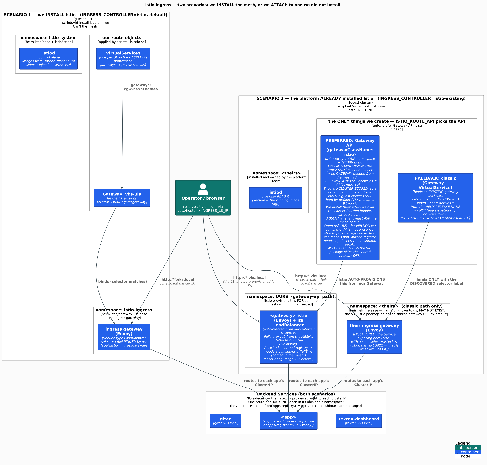

# Istio on VKS

**Where it runs:** the **GUEST / workload cluster** — *not* the Supervisor.
**Who installs it:** the cluster owner, as a **VKS Standard Package**. Not us.
**What we do:** **attach** to it (`INGRESS_CONTROLLER=istio-existing`) — we install nothing.

> **The one-line answer to "how do we get Istio's credentials?"**
> **There are none.** Istio has no login, no bearer token, no admin API, no UI. Access to the mesh
> is plain **kubectl RBAC**. The only credential-shaped object anywhere near it is a TLS `Secret`
> named by `Gateway.tls.credentialName`, which must live in the **gateway's** namespace — so it is
> something you **request from the mesh admin**, never something you fetch. (Contrast Harbor and
> ArgoCD, which do have real admin passwords.)

## What Broadcom ships

| Fact | Value | Confidence |
|---|---|---|
| Packaging | Carvel **Standard Package**, installed into the **guest cluster**; requires **VKr 1.29 or later** | 9.0-doc (inferred for 9.1) [src: url=https://techdocs.broadcom.com/us/en/vmware-cis/vcf/vcf-service-administration-and-development/9-0/managing-vsphere-kuberenetes-service-clusters-and-workloads/installing-standard-packages-on-tkg-service-clusters/installing-standard-packages-on-tkg-cluster-using-tkr-for-vsphere-8-x/installaing-and-using-istio/install-istio.html date=2026-07-15 quote="Follow these instructions to install the Istio carvel package on a VKS cluster that is running VKr 1.29 and later."] |
| Package name | `istio.kubernetes.vmware.com` | 9.0-doc (inferred for 9.1) [src: url=https://techdocs.broadcom.com/us/en/vmware-cis/vcf/vcf-service-administration-and-development/9-0/managing-vsphere-kuberenetes-service-clusters-and-workloads/installing-standard-packages-on-tkg-service-clusters/installing-standard-packages-on-tkg-cluster-using-tkr-for-vsphere-8-x/installaing-and-using-istio/install-istio.html date=2026-07-15 quote="istio.kubernetes.vmware.com"] |
| Versions | VMware-built, e.g. `1.25.3+vmware.1-vks.1`, `1.28.2+vmware.1-vks.1` | 9.0-doc — **re-check the exact strings on a lab** [src: url=https://techdocs.broadcom.com/us/en/vmware-cis/vcf/vcf-service-administration-and-development/9-0/managing-vsphere-kuberenetes-service-clusters-and-workloads/installing-standard-packages-on-tkg-service-clusters/installing-standard-packages-on-tkg-cluster-using-tkr-for-vsphere-8-x/installaing-and-using-istio/install-istio.html date=2026-07-15 quote="1.25.3+vmware.1-vks.1"] |
| Install (package CLI — **LEGACY path**; see the repository-add note below) | `vcf package install istio -p istio.kubernetes.vmware.com -v <ver> --values-file istio-data-values.yaml -n istio-installed` | 9.0-doc [src: url=https://techdocs.broadcom.com/us/en/vmware-cis/vcf/vcf-service-administration-and-development/9-0/managing-vsphere-kuberenetes-service-clusters-and-workloads/installing-standard-packages-on-tkg-service-clusters/installing-standard-packages-on-tkg-cluster-using-tkr-for-vsphere-8-x/installaing-and-using-istio/install-istio.html date=2026-07-15 quote="vcf package install istio -p istio.kubernetes.vmware.com -v 1.25.3+vmware.1-vks.1 --values-file istio-data-values.yaml -n istio-installed"] |
| Install (VCF 9 addon CLI) | `vcf addon install create istio --cluster-name $VKS_CLUSTER -y` · update: `vcf addon install update istio --cluster-name $VKS_CLUSTER -f values.yaml` | community (VMware VCF blog, 2025-03, VKS 3.5) [src: url=https://blogs.vmware.com/cloud-foundation/2025/03/06/istio-on-vsphere-kubernetes-service-vks-a-walkthrough/ date=2026-07-15 quote="vcf addon install create istio --cluster-name $VKS_CLUSTER -y"] |
| Control-plane namespace | `istio-system` (configurable) | 9.0-doc [src: url=https://techdocs.broadcom.com/us/en/vmware-cis/vcf/vcf-service-administration-and-development/9-0/managing-vsphere-kuberenetes-service-clusters-and-workloads/installing-standard-packages-on-tkg-service-clusters/standard-package-reference/istio-package-reference.html date=2026-07-15 quote="The namespace in which to install Istio. It is also the root namespace in the mesh."] |
| **Ingress gateway** | **DISABLED by default** (`istio.gateways.ingress.enabled: false`); namespace `istio-ingress` when enabled | 9.0-doc [src: url=https://techdocs.broadcom.com/us/en/vmware-cis/vcf/vcf-service-administration-and-development/9-0/managing-vsphere-kuberenetes-service-clusters-and-workloads/installing-standard-packages-on-tkg-service-clusters/standard-package-reference/istio-package-reference.html date=2026-07-15 quote="It is auto deployed if istio.gateways.ingress.enabled is true in the data values, the default value is false."] |
| Data plane | **sidecar** by default; **ambient** supported (requires `istioCNI.enabled`) | 9.0-doc (ambient half cited; sidecar-default is inferred) [src: url=https://techdocs.broadcom.com/us/en/vmware-cis/vcf/vcf-service-administration-and-development/9-0/managing-vsphere-kuberenetes-service-clusters-and-workloads/installing-standard-packages-on-tkg-service-clusters/standard-package-reference/istio-package-reference.html date=2026-07-15 quote="A DaemonSet to power Istio's ambient data plane mode, which is responsible for securely connecting and authenticating workloads within the mesh."] |
| **`istio.istioCNI.enabled`** | **defaults to `true`** — so the `istio-cni-node` DaemonSet ships on a **sidecar** install too, not only in ambient mode. Do **not** read CNI as an ambient-only opt-in | 9.0-doc (inferred for 9.1) [src: url=https://techdocs.broadcom.com/us/en/vmware-cis/vcf/vcf-service-administration-and-development/9-0/managing-vsphere-kuberenetes-service-clusters-and-workloads/installing-standard-packages-on-tkg-service-clusters/standard-package-reference/istio-package-reference.html date=2026-07-22 quote="The flag to install istio-cni or not. DaemonSet istio-cni-node is deployed if it is true. It must be true if ambient mode is enabled."] |
| **`istio.gateways.egress.enabled`** | **defaults to `false`** — but a mesh admin may enable it, giving the cluster a **SECOND** gateway in `istio-egress`. See the attach-discovery warning below. ⚠️ The quoted description is **shared verbatim with the ingress flag**, so it does not discriminate this row; the `false` default is read from the page's parameter **table**, not from that sentence | 9.0-doc (inferred for 9.1) — default from the parameter table, read 2026-07-22 [src: url=https://techdocs.broadcom.com/us/en/vmware-cis/vcf/vcf-service-administration-and-development/9-0/managing-vsphere-kuberenetes-service-clusters-and-workloads/installing-standard-packages-on-tkg-service-clusters/standard-package-reference/istio-package-reference.html date=2026-07-22 quote="The flag to install Istio gateway static component."] |
| Air-gap / private registry | a Secret with registry credentials named in `istio.meshConfig.imagePullSecrets` | 9.0-doc [src: url=https://techdocs.broadcom.com/us/en/vmware-cis/vcf/vcf-service-administration-and-development/9-0/managing-vsphere-kuberenetes-service-clusters-and-workloads/installing-standard-packages-on-tkg-service-clusters/standard-package-reference/istio-package-reference.html date=2026-07-15 quote="Enabling Istio sidecar or gateway injection requires a Secret with registry credential in the application's namespace, and its name must be specified in istio.meshConfig.imagePullSecrets."] |
| **Route API Broadcom demonstrates** | the **Kubernetes Gateway API** (`gatewayClassName: istio`) → auto-provisioned Service `<gateway-name>-istio`, type LoadBalancer, **in the app's own namespace** | community (VMware VCF blog) [src: url=https://blogs.vmware.com/cloud-foundation/2025/03/06/istio-on-vsphere-kubernetes-service-vks-a-walkthrough/ date=2026-07-15 quote="gatewayClassName: istio"] |

## Installing it yourself (make targets)

Istio is a **VKS Standard Package on the GUEST cluster** — a different family from Harbor and
ArgoCD, which are Supervisor Services. Point `KUBECONFIG` at the **guest** cluster, then:

```bash
make list-vks-packages                                              # what this cluster offers
make install-vks-package   PACKAGE=istio.kubernetes.vmware.com      # latest; PKG_VERSION= to pin
make uninstall-vks-package PACKAGE=istio.kubernetes.vmware.com CONFIRM=yes
```

Generic on purpose: the same mechanism installs any of the ~25 Standard Packages (cert-manager,
contour, prometheus, external-dns, cilium, …). `PKG_VALUES=<file>` supplies data-values — that is
how you would turn the ingress gateway on, since it ships off.

The install creates a ServiceAccount and cluster-admin binding named after the package (a Standard
Package deploys CRDs, webhooks and a CNI DaemonSet), and the uninstall removes exactly those.

MEASURED 2026-08-10 on a 9.1 guest cluster: install 20 s, uninstall 11 s, `istio-system` and every
workload gone afterwards.

## The package does NOT pin istiod's memory — it inherits the upstream 2048Mi (2026-08-24)

Load-bearing if you install Istio the VKS way on best-effort-small workers: **the Standard Package
hits the same scheduling wall our helm path did.** It exposes `istio.pilot.resources.requests` as a
tunable and **pins it, in its own schema, at 2048Mi**.

⚠️ **CORRECTED 2026-08-25 — this section previously said the package leaves `resources` `null` "so
the upstream chart default applies". It does not.** `config/schema.yaml` in the package's own bundle
sets `requests: {cpu: 500m, memory: 2048Mi}` directly. The `null` reading came from the openAPIv3
view (`kubectl get package -o jsonpath=…valuesSchema`), which shows no default on the `resources`
NODE because the defaults sit on its LEAVES — so `default=None` there means "this node has no
default of its own", not "nothing is set below it". The CONSEQUENCE is unchanged (2048Mi does not
fit); only the mechanism was wrong, and it mattered because "inherits an upstream default" and
"pins its own" are different things to argue with.

| Fact | Observed | Confidence |
|---|---|---|
| `istio.pilot.resources.requests` default | **`{cpu: 500m, memory: 2048Mi}`** — the package pins it ITSELF, in `config/schema.yaml` | measured 2026-08-25 [src: cmd="crane export <bundle> - \| tar -x; sed -n '138,146p' config/schema.yaml" out="requests: cpu 500m / memory 2048Mi"] |
| Is it an upstream inherit? | **No** — the package's own schema default. The upstream chart's `{{ template "resources" . }}` is never reached for `discovery` | measured 2026-08-25 [src: cmd="grep -n resources config/upstream/istiod.yaml" out="707/966/1626 template resources, all overlaid"] |
| Do the overlays override it? | **No.** `config/overlay/upstream/istiod-overlay.yaml` wires `values.istio.pilot.resources` through unchanged | measured from the bundle [src: cmd="grep -rn resources config/overlay/upstream/istiod-overlay.yaml" out="only wires values.istio.pilot.resources through; no literal memory/cpu override" date=2026-08-24] |
| Consequence on best-effort-small | istiod Pending; workers are 2833Mi allocatable and this demo's own workload holds ~874/957Mi, so even perfectly balanced there is 1918Mi free — 130Mi short | lab-verified 9.1 [src: cmd="kubectl describe pod istiod" out="0/3 nodes are available: 1 node(s) had untolerated taint(s), 2 Insufficient memory" date=2026-08-24] |
| **Can a data-values file fix it?** | **YES.** Rendering the package offline with our values gives istiod `requests: {cpu: 100m, memory: 768Mi}`, `replicas: 1`, and the ingress gateway ON as a `LoadBalancer` in `istio-ingress`. The overlay sets `requests:` unconditionally | measured 2026-08-25, no cluster touched [src: cmd="ytt -f config/ --data-values-file k8s/istio/vks-package-values.yaml" out="istiod requests cpu 100m memory 768Mi replicas 1"] |
| Package vs our helm Istio | package offers **1.28.5**`+vmware.1-vks.1`; our helm path runs **1.30.3** — switching is a **two-minor DOWNGRADE** | measured 2026-08-25 on a live 9.1 guest cluster [src: cmd="make list-vks-packages; helm list -A" out="istio 1.28.5+vmware.1-vks.1 vs istiod-1.30.3"] |

The bundle is **publicly readable** — no Broadcom credentials were needed to establish any of this:
`crane export <the bundle ref above> - | tar -x`. That is the cheapest way to answer "what would the
package actually deploy?" without installing it into a cluster you care about.

**The fix is the same value on both paths.** Our helm path pins it with `ISTIOD_MEMORY_REQUEST`
(default `768Mi`; measured steady-state RSS on a configured mesh is **43/39/39Mi**). The package path
needs the equivalent in a data-values file:

```yaml

# istio-values.yaml  ->  make install-vks-package PACKAGE=istio.kubernetes.vmware.com PKG_VALUES=istio-values.yaml
istio:
  pilot:
    resources:
      requests:
        cpu: 500m
        memory: 768Mi
```

⚠️ **UNVERIFIED:** that values file has not been applied to a real cluster. The *schema key* is
confirmed present and `null`-defaulted (above); the *install* through it is not. Settle it by
installing the package with it on a throwaway guest cluster and reading
`kubectl -n istio-system get deploy istiod -o jsonpath='{...resources.requests}'`.

## Lab-verified on 9.1 (2026-08-10)

Installed and uninstalled the package on a real 9.1 guest cluster (VKr v1.32). These rows were
previously `9.0-doc (inferred for 9.1)`; they are now observed.

| Fact | Observed | Confidence |
|---|---|---|
| Package name | `istio.kubernetes.vmware.com` — confirmed | lab-verified 9.1 [src: cmd="kubectl get packages -A" out="istio.kubernetes.vmware.com.1.28.5+vmware.1-vks.1" date=2026-08-10] |
| Versions offered | `1.27.1` `1.27.4` `1.27.5` `1.27.8` `1.28.2` `1.28.5` (all `+vmware.1-vks.1`). The doc's other example, **1.25.3, is NOT offered on 9.1** | lab-verified 9.1 [src: cmd="kubectl get packages -A -o json jq" out="1.27.1+vmware.1-vks.1 .. 1.28.5+vmware.1-vks.1" date=2026-08-10] |
| Control-plane namespace | `istio-system`, created by the install; `istiod` 2/2 | lab-verified 9.1 [src: cmd="kubectl get deploy -A grep istio" out="istio-system istiod 2/2" date=2026-08-10] |
| **Ingress gateway off by default** | **confirmed** — only `istiod` and `istio-support`; no gateway Deployment and no `istio-ingress` namespace | lab-verified 9.1 [src: cmd="kubectl get deploy -A grep istio" out="istio-system istiod; istio-system istio-support" date=2026-08-10] |
| **`istioCNI.enabled` defaults true** | **confirmed** — `istio-cni-node` DaemonSet 3/3 on a **sidecar** install, no ambient mode | lab-verified 9.1 [src: cmd="kubectl get daemonset -A grep istio" out="istio-system istio-cni-node 3 3 3" date=2026-08-10] |
| `istio-support` Deployment | ships alongside `istiod`; not mentioned in the package reference | lab-verified 9.1 [src: cmd="kubectl get deploy -A grep istio" out="istio-system istio-support 1/1" date=2026-08-10] |
| Uninstall | `kubectl -n vmware-system-tkg delete pkgi istio` -> **12s**, `istio-system` and every workload gone | lab-verified 9.1 [src: cmd="kubectl -n vmware-system-tkg delete pkgi istio" out="deleted; no istio namespaces remain" date=2026-08-10] |

⚠️ **The PackageInstall must live in `vmware-system-tkg`.** Carvel `Package` objects are
NAMESPACED and the standard repo publishes them there, so a PackageInstall created anywhere else
fails with `Reconcile failed: Package istio.kubernetes.vmware.com not found` — which reads like a
missing package and is really a wrong namespace. Measured: it retried that for 4 minutes before
the namespace was corrected. Every platform-managed install on the cluster (`<cluster>-antrea`,
`-gateway-api`, `-metrics-server`) sits in `vmware-system-tkg` for the same reason.

⚠️ **This was installed with a PackageInstall, not `vcf package install`.** The CLI creates the
same object; the CLI wrapper itself is still unverified here.

**Two consequences that change what you must do:**

1. The shared ingress gateway is **off by default** — so on a real cluster there may be **nothing
   for the classic `Gateway`/`VirtualService` path to bind to**.
2. Broadcom routes with the **Gateway API** — which is *also* the easier path for a tenant (below).

## How to configure a mesh you did not install

### 1. Discover it (all `kubectl`, no CLI)

| What | How | Confidence |
|---|---|---|
| istiod namespace | `kubectl get deploy -A -l app=istiod` | KinD-verified [src: code:scripts/lib/istio.sh:52] |
| Istio version | the running **istiod image tag** — ground truth, never a doc. **It will not be ours:** we install upstream **1.30.3**; a 9.1 mesh runs a VMware build (measured `1.27.1`–`1.28.5`). See the note below | KinD-verified [src: code:scripts/lib/istio.sh:56-57] |
| **Ingress gateway Service** | a Service exposing **port 15021** (the istio-proxy status-port) **and** carrying a `spec.selector.istio` key | KinD-verified [src: code:scripts/lib/istio.sh:69-70] |
| **Gateway selector label** | `kubectl -n <ns> get svc <svc> -o jsonpath='{.spec.selector.istio}'` | KinD-verified [src: code:scripts/90-e2e-istio-existing.sh:112] |
| Route API in use | is there an **Accepted `GatewayClass` named `istio`**? → Gateway API. Else classic. | KinD-verified [src: code:scripts/lib/istio.sh:222-224] |

> **We install upstream Istio; a real lab runs a VMware-built one, and nothing keeps them in step.**
> `INGRESS_CONTROLLER=istio` installs **upstream 1.30.3** — charts from
> `istio-release.storage.googleapis.com`, images mirrored as `istio/pilot` + `istio/proxyv2`
> (`.env.example:601`, gated by `check-image-alignment`). `istio-existing` attaches to whatever the VKS
> add-on repository shipped: **measured 2026-08-10 on a 9.1 guest cluster, `1.27.1` `1.27.4` `1.27.5`
> `1.27.8` `1.28.2` `1.28.5`, all `+vmware.1-vks.1`** (the "Versions offered" row in the Broadcom table).
> ⚠️ Do **not** quote the `1.25.3` that appears in the 9.0 doc — it is **not offered on 9.1**, and citing
> it over the measurement is exactly the error the grades exist to prevent.
>
> **The gap is structural, not a number to memorise.** Ours is a pin Renovate bumps and a gate enforces;
> theirs is fixed by the add-on repository the VKr ships, which we neither choose nor track — and **no gate
> can see it**, because it is knowable only from a live mesh. Re-derive, never assume:
> `kubectl get packages -A | grep istio`.
>
> **What our tests prove:** our routing objects, against a mesh **we** installed. **What they do not:**
> anything about that mesh. Two things follow, and only one is a worry:
>
> - **The Gateway-API attach path is SAFE across the gap.** Istio has served
>   `gateway.networking.k8s.io/v1` and auto-provisioned `<gw>-<class>` since **1.25**, so
>   `gatewayClassName: istio` behaves the same at 1.27/1.28 as at 1.30. Measured across the actual
>   attach range (`go.mod` per release branch, 2026-08-12): **1.25 → gateway-api v1.2.1 · 1.27 →
>   v1.3.0 · 1.28 → v1.4.1 · 1.30 → v1.5.1**; our manifests use only `v1` GA fields, present since
>   v1.2.1. This was a suspicion worth **refuting** rather than publishing.
> - **The real exposure is DISCOVERY, not routing.** `47-attach-istio.sh:65` finds istiod by the label
>   `app=istiod` — verified on **our** build, **never on VMware's**. If their build omits it, attach
>   `die`s on a healthy mesh — and it dies *before* the route-API detection, which does not need istiod's
>   namespace at all. One command settles it, and it is step 13 of the lab plan:
>   `kubectl -n istio-system get deploy istiod -o jsonpath='{.metadata.labels}'`
>
> **Support window, stated carefully:** upstream's active window is 1.29/1.30, so every version a 9.1 lab
> can offer sits outside it. VMware builds its own and may backport — **whether `+vmware.N-vks.M` carries
> upstream CVE fixes is UNVERIFIED**, and "outside the window" must not be read as "unpatched".
>
> Grade: **ours** repo-verified and observed installing 1.30.3 in a walk (2026-08-12); **theirs**
> lab-verified 9.1 (2026-08-10); **Gateway-API-since-1.25** upstream-doc-verified (istio.io v1.25 vs
> latest, 2026-08-12); the **`app=istiod` label on VMware's build UNVERIFIED**.

The **15021** signature matters: istiod does **not** expose it (it serves 15010/15012/443/15014),
so this cleanly excludes the control plane. A naive `app.kubernetes.io/part-of=istio` label match
picks **istiod** instead, and every route then silently fails to bind.

`make istio-preflight` does all of this, read-only, and tells you what to request from the mesh admin.

### 2. The load-bearing gotcha: the selector is NOT a constant

The `istio/gateway` helm chart derives the gateway workload's `istio:` label **from the helm release
name**. Installed as release `platform-gw`, the gateway is labelled `istio: platform-gw` — *not*
`ingressgateway`.

```text
svc/platform-gw   spec.selector = {"app":"platform-gw","istio":"platform-gw"}
```

So a `Gateway` with a hardcoded `selector: {istio: ingressgateway}` **binds nothing** on a mesh you
did not install — and **the API server accepts it without any error**. (KinD-verified.)

### 3. Two silent failure modes, with distinct symptoms

| Mistake | Symptom | Confidence |
|---|---|---|
| `Gateway.spec.selector` matches no workload | Envoy never gets a listener → **connection refused** (no HTTP at all) | KinD-verified [src: code:scripts/90-e2e-istio-existing.sh:177-180] |
| `VirtualService` names the Gateway by **bare name** from another namespace | the name resolves **namespace-locally** → **404** | KinD-verified [src: code:scripts/lib/istio.sh:387-390] |

Nothing validates that a Gateway's selector matches a real workload. That is why discovery — not
documentation — is the mechanism.

**A third outcome, and this one is LOUD by design: two gateways.** `istio.gateways.egress.enabled`
defaults to `false`, but a mesh admin may turn it on — a real VKS values file in the wild does
exactly that, putting an egress gateway in `istio-egress` alongside the ingress one. If that
egress Service also exposes **15021** with an `istio` selector key, discovery finds **two**
candidates and `make attach-istio` **refuses to guess**: it fails, prints both, and tells you
which two variables to pin [src: code:scripts/lib/istio.sh:85-89]. That is correct behaviour, not
a bug — but it is a failure an operator on a mesh they did not install can hit on the first run,
so expect it and set `ISTIO_GATEWAY_NAMESPACE` + `ISTIO_GATEWAY_SERVICE`.

Whether VMware's egress template actually exposes 15021 is **NOT-ESTABLISHED** — it is one
`kubectl` away on a real cluster and is tracked in
[the lab validation plan](../lab-validation-plan.md).

### 4. Attach: prefer the Gateway API

| | **gateway-api** (preferred) | **classic** |
|---|---|---|
| Needs a pre-existing gateway workload? | **No** — Istio **auto-provisions** the proxy *and* its LoadBalancer | Yes, and its selector must be discovered |
| Needs anything from the mesh admin? | **For routing, no** — only rights in your own namespaces. **On an air-gapped mesh whose proxy registry needs auth, yes** — a gateway pull-secret (see the Air-gap row). | Usually (rights in the gateway ns, or a shared Gateway to reference) |
| Air-gap | **Free only when WE install** (`INGRESS_CONTROLLER=istio`: we set `global.hub=<Harbor>` and the infra project is anonymous-pull — but that is **only with the default `HARBOR_PUBLIC_PROJECTS=true`**. With `=false`, which `check-pull-secret-alignment.sh` calls **the tenant default**, install mode needs the *same* pull secret as the attach row below, and istiod/the gateway `ImagePullBackOff` without it). **On an ATTACHED VKS-package mesh: NOT automatic** — the auto-provisioned `<gw>-istio` proxy takes its image from the *mesh's* istiod hub, so pulling depends on the mesh's registry. See the note below. | already configured by whoever installed the mesh |
| Works when the VKS package's shared gateway is OFF (the default)? | **Yes** | **No — nothing to bind to** |

`ISTIO_ROUTE_API=auto` (default) picks the Gateway API whenever Istio is an Accepted `GatewayClass`,
else falls back to classic.

> **Gateway API CRDs.** We install them when we own the cluster (`istio_ensure_gwapi_crds`,
> `GATEWAY_API_VERSION`), carry them in the air-gap bundle, and **say so** when they are absent rather than
> degrading silently to the classic path (whose shared gateway the VKS package ships **disabled**). **A
> tenant cannot install them** (cluster-scoped) — `istio-preflight` prints that ask.
>
> **CONFIRMED 9.1-doc (2026-07-14): a VKS 9.1 guest cluster SHIPS the Gateway API CRDs by default** — from
> the VKr (the cluster image), not Istio; from VKS 3.7.0 / VKr 1.36 they are a VKS-**managed** add-on, ON
> by default, with an opt-OUT label `addon.addons.kubernetes.vmware.com/gateway-api: unmanaged` (VKS 3.7
> Add-ons RN, `/9-1/`, 200).
>
> **So the risk is the VERSION, not the presence** (Backlog **B2**): the CRDs are VKS-managed at the VKr's
> chosen version while `istio_ensure_gwapi_crds` server-side-applies our pinned `GATEWAY_API_VERSION`, so
> on a real lab we may up/down-grade a CRD the add-on manager owns. The VKr→gateway-api version map is not
> published in any Broadcom doc; only the cluster answers it —
> `kubectl get crd gateways.gateway.networking.k8s.io -o jsonpath='{.metadata.annotations.gateway\.networking\.k8s\.io/bundle-version}'`
> plus the `addon.addons.kubernetes.vmware.com/gateway-api` label. **Grade: mechanism KinD-verified;
> "CRDs present by default" 9.1-doc; the exact version + whether to defer to it is lab-only (B2).** This
> column was once mis-graded `KinD-verified` for a false reason; arc in
> [`docs/reviews/2026-07-14-vks-provenance.md`](../reviews/2026-07-14-vks-provenance.md).
> <!-- arc-ok: 2026-07-14 -->

<!-- -->

> **`--gateway-channel=disabled` on cloud-provider-kind is load-bearing: drop it and a CPK that vendors
> gateway-api < v1.5.0 silently kills every LoadBalancer.** The `safe-upgrades`
> `ValidatingAdmissionPolicy` ships in the **standard** bundle **we already install** — it is in the
> cluster today, not a future hazard (`bundle/manifests/gateway-api-v1.5.1.yaml`, `channel: standard`).
> Its CEL denies any gateway-api CRD whose `bundle-version` matches `v1.[0-4].\d+` or `v0` (i.e. anything
> before v1.5.0), and denies experimental-on-standard. CPK force-reconciles its **embedded** CRDs at
> startup with a plain `Create()`, so it is subject to that policy: **CPK v0.11.1 vendors v1.5.1 and
> passes**. What defuses this is CPK's vendored version **plus** the flag — not our pin. If the flag were
> ever dropped (a refactor, a CPK bump) **and** CPK vendored an older bundle, its CRD install would be
> DENIED, it aborts its **whole** controller, and every Service of type LoadBalancer silently stops
> getting an IP — surfacing as "Harbor LB did not get an external IP", which points nowhere near an
> admission policy. This is why `05-kind-up.sh` asserts CPK logged the skip and counts its **crash
> lines** rather than trusting `docker ps` (a `--restart unless-stopped` container shows `Up` *between*
> crash-loop cycles).
>
> Two separate controls are often confused with this one, and neither is about the VAP: `renovate.json`
> **groups** istio + gateway-api because a solo CRD bump re-introduces the `supportedFeatures`
> `[]string`→`[]object` skew that crash-loops controllers; and it **caps** gateway-api at
> `allowedVersions: <v1.6.0` because v1.5.1 is the newest any Istio vendors (remove the cap when an
> Istio release vendors v1.6+ — the condition is inline there).
>
> **Grade: the policy, its CEL and the channel are source-verified from the on-disk bundle
> (2026-07-16); CPK's vendored version and the LB-death consequence are asserted by
> `scripts/05-kind-up.sh`'s startup checks, not observed as a failure here.**

<!-- -->

> **Air-gap on an ATTACHED mesh — the pull-secret you may owe (9.0-doc).**
> The `<gw>-istio` proxy Istio auto-provisions in `vks-ingress` (`ISTIO_GWAPI_NAMESPACE`)
> takes its image from the **mesh's** istiod hub — whatever the platform team set, NOT your
> Harbor. If that registry requires authentication, the proxy pod **ImagePullBackOffs** and the
> Gateway never programs, unless a `kubernetes.io/dockerconfigjson` Secret — whose name is listed
> in the mesh's `istio.meshConfig.imagePullSecrets` — exists in `vks-ingress`. That is two objects:
>
> | Object | Owner |
> |---|---|
> | the dockerconfigjson **Secret**, in `vks-ingress` (your own namespace) | **you** create it |
> | that Secret's **name** in `istio.meshConfig.imagePullSecrets` (mesh-global) | **mesh admin** (usually already set for the mesh to run air-gapped at all) |
>
> **What to do:** ask the mesh admin — (1) does the mesh pull `proxyv2` from an authenticated
> registry? If anonymous-pull, you need nothing. (2) If authenticated: the imagePullSecret **name**
> in `istio.meshConfig.imagePullSecrets`, plus credentials for that registry. Then create that Secret
> (that exact name) in `vks-ingress` yourself. The KinD e2e never exercises this: the fixture installs
> the platform istiod with `global.hub=<Harbor>` (`scripts/90-e2e-istio-existing.sh`) **and** Harbor's
> infra project is anonymous-pull, so the auto-provisioned proxy pulls with no secret.
>
> **Grade: 9.0-doc** (Istio *Package Reference*, `/9-0/`; the `/9-1/` page 404s — same source as the
> **Air-gap / private registry** row of the confidence table above). Whether
> `istio.meshConfig.imagePullSecrets` propagates onto the **Gateway-API-provisioned** Deployment
> specifically (vs. classic sidecar/gateway injection) is **lab-unverified** — the doc says "sidecar
> **or** gateway injection".

### 5. RBAC — this *is* the access model

Measured with `kubectl auth can-i --as=system:serviceaccount:…` for a tenant holding only
`virtualservices` rights in its own namespace (KinD-verified):

| Action | Allowed? |
|---|---|
| create VirtualServices/HTTPRoutes in its **own** namespaces | **yes** |
| create a `Gateway` in the **gateway** namespace | **no** |
| create a VirtualService in the gateway namespace | **no** |
| **read the gateway Service** (i.e. run discovery at all) | **no** |

So a locked-down tenant cannot even *discover* the mesh — the values must be handed over. Set
`ISTIO_GATEWAY_NAMESPACE` / `ISTIO_GATEWAY_SERVICE` / `ISTIO_GATEWAY_LABEL` in `.env` and the
**gateway-Service** discovery is skipped. ⚠️ **Not discovery *entirely*** (measured): `istio_discover`
still `require_cmd`s **`kubectl` AND `jq`**, and still attempts one **cluster-scoped**
`kubectl get deploy -A -l app=istiod` for the istiod version. A `Forbidden` there is non-fatal — the
version simply reports `<unknown>` — but the RBAC table above says a locked-down tenant may not run
discovery at all, so do not read this as "needs no cluster read".

## Pod Security Admission — it will reject your pods

A VKS guest cluster **enforces the `restricted` Pod Security Standard by default from VKr v1.26** —
*"pods violating security are rejected unless namespace configuration is changed"* (9.0-doc). Only
`kube-system`, `tkg-system`, `vmware-system-cloud-provider` are exempt. **KinD enforces nothing**, so
this is invisible locally.

Measured minimums (KinD-verified, via a server-side dry-run label — `make psa-check`):

| Namespace | Minimum | Why |
|---|---|---|
| `gitea`, `tekton-pipelines` (+ `-resolvers`), `traefik`, **and every app namespace in `apps/registry.tsv`** (today `javawebapp`, `gowebapp`) | `restricted` | compliant as they ship. The app set is **derived**, not enumerated — `49-psa-check.sh` reads the registry, so do not hand-list apps here |
| **`ci`** (build TaskRuns) | **`baseline`** | **Kaniko builds as root** (`runAsUser=0`, unrestricted caps, no `seccompProfile`) |
| **the namespace holding your `Gateway`** | **`baseline`** | the proxy Istio **auto-provisions** sets no `seccompProfile` — and **the platform's istiod creates that pod, not you**, so you cannot make it compliant |

**Community field evidence: their `privileged` CORROBORATES that `restricted` is too strict, and is
SILENT on `baseline` vs `privileged` — because they never tested `baseline`.** Two VKS lab
walkthroughs (community, 2026, see Sources) label Istio namespaces `privileged`. Read what each one
actually labels, and why — the three cases are not the same case:

| Article | labels `privileged` on | Their mechanism | Applies to us? |
|---|---|---|---|
| multi-cluster | the **app** namespace (`sample`) | its label set also carries **`istio-injection=enabled`** → injected sidecars; `istio-init` needs `NET_ADMIN`, which `baseline` forbids | **Not in install mode** (`46-install-istio.sh` sets `global.proxy.autoInject=disabled`). **In ATTACH mode the platform's istiod owns injection** — see the warning below. |
| multi-cluster | **`istio-system`** | the **`istio-cni-node` DaemonSet** (hostPath + `NET_ADMIN`) — their pod list shows it running **even for a sidecar install** | **No.** We install no CNI, and in attach mode `psa-check` marks `istio-system` **not ours** — the platform owns it. |
| **single-cluster** | **the gateway namespace ONLY** (their `istio-ingress`; role-wise **our `vks-ingress`** / `ISTIO_GWAPI_NAMESPACE` — the auto-provisioned `<gw>-istio` topology. Note the **name collision**: our `istio-ingress` / `ISTIO_GATEWAY_NAMESPACE` is the *classic* shared gateway. One knob, `PSA_LEVEL_INGRESS`, covers both) | annotated *"Required in VKS to allow Istio proxies to run"* — **the proxy itself**. No sidecar, no CNI in that causal chain | **This is the transferable one — and it is UNDER-DETERMINED.** |

**Why it does not settle our `baseline`.** Their datapoint distinguishes exactly two states: the VKS
default (`restricted`) → the proxy fails, and `privileged` → it runs. **They never tested the middle
rung.** The annotation is an assertion in a YAML comment, not a measurement — and it is exactly the
artifact a practitioner produces when a rejection sends them for the biggest hammer. So it
**corroborates** what this page already said (the gateway namespace needs *more than* `restricted`)
and says **nothing** about `baseline` vs `privileged`. Our `baseline` is a **server-side dry-run
measurement of the actual pod spec**; theirs is an unmeasured assertion consistent with skipping a rung.

**And the residual is narrower than "the image".** PSA evaluates the **pod SPEC** — `securityContext`,
capabilities, `hostPath`, `hostNetwork`, `seccompProfile` — never what the binary does. So a
*VMware-built proxy image* cannot move the PSA answer; only a different **istiod injection template**
can, by emitting a less compliant spec. Mechanically nothing in the shape argues for `privileged`: a
Gateway-API-provisioned proxy has **no `istio-init`**, so no `NET_ADMIN`/`NET_RAW`, and
`NET_BIND_SERVICE` is a capability `baseline` permits. The articles say nothing about VMware's
template — so this residual is **unchanged** by their evidence.

⚠️ **Attach mode: injection is the PLATFORM's policy, not ours.** `global.proxy.autoInject=disabled`
lives in `46-install-istio.sh`, which **does not run** when `INGRESS_CONTROLLER=istio-existing`. A
platform mesh with `sidecarInjectorWebhook.enableNamespacesByDefault=true` (or a revision tag) injects
with **no namespace label at all** — and `PSA_LEVEL_APP=restricted` (`lib/istio.sh`) then **rejects
every app pod**. `make istio-preflight` should report whether the mesh injects by default; it does not
yet — **Backlog B26**.

## What we run

| Command | Does |
|---|---|
| `make istio-preflight` | read-only: is Istio here, what selector does it require, what may this kubeconfig do, what must the mesh admin grant? |
| `make install-ingress INGRESS_CONTROLLER=istio-existing` | attach — installs **nothing** |
| `make psa-check` | would this cluster even admit our pods? |
| `make install-ingress` (default `istio`) | **install** the mesh — KinD / a mesh-free cluster **only** |
| `make e2e-kind-istio-existing` | regression test: a "platform team" installs Istio under **foreign naming**, we attach, **both** route APIs |
| `make verify-gateway-image` | **LIVE**: every RUNNING Istio container image came from **our Harbor**. Catches a silently-ignored `--set global.hub` — helm accepts an unknown `--set` key with rc=0 and no output, so on a **dual-homed** box the mesh falls back to `docker.io`, `helm --wait` succeeds and `verify-ingress` returns 200 over a mesh that never touched Harbor. Asserts in `istio` mode only; **skips loudly** in `istio-existing` (the hub is the platform's) and `traefik`. |



## Field evidence — two community VKS walkthroughs (2026)

The only end-to-end **real-VKS** Istio evidence we have. A practitioner's lab, not Broadcom docs and
not ours — so **`community` grade throughout**, and it loses to any primary-sourced fact above.

> ⚠️ **Both Medium URLs below return HTTP 403 from this box** (measured 2026-07-20, with *and* without
> a browser User-Agent; every other cited URL in this file returns 200). That is **NOT** evidence the
> citation is fabricated — worth stating explicitly, because this repo *has* shipped a fabricated
> `vcf` command once, so a reader hitting 403 may reasonably suspect it again. What a 403 cannot
> distinguish from here: Medium blocking a datacenter IP, member-only content, or a removed article.
> **The durable evidence is the verbatim `quote=` inside each `[src:]` token** — which is why the
> convention stores it: a citation whose URL rots still carries what it claimed.
> Do **not** build a URL-liveness gate for this. It needs the network (so it fails open or flakes),
> and 403-vs-removed is exactly the interpretive call a gate cannot make — the same reason B38's
> citation-resolving gate was refuted.

| Fact | Value | Confidence |
|---|---|---|
| Package repository must be **added first** | `vcf package repository add vks-standard --url projects.packages.broadcom.com/vsphere/supervisor/vks-standard-packages/3.6.0-20260416/vks-standard-packages:3.6.0-20260416 -n tkg-system` — a **LEGACY-path** step, **not** a gap in our sequence: VKS **3.5+** ships an embedded standard-package repository, and our own lab found the packages published in `vmware-system-tkg` (add-on-managed), not `tkg-system` | community [src: url=https://medium.com/@bob-bauer/multi-primary-istio-architecture-on-vsphere-kubernetes-service-vks-e704e8f64161 date=2026-07-16 quote="vcf package repository add vks-standard --url projects.packages.broadcom.com/vsphere/supervisor/vks-standard-packages/3.6.0-20260416/vks-standard-packages:3.6.0-20260416 -n tkg-system"] |
| Repo version determines the Istio version | repo `v2025.6.17` → Istio 1.25; repo `3.6.0-20260320` → Istio 1.28. `kubectl get pkgr -n tkg-system` | community [src: url=https://medium.com/@bob-bauer/istio-on-vmware-vks-single-cluster-install-a574a3c95bbb date=2026-07-16 quote="Note: v2025.6.17 supports Istio 1.25. For this guide, I recommend the 3.6.0-20260320 repository, which offers Istio 1.28."] |
| Install namespace **variant** | both walkthroughs use `vcf package install istio … -n tkg-system`. Our `-n istio-installed` is **9.0-doc with a live quote**, so it is the better-graded fact — record this as a variant, do **not** replace | community [src: url=https://medium.com/@bob-bauer/istio-on-vmware-vks-single-cluster-install-a574a3c95bbb date=2026-07-16 quote="vcf package install istio -p istio.kubernetes.vmware.com -v 1.28.2+vmware.1-vks.1 --values-file istio-data-values.yaml -n tkg-system"] |
| Gateway API CRDs ship by default | corroborates **B2**'s premise from a second, independent direction | community [src: url=https://medium.com/@bob-bauer/istio-on-vmware-vks-single-cluster-install-a574a3c95bbb date=2026-07-16 quote="Gateway API CRDs (Built-in): Newer VKS clusters include these by default."] |
| VCF CLI on 8.x Supervisors | package management works, but it **does not do authentication or context creation** — bears on Backlog **B20** | community [src: url=https://medium.com/@bob-bauer/istio-on-vmware-vks-single-cluster-install-a574a3c95bbb date=2026-07-16 quote="The VCF CLI can be used on 8.x Supervisors for package management, however it currently does not handle authentication or context creation."] |
| Their ingress best practice **is our tenant model** | `Gateway` in a dedicated namespace owned by platform admins (`allowedRoutes.namespaces.from: All`, wildcard host); `HTTPRoute` in the app's namespace via cross-namespace `parentRefs`; auto-provisioned `<gw>-istio` + LB | community [src: url=https://medium.com/@bob-bauer/istio-on-vmware-vks-single-cluster-install-a574a3c95bbb date=2026-07-16 quote="We'll create this in a dedicated istio-ingress namespace, which is a best practice that allows Platform Admins to own the Gateway while developers manage their own routes."] |
| **Multi-cluster is supported, and BROADCOM documents it** | Both topologies — *"Primary-remote on different networks"* and *"Multi-primary on different networks"*. ⚠️ **SIDECAR MODE ONLY** — *"the upstream ambient multi-cluster feature has not yet reached GA"* — so this **excludes** the ambient row above, it is not an orthogonal axis. Schema: `meshConfig.{meshID,network,multiCluster.{enabled,clusterName,clusterProfile,primaryClusterNames,remotePilotAddress}}` + `externalIstiod: true` on primaries. Trust: a shared **`cacerts`** Secret in the **root namespace of each PRIMARY**. Floor `1.28.2+vmware.1-vks.1` *("including 1.28.1+vmware.1-vks.1")* — still the **PACKAGE's** floor, not Istio's. | 9.0-doc [src: url=https://techdocs.broadcom.com/us/en/vmware-cis/vcf/vcf-service-administration-and-development/9-0/managing-vsphere-kuberenetes-service-clusters-and-workloads/installing-standard-packages-on-tkg-service-clusters/installing-standard-packages-on-tkg-cluster-using-tkr-for-vsphere-8-x/installaing-and-using-istio/using-istio/configure-istio-multi-clusters.html date=2026-07-19 quote="Starting from version 1.28.2+vmware.1-vks.1 (including 1.28.1+vmware.1-vks.1), the Istio package supports the multi-cluster feature"] |
| **NOT STATED by Broadcom** (do not read the row above as covering these) | The `cacerts` **DATA KEYS**; the **east-west gateway's creation method** (Broadcom defers to upstream); **inter-cluster network reachability**. | 9.0-doc, by ABSENCE [src: url=https://techdocs.broadcom.com/us/en/vmware-cis/vcf/vcf-service-administration-and-development/9-0/managing-vsphere-kuberenetes-service-clusters-and-workloads/installing-standard-packages-on-tkg-service-clusters/installing-standard-packages-on-tkg-cluster-using-tkr-for-vsphere-8-x/installaing-and-using-istio/using-istio/configure-istio-multi-clusters.html date=2026-07-19 quote="Install the east-west gateway in the primary cluster that is required to expose the control plane and the application services"] |
| Multi-cluster recipe (community) | shared root CA → cert-manager `ClusterIssuer` → per-cluster intermediate `Certificate` (secret `cacerts`); east-west gateway installed with **upstream `istioctl`**; `istioctl create-remote-secret` for endpoint discovery. 🔴 **TWO AIR-GAP TRAPS, and they are ours:** upstream `istioctl` renders **`docker.io/istio/proxyv2`** — *not* Harbor — which breaks the air gap AND skews against the VMware-built istiod; and upstream **forbids** exposing the east-west gateway through a **Layer-7 LB** (it terminates TLS → breaks `AUTO_PASSTHROUGH` → 503s), while **VKS VIPs come from NSX/AVI**. Ask which layer the VIP operates at *before* designing anything multi-cluster. | community — the creation method is the walkthrough's, **not** Broadcom's [src: url=https://medium.com/@bob-bauer/istio-on-vmware-vks-single-cluster-install-a574a3c95bbb date=2026-07-16 quote="Multi-cluster was released in early 2026 and requires you to use Istio package 1.28.2+vmware.1-vks.1 or newer."] |

**Verification commands worth stealing** — they assert the **path**, where ours assert the payload:
`curl -vI <host>` → look for the **`server: istio-envoy`** header (proves the response came through the
mesh gateway, not from something else answering); `istioctl x describe pod <pod> -n <ns>` → *"Workload
mTLS mode: STRICT"*; `istioctl proxy-config routes deployment/<gw>-istio -n <ns> --name http.80 -o
json` → the `virtualHost` for your host, proving the route **programmed** into the proxy rather than
merely being `Accepted`.

**Do not copy one thing from them:** the multi-cluster walkthrough labels **both** clusters' app
namespace `topology.istio.io/network=vks-ist02-net`. Cluster 1's must be `vks-ist01-net` — its own
prose says the network must be unique "or you will not get cross-cluster traffic". It is a
copy-paste slip, and copying it breaks the very thing the article teaches.

### A third, independent corroboration — a GitOps-driven package install (2026-07-22)

A separate automation of this same lab family installs the package **declaratively through Argo
CD** rather than with `vcf package install`. It is third-party (not Broadcom), so it is graded
`community` — but it corroborates the package name and the repository namespace from a direction
neither walkthrough covers, and it exposes the values schema of a mesh we might attach to. Full
context in [lab-automation.md](../lab-automation.md); the question of whether *we* should install
this way is settled in [the decision record](../decisions/istio-via-vks-package.md) (**rejected**).

| Fact | Value | Confidence |
|---|---|---|
| The package installs via a Carvel `PackageInstall` CR | `vcf package install` is a CLI wrapper over kapp-controller; the CR can be driven by Argo CD | community [src: url=https://github.com/warroyo/vks-argocd-examples/blob/main/istio/source/istio.yml date=2026-07-22 quote="refName: istio.kubernetes.vmware.com"] |
| A **`-vks.2`** build exists | `1.25.3+vmware.1-vks.2` — our Versions row records `-vks.1`. The `+vmware.N-vks.M` suffix increments on no published schedule, so treat any recorded string as an example | community [src: url=https://github.com/warroyo/vks-argocd-examples/blob/main/istio/source/istio.yml date=2026-07-22 quote="constraints: 1.25.3+vmware.1-vks.2"] |
| A **third** `PackageRepository` URL shape | structurally unlike the one recorded above — different path segments, not just a different version. **Read the URL off the lab; never copy one** | community [src: url=https://github.com/warroyo/vks-argocd-examples/blob/main/vks-standard-repo/source/repo.yml date=2026-07-22 quote="projects.packages.broadcom.com/vsphere/supervisor/packages/2025.8.19/vks-standard-packages:v2025.8.19"] |
| Repository namespace confirmed | `tkg-system`, matching the `vcf package repository add … -n tkg-system` row above | community [src: url=https://github.com/warroyo/vks-argocd-examples/blob/main/vks-standard-repo/source/repo.yml date=2026-07-22 quote="namespace: tkg-system"] |
| Installing the package needs **cluster-admin-equivalent** RBAC | their install ServiceAccount holds a cluster-wide all-verbs ClusterRole. Istio's resources are cluster-scoped (CRDs, ClusterRoles, webhooks, namespaces, the CNI DaemonSet), so no namespace-scoped ServiceAccount suffices — **a tenant cannot install this package** | community [src: url=https://github.com/warroyo/vks-argocd-examples/blob/main/package-rbac/source/rbac.yml date=2026-07-22 quote="name: carvel-sa-cluster-role"] |
| ⚠️ That mesh runs with **PSA switched off** | its cluster topology sets the guest cluster's Pod Security Standard to deactivated, so **nothing about that deployment is evidence for our `restricted`/`baseline` question** | community [src: url=https://github.com/warroyo/vcfa-terraform-examples/blob/main/modules/vks-cluster/main.tf date=2026-07-22 quote="podSecurityStandard"] |

## Open / unverified

- Exact VKS 9.1 Istio package **version strings** (the Istio *Package Reference* page resolves only to
  the `/9-0/` tree — its `/9-1/` path 404s — so the version strings are 9.0-sourced).
- **Multi-cluster Istio: no script and no e2e — but no longer UNVERIFIED.** Broadcom ships a
  *Configure Istio multi-clusters* page, so the schema, the floor and both topologies are `9.0-doc`
  (see the row above). What is still genuinely open is narrower and worth naming precisely:
  the **`cacerts` DATA KEYS** (Broadcom names the Secret and its namespace but **NOT its keys**, so
  cert-manager's `tls.crt`/`tls.key` vs upstream's `ca-cert.pem`/`ca-key.pem`/`root-cert.pem`/
  `cert-chain.pem` is unresolved — one `kubectl get secret cacerts -o jsonpath='{.data}'` settles it);
  the east-west gateway's **creation method** (**NOT STATED** — Broadcom defers to upstream, which is
  exactly where the two air-gap traps bite); and **inter-cluster network reachability** (**NOT
  STATED** — an unknown, not a satisfied prerequisite).
- **The gateway namespace's true PSA minimum.** Does **VMware's istiod injection template** emit a
  spec less compliant than upstream's? (Not its proxy *image* — PSA reads the **spec**, never the
  binary.) If it emits a `seccompProfile` the namespace could **tighten** to `restricted`; if it emits
  something `baseline` forbids, `PSA_LEVEL_INGRESS` must rise. The community walkthroughs cannot
  answer this: they only ever tested `restricted` (fails) and `privileged` (works).

  🔴 **`make psa-check` CANNOT settle it by itself, and it fails DECEPTIVELY.** `psa_min_level`
  dry-runs against **existing pods**. If the level is too low the proxy is **rejected at admission** →
  **zero pods** → nothing violates → it reports **`NEEDS(min)=restricted`** — the *opposite* of the
  truth — then `no pods yet — level unproven`, and **exits green**. Read the admission event instead:
  the ReplicaSet's `FailedCreate … violates PodSecurity "baseline:latest"`.

  **The procedure that works** — only for a namespace **we own** (`vks-ingress`, or install mode):
  create it `enforce=privileged` **with `warn=baseline`**, let the proxy start, then read the warning
  (it surfaces the violation with no rejection and no loosen/tighten dance) and `make psa-check` to
  measure the minimum against the *running* pod. Then tighten to what was measured.
  **In ATTACH mode you cannot do this** — the gateway namespace may be platform-owned, and a tenant
  cannot loosen it. There, the prescription is to hand the mesh admin the `FailedCreate` event.
- Ambient mode (`istioCNI.enabled: true`) on VKS with Antrea — untested here.
- Whether a platform-supplied mesh in *your* lab exposes the shared gateway at all.

## Sources

- Broadcom TechDocs — *Istio Package Reference*, *Install Istio* (these pages resolve only to the
  `/9-0/` tree today; the VKS **Add-ons** release notes are genuine 9.1 at `/9-1/`, and confirm Istio
  is a guest-cluster package and that *Standard Packages* was renamed to *VKS Add-ons* in 3.7.0)
- Broadcom TechDocs — *Configure PSA for VKr 1.25 and Later*
- VMware VCF blog — *Istio on vSphere Kubernetes Service (VKS): A Walkthrough* (2025-03, VKS 3.5)
- Community (Bob Bauer, Medium) — [*Single Cluster Istio on VKS*](https://medium.com/@bob-bauer/istio-on-vmware-vks-single-cluster-install-a574a3c95bbb)
  (2026-04-16) and [*Multi-Cluster Istio architecture on VKS*](https://medium.com/@bob-bauer/multi-primary-istio-architecture-on-vsphere-kubernetes-service-vks-e704e8f64161)
  (2026-05-11). Read 2026-07-16; both carry a "lab environments only, opinions my own" disclaimer.
  Env: vSphere 9.0.2, Supervisor 1.32.9, VKS 3.6.2+v1.35, vKR 1.35.2, repo 3.6.0-20260416,
  Istio 1.28.5, cert-manager 1.19.2.
- This repo: `docs/decisions/istio-on-vks.md` (the decision + the full verification matrix)

## `vcf addon` vs a hand-applied `PackageInstall` — corrected grades (2026-08-25)

| claim | grade | evidence |
|---|---|---|
| `vcf addon` is the **NEWER** mechanism (VKS 3.5+), not an obsolete one | **9.1-primary-doc** | Broadcom calls the PackageInstall path *"the older package mechanism"* / *"legacy PackageInstall"*, ships a page titled *"Migrate a Legacy Package Add-on"* and a one-way `vcf addon install migrate` verb |
| **neither path is formally deprecated** | **9.1-primary-doc** | zero deprecation notices for `vcf package`/Carvel/PackageInstall in the VCF 9.1 Product Support Notes; the 9.1 doc says the old workflow *"remains available"* |
| a hand-applied `PackageInstall` is a **documented, supported** path | **9.1-primary-doc** | the air-gapped 9.1 guide §1d: Standard Packages are managed *"by using the VCF CLI **or Carvel custom resources**"*; and Broadcom's *Install Cluster Autoscaler Using Kubectl* page ships the full SA + CRB + PackageInstall YAML |
| **Istio has NOT been migrated to the addon path** | **9.1-primary-doc, measured** | Broadcom's Istio page and NFS page were both updated **2026-08-22**; NFS is `vcf addon`×5 / `vcf package`×0, Istio is `vcf addon`×**0** / `vcf package`×**5** |
| `vcf addon` targets the **Supervisor**, not the guest | **9.1-primary-doc** | *"set kubectl context to Supervisor API-Server"*; `AddonInstall` etc. live in `vmware-system-vks-public` **on the Supervisor** |

**So we keep the `PackageInstall` path** — not because it is more current (it is not), but because
`vcf addon` needs the **entitled** VCF Consumption CLI **and Supervisor access**, which a tenant
(the default posture, RULE ZERO-B) does not have; because its air-gapped image resolution requires
Harbor-as-a-Supervisor-Service plus Software Depot; and because Istio is measurably still on the
`vcf package` side of Broadcom's own documentation.

## Why we install into `vmware-system-tkg` — a DELIBERATE trade-off, not the only option

Grade: **lab-verified 2026-08-25** (guest `cicd-gc0825181952`, VKr `v1.34.9+vmware.2`, repo build
`vks-standard-packages:3.6.0-20260416`) unless marked otherwise.

`vks-package.sh` applies its `PackageInstall` + ServiceAccount + cluster-admin ClusterRoleBinding
into **`vmware-system-tkg`**, riding the **system-managed** `PackageRepository` that ships with the
cluster. Broadcom's own kubectl documentation and community practice instead put a **customer-owned**
versioned repository in **`tkg-system`**. Both work. Here is why we do not move.

| | ride the system repo (**what we do**) | own a repo in `tkg-system` |
|---|---|---|
| objects we create | PackageInstall + SA + CRB | …plus a `PackageRepository` we must maintain |
| **air gap** | **free** — the platform team already relocated it | **we** must relocate the bundle ourselves, i.e. the Software-Depot flow this repo deliberately does not adopt |
| version tracking | automatic — the system repo follows the VKS Service release | **ours**: *"you should update your repository when you update VKS Service versions"* ([Bauer](https://medium.com/@bob-bauer/managing-vks-package-repositories-fe345bd8bf08)) |
| isolation from system lifecycle | none — see the risk below | full |

**The risk, measured rather than assumed.** The system namespace is *"reserved for the addon
controller and system-owned packages. Using it for customer-managed installs is discouraged to avoid
potential conflicts with automated system updates."* On **this** cluster that conflict cannot occur:

- `kubectl get crd | grep -c addon` -> **0** — no addon framework on the guest at all;
- `kapp-controller` runs in **`tkg-system`**, which is otherwise **empty** (no `pkgr`, no `pkgi`);
- the 8 existing installs are all `<cluster>-<component>` (antrea, gateway-api, metrics-server,
  pinniped, …) — our `istio` collides with none of them.

So it is a **MEDIUM that becomes live on VKS 3.7+**, where the addon framework actively reconciles
that namespace and an addon-managed `istio` and ours would be two writers on one name. `43-install-
istio-package.sh` warns when addon CRDs are present.

**Discrepancy left OPEN, not guessed.** Bauer names the system repo's namespace **`vmware-vks-system`**;
on this lab that namespace **does not exist** and the repository is in `vmware-system-tkg`. Either the
article has a slip or it is version-dependent. One lab cannot tell. Settle it on a VKS 3.7 cluster:

```sh
kubectl get ns | grep -E 'vmware-(vks-system|system-tkg)'
kubectl get pkgr -A
```

**Both paths are supported.** The same article: *"Customers are encouraged to adopt the Addon
controller pattern… **However, manual lifecycle operations via the CLI remain a supported
alternative for granular control.**"* And Broadcom's air-gapped 9.1 guide §1d: VKS Standard Packages
are managed *"by using the VCF CLI **or Carvel custom resources**"*.

## Air-gapped relocation: the images come from the Software Depot, NOT from your Harbor

[src: github.com/vmware/vsphere-supervisor@main path=airgapped/air-gapped-vcf91.md] — Broadcom's own
"VKS Deployment Guide for VCF 9.1.0 air-gapped environments". Grade: **primary-sourced (upstream
repo), NOT lab-verified.**

Istio is a **VKS Standard Package**, and the guide relocates the whole Standard-Packages bundle —
not per-package — through the Supervisor's **Software Depot OCI registry**:

| step | what happens |
|---|---|
| 1d | `oci_image_depot_migrator.py download -s .../vks-standard-packages/<ver>/...` onto a bastion |
| 6b | `oci_image_depot_migrator.py upload` (or `copy`, from a DMZ) into Software Depot's OCI registry. `imgpkg copy` runs INSIDE that script |
| 7a/7b | a Supervisor **management proxy**, then the Harbor service's package YAML has `spec.template.spec.fetch[0].imgpkgBundle.image` edited from `depot.kube-system.svc/...` to `depot-image-proxy.kube-system.svc.cluster.local/...` |
| 8c | with Harbor up, a `default-addonrepository-<ver>-regional-harbor` appears at **`depot.kube-system.svc/vcf/vks-standard-packages/ga/...`** and add-ons install via `vcf addon install create` |

### What this means for OUR air-gap check (scripts/43-install-istio-package.sh)

1. **The bundle host on a correctly air-gapped 9.1 is `depot.kube-system.svc` (or
   `depot-image-proxy.kube-system.svc.cluster.local`) — an IN-CLUSTER service, not our Harbor.**
   Our "air-gap safe" arm accepts only `localhost:*`, `127.0.0.1:*` and `$HARBOR_URL*`, so those
   hosts fall through to `*)` and the check **DIES on the officially documented configuration**,
   telling the operator to request a relocation the guide already had them perform. That is a
   false block, and it must be fixed before the check can be trusted on a real lab.
2. **The relocation is a PLATFORM-TEAM action with a name.** The die message should cite
   `oci_image_depot_migrator.py` and this guide, not a vague "ask them".
3. **The documented install verb is `vcf addon install create`**, while we apply a `PackageInstall`
   CR directly (B476). Both reach kapp-controller; what makes images resolve locally is the
   step-7 repository wiring, which is a Supervisor prerequisite we neither perform nor verify.

### SETTLED ON THE LAB 2026-08-25 — grade: **lab-verified**

Measured on guest cluster `cicd-gc0825181952` (VKr `v1.34.9+vmware.2`), read-only:

| fact | measurement |
|---|---|
| Carvel `Package` CRs live in **`vmware-system-tkg`** | all **84** packages; **zero** in any other namespace |
| **`vmware-system-vks-public` does not exist on the guest** | `Error from server (NotFound): namespaces "vmware-system-vks-public" not found`. The guide's namespace is the `vcf addon` listing's view, NOT where the CRs live — our default is correct |
| istio ships **one `Package` per VERSION** | six: `1.27.1 · 1.27.4 · 1.27.5 · 1.27.8 · 1.28.2 · 1.28.5`. So a `refName`-only filter matches six objects, and `tail -1` picks `1.28.5` whatever you pinned |
| the bundle host on a **non-relocated** lab | `projects.packages.broadcom.com/vsphere/supervisor/vks-standard-packages/3.6.0-20260416/vks-standard-packages@sha256:...`, and the `PackageRepository` `vmware-system-tkg/standard-packages` points at the same registry (`Reconcile succeeded`) |

**Still NOT-ESTABLISHED:** whether a *relocated* lab rewrites that field to `depot.kube-system.svc`.
This lab is not relocated, so it cannot answer. Settle it on one that is:

```sh
kubectl get packages -A -o json | jq -r '.items[]|select(.spec.refName|test("istio"))
  | "\(.metadata.namespace) \(.spec.version) \(.spec.template.spec.fetch[0].imgpkgBundle.image)"'
kubectl get packagerepositories -A -o json | jq -r '.items[]|"\(.metadata.name) -> \(.spec.fetch.imgpkgBundle.image)"'
```

### Superseded: the namespace question (kept so it is not re-opened)

`vcf addon available list` reports add-ons in **`vmware-system-vks-public`**; our probe and
`vks-package.sh` use **`vmware-system-tkg`**, which is **lab-verified 2026-08-10** (a PackageInstall
in another namespace failed `Package istio.kubernetes.vmware.com not found`). Those can both be
true — the AddonRepository and the `Package` CRs need not share a namespace. Settle it in one
command on a real lab:

```sh
kubectl get packages -A -o json \
  | jq -r '[.items[]|select(.spec.refName=="istio.kubernetes.vmware.com")|.metadata.namespace]|unique'
```

If that returns anything other than `["vmware-system-tkg"]`, the namespaced probe in
`43-install-istio-package.sh` is looking in the wrong place and silently finds nothing.

## MEASURED ON VKS 3.7.1 — the addon framework does NOT reach the guest

Grade: **lab-verified 2026-08-26**. Lab upgraded `tkg.vsphere.vmware.com` **3.6.3-embedded+v1.35 ->
3.7.1+v1.36** (2m01s), then `cicd-gc0825181952` rebased `builtin-generic-v3.6.0 -> v3.7.0`,
k8s `v1.34.9 -> v1.35.6+vmware.2` (9m04s, every Machine replaced).

| question | 3.6.3 | **3.7.1** |
|---|---|---|
| addon CRDs **on the guest** | 0 | **0 — still Supervisor-side only** |
| namespace holding Carvel `Package` CRs | `vmware-system-tkg` (84) | **`vmware-system-tkg` (116)** — one namespace, unchanged |
| istio `Package` objects | 6 (`1.27.1 … 1.28.5`) | **8** (`+1.28.9`, `+1.30.2`) |
| `PackageRepository` objects | 1 (`standard-packages`) | **2** — plus `vks-addons-3.7.0-20260723`, same namespace |
| overlapping `refName`+`version` across repos | n/a | **0** — the pair is still unique |
| existing PackageInstalls | 8 `<cluster>-<component>` | 9 (`+helm-controller`) — our `istio` collides with none |
| `tkg-system` | empty | **still empty** |

**The collision risk documented for "VKS 3.7+" does NOT materialise.** There is no addon controller
on the guest at 3.7.1 to compete with a hand-applied `PackageInstall`, so
`43-install-istio-package.sh`'s tripwire stays silent — now proven silent on the version it was
built for, not merely on 3.6. Keep the tripwire: it costs one `kubectl get crd` and it fires the day
the framework does land guest-side.

**Two things this SHARPENS rather than settles:**

1. **B484 F1 got worse.** A `refName`-only filter now matches **eight** Packages, so `tail -1` picks
   even more arbitrarily. The prescribed fix — filter on `refName` **AND** `version`, then assert
   exactly one match — is verified still sound: **0** duplicate `refName`+`version` pairs even with
   two repositories in the namespace.
2. **A second repository is new.** `vks-addons-3.7.0-20260723` appears guest-side alongside
   `standard-packages`. Anything that assumes "one repository per namespace" is now wrong.

**And the demo survived it**: after the node roll, all six apps' pods are `Running` and **zero** pods
cluster-wide are outside Running/Completed.

## Guest-cluster upgrade: there IS a vCenter UI — it is the Local Consumption Interface, on the `Resources` tab

Grade: **lab-verified 2026-08-26** (LCI `com.vmware.cci-ns~9.1.1.0`, vCenter 9.1 build 25629530).

Three supported paths, not one:

| path | how |
|---|---|
| **vCenter UI** | Supervisor Management -> Namespaces -> `<ns>` -> **`Resources`** tab -> *vSphere Kubernetes Service* -> the cluster's **⋮** -> **Upgrade** (siblings: *View YAML*, *Download Kubeconfig File*, *Delete*; plus **+ CREATE**) |
| **VCF CLI** | `vcf cluster available-upgrades get <c> -n <ns>` then `vcf cluster upgrade <c> -n <ns> --kr <vkr>` (`--kr` accepts a name PREFIX and picks the latest compatible) |
| **kubectl** | patch `.spec.topology.version` (and `.classRef.name`) on the Cluster object, and let Cluster API roll the Machines |

⚠️ **WHY THE UI IS EASY TO MISS, and it cost a long search here.** LCI is a **Supervisor-SERVED vSphere Client
plugin**, not a native vCenter view. It renders ONLY on the namespace's **`Resources`** tab. Every native
surface shows the cluster **read-only** — `Compute -> VMware Resources -> Kubernetes clusters` (no row
action, name not a link, double-click inert), the namespace **ACTIONS** menu (Add Permission / Remove
only), **Updates** (Supervisor-only, "No items found"), **Supervisors**, **Configure -> General ->
Kubernetes Service** (content libraries only), **Global Inventory Lists** (no Kubernetes list), and the
Hosts-and-Clusters inventory, where the cluster appears as a Resource Pool badged **`Consumer Managed`**
with every mutating action greyed out. That badge is REAL — but it is about the vCenter inventory object,
and concluding "therefore there is no UI" from it is WRONG. The UI is one tab away in the same tab bar.

**Precondition:** LCI must be installed. From VCF **9.1** it is a **Core Supervisor Service**, installed
when the Supervisor is enabled; on 9.0 it is a manual add (`Supervisor Management -> Services -> Add New
Service -> Consumption Interface`). On this lab it shows as `cci-ns.vmware.com` **ACTIVATED**, namespace
`svc-cci-ns-*`, service `cci-ns-plugin-service:8053`. If that tile is absent, there is no cluster UI and
`vcf cluster upgrade` is the path.

**ClusterClass is not a picker.** Auto-rebase moves it when the Kubernetes version is upgraded — it
*"updates the existing Cluster object to use the latest ClusterClass that supports the Kubernetes versions
requested by the cluster"*. Observed verbatim when this lab was rebased: `v3.6.0 -> v3.6.0` followed by
*"ClusterClass builtin-generic-v3.6.0 updated to the newest compatible ClusterClass builtin-generic-v3.7.0"*.
To force it, remove the `kubernetes.vmware.com/skip-auto-cc-rebase: ""` annotation — via **View YAML**,
which is an editable, saveable Cluster YAML (the UI equivalent of `kubectl edit cluster`).

[src: github.com/vsphere-tmm/Supervisor-Services path=consumption-interface/Release_Notes_9_0_1.md]
*"Allows the user to Upgrade an existing cluster by updating its VKr version."* — the action's existence,
vendor-primary at 9.0.x; **9.1.1.0 confirmed live on this lab** (the URL carries the plugin version).
